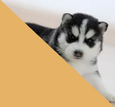

## 第八章 透视相机轨道控制器

之前咱们说过了正交相机的轨道控制器，接下来再看透视相机的轨道控制器，就会方便很多。


### 1-透视相机的位移轨道

透视相机的位移轨道和正交相机的位移轨道是相同原理的，都是对相机视点和目标点的平移。

接下来咱们直接说一下代码实现。

1.建透视交相机

```js
const eye = new Vector3(0, 0.5, 1)
const target = new Vector3(0, 0, -2.5)
const up = new Vector3(0, 1, 0)

const [fov, aspect, near, far] = [
    45,
    canvas.width / canvas.height,
    1,
    20
]
const camera = new PerspectiveCamera(fov, aspect, near, far)
camera.position.copy(eye)
camera.lookAt(target)
camera.updateWorldMatrix(true)
```


2.在正交相机的位移轨道的基础上改一下pan方法


- 将鼠标在画布中的位移量转目标平面位移量


```js
const {matrix,position,up}=camera
const {clientWidth,clientHeight}=canvas

//视线长度：相机视点到目标点的距离
const sightLen = position.clone().sub(target).length()
//视椎体垂直夹角的一半(弧度)
const halfFov = fov * Math.PI / 360
//目标平面的高度
const targetHeight = sightLen * Math.tan(halfFov) * 2
//目标平面与画布的高度比
const ratio = targetHeight / clientHeight
//画布位移量转目标平面位移量
const distanceLeft = x * ratio
const distanceUp = y * ratio
```

注：目标平面是过视点，平行于裁剪面的平面


- 将鼠标在目标平面中的位移量转世界坐标


```js
//相机平移方向
//鼠标水平运动时，按照相机本地坐标的x轴平移相机
const mx = new Vector3().setFromMatrixColumn(matrix, 0)
//鼠标水平运动时，按照相机本地坐标的y轴，或者-z轴平移相机
const myOrz = new Vector3()
if (screenSpacePanning) {
    //y轴，正交相机中默认
    myOrz.setFromMatrixColumn(matrix, 1)
} else {
    //-z轴，透视相机中默认
    myOrz.crossVectors(up, mx)
}

//目标平面位移量转世界坐标
const vx = mx.clone().multiplyScalar(-distanceLeft)
const vy = myOrz.clone().multiplyScalar(distanceUp)
panOffset.copy(vx.add(vy))
```


透视相机的位移轨道就这么简单，接下来咱们说一下透视相机的缩放轨道。


### 2-透视相机的缩放轨道

透视相机缩放是通过视点按照视线的方向，接近或者远离目标点来实现的。


#### 2-1-举个例子

已知：

- 视点e=5
- 目标点t=15
- （视点即将位移的距离）/（位移前，视点与与目标点的距离）= 0.4

求：视点移动2次后的位置

解：

视点第1次移动后的位置：5+(15-5)*0.4=9

视点第2次移动后的位置：9+(15-9)*0.4= 11.4 

基本原理就是这样，视点移动n此后的位置都可以按照上面的逻辑来计算。

接下来，咱们看一下代码实现。


#### 2-2-代码实现

我们可以直接在正交相机缩放轨道的基础上做一下修改。

```js
function dolly(dollyScale) {
    camera.position.lerp(target, 1 - dollyScale)
}
```

- lerp ( v : Vector3, alpha : Float ) 按比例去两点之间的插值

  其源码如下：

```js
lerp( v, alpha ) {
    this.x += ( v.x - this.x ) * alpha;
    this.y += ( v.y - this.y ) * alpha;
    this.z += ( v.z - this.z ) * alpha;
    return this;
}
```


- dollyScale：（位移之后视点与目标点的距离）/（位移前，视点与与目标点的距离）

- 1-dollyScale：（视点即将位移的距离）/（位移前，视点于与目标点的距离）


正交相机缩放轨道的基本实现原理就是这么简单。

然而，后面我们还得用球坐标对相机进行旋转，球坐标是已经涵盖了相机视点位的。

因此，我们还可以直接把相机视点位写进球坐标里。


#### 2-3-球坐标缩放

1.像正交相机的旋转轨道那样，定义球坐标对象。

```js
const spherical = new Spherical()
    .setFromVector3(
        camera.position.clone().sub(target)
    )
```


2.修改旋转方法

```js
function dolly(dollyScale) {
    spherical.radius*=dollyScale
}
```


3.更新方法也和正交相机的旋转轨道一样

```js
function update() {
    //基于平移量平移相机
    target.add(panOffset)
    camera.position.add(panOffset)

    //基于球坐标缩放和旋转相机
    const rotateOffset = new Vector3()
    .setFromSpherical(spherical)
    camera.position.copy(
        target.clone().add(rotateOffset)
    )

    //更新投影视图矩阵
    camera.lookAt(target)
    camera.updateMatrixWorld(true)
    pvMatrix.multiplyMatrices(
        camera.projectionMatrix,
        camera.matrixWorldInverse,
    )

    //重置球坐标和平移量
    spherical.setFromVector3(
        camera.position.clone().sub(target)
    )
    panOffset.set(0, 0, 0)

    // 渲染
    render()
}
```


### 3-透视相机的旋转轨道

透视相机的旋转轨道和正交相机的实现原理都是一样的，可以用球坐标系实现，也可以用轨迹球实现。

- 基于球坐标系的旋转轨道，可直接参考正交相机基于球坐标系的旋转轨道来写。

```js
/* 旋转轨道 */
const spherical = new Spherical()
.setFromVector3(
    camera.position.clone().sub(target)
)
//'xy','x','y'
const rotateDir = 'xy'

……

/* 指针移动时，若控制器处于平移状态，平移相机；若控制器处于旋转状态，旋转相机。 */
canvas.addEventListener('pointermove', ({ clientX, clientY }) => {
    dragEnd.set(clientX, clientY)
    switch (state) {
        case 'pan':
            pan(dragEnd.clone().sub(dragStart))
            break
        case 'rotate':
            rotate(dragEnd.clone().sub(dragStart))
            break
    }
    dragStart.copy(dragEnd)
})
……

// 旋转方法
function rotate({ x, y }) {
    const { clientHeight } = canvas
    const deltaT = pi2 * x / clientHeight
    const deltaP = pi2 * y / clientHeight
    if (rotateDir.includes('x')) {
        spherical.theta -= deltaT
    }
    if (rotateDir.includes('y')) {
        const phi = spherical.phi - deltaP
        spherical.phi = Math.min(
            Math.PI * 0.99999999,
            Math.max(0.00000001, phi)
        )
    }
    update()
}

function update() {
    //基于平移量平移相机
    target.add(panOffset)
    camera.position.add(panOffset)

    //基于球坐标缩放相机
    const rotateOffset = new Vector3()
    .setFromSpherical(spherical)
    camera.position.copy(
        target.clone().add(rotateOffset)
    )

    //更新投影视图矩阵
    camera.lookAt(target)
    camera.updateMatrixWorld(true)
    pvMatrix.multiplyMatrices(
        camera.projectionMatrix,
        camera.matrixWorldInverse,
    )

    //重置旋转量和平移量
    spherical.setFromVector3(
        camera.position.clone().sub(target)
    )
    panOffset.set(0, 0, 0)

    // 渲染
    render()
}
```


- 对于轨迹球的旋转轨道，基于正交相机轨迹球旋转的代码略作调整即可。

```js
/* 旋转轨道 */
const quaternion = new Quaternion()

function rotate({ x, y }) {
    const { matrix, position, fov } = camera
    const {  clientHeight } = canvas

    /* 1.基于鼠标拖拽距离计算旋转量 */
    // 鼠标位移距离在画布中的占比
    const ratioY = -y / clientHeight
    //基于高度的x位置比-用于旋转量的计算
    const ratioBaseHeight = x / clientHeight
    //位移量  
    const ratioLen = new Vector2(ratioBaseHeight, ratioY).length()
    //旋转量
    const angle = ratioLen * pi2

    /* 2.将鼠标在画布中的位移量转目标平面位移量 */
    //视线长度：相机视点到目标点的距离
    const sightLen = position.clone().sub(target).length()
    //视椎体垂直夹角的一半(弧度)
    const halfFov = fov * Math.PI / 360
    //目标平面的高度
    const targetHeight = sightLen * Math.tan(halfFov) * 2
    //目标平面与画布的高度比
    const ratio = targetHeight / clientHeight
    //画布位移量转目标平面位移量
    const distanceLeft = x * ratio
    const distanceUp = -y * ratio

     /* 3.将鼠标在目标平面中的位移量转世界坐标，并从中提取鼠标在世界坐标系中的位移方向 */
    // 相机本地坐标系的x,y轴
    const mx = new Vector3().setFromMatrixColumn(matrix, 0)
    const my = new Vector3().setFromMatrixColumn(matrix, 1)
    // 将鼠标在相机世界的x,y轴向的位移量转换为世界坐标位
    const vx = mx.clone().multiplyScalar(distanceLeft)
    const vy = my.clone().multiplyScalar(distanceUp)
    //鼠标在世界坐标系中的位移方向-x轴
    const moveDir = vx.clone().add(vy).normalize()

    /* 4.基于位移方向和视线获取旋转轴 */
    //目标点到视点的单位向量-z轴
    const eyeDir = position.clone().sub(target).normalize()
    //基于位移方向和视线获取旋转轴-上方向y轴
    const axis = moveDir.clone().cross(eyeDir)

    /* 5.基于旋转轴和旋转量更新四元数 */
    quaternion.setFromAxisAngle(axis, angle)

    update()
}


function update() {
    //基于平移量平移相机
    target.add(panOffset)
    camera.position.add(panOffset)

    //基于旋转量旋转相机
    const rotateOffset = camera.position.clone()
    .sub(target)
    .applyQuaternion(quaternion)

    camera.position.copy(
        target.clone().add(rotateOffset)
    )
    camera.up.applyQuaternion(quaternion)

    //更新投影视图矩阵
    camera.lookAt(target)
    camera.updateMatrixWorld(true)
    pvMatrix.multiplyMatrices(
        camera.projectionMatrix,
        camera.matrixWorldInverse,
    )

    //重置旋转量和平移量
    quaternion.setFromRotationMatrix(new Matrix4())
    panOffset.set(0, 0, 0)

    // 渲染
    render()
}
```


## 第九章 封装相机轨道对象

接下来我会参考three.js 里的OrbitControls对象，封装一个轨道控制器出来。

至于轨迹球的封装，我就留给大家来练手了，可以参考着TrackballControls 来实现。

首先我们先对之前所学的正交相机轨道和透视相机轨道做一个差异的对比：

- 旋转轨道
  - 正交相机和透视相机的旋转轨道都是一样的，都是使用球坐标，让相机视点围绕目标点做的旋转。
- 位移轨道
  - 正交相机的位移轨道是鼠标从canvas画布到近裁剪面，再到世界坐标系的位移量的转换，最后这个位移量会同时作用于相机的目标点和视点。
  - 透视相机的位移轨道是鼠标从canvas画布到目标平面，再到世界坐标系的位移量的转换，最后这个位移量会同时作用于相机的目标点和视点。
- 缩放轨道
  - 正交相机的缩放轨道是通过对其可视区域的宽高尺寸的缩放实现的。
  - 透视相机的缩放轨道是通过相机视点在视线上的位移实现的。


整体的原理就是这样，接下来就可以封装轨道控制器了。


### 1-轨道控制器的封装

我这里没有原封不动抄袭there.js，我参考其整体原理，做了一下简化和取舍。

大家若有更好的想法，也可以自己封装一个出来，然后努力超越three.js。

整体代码如下：

```js
import {
    Matrix4, Vector2, Vector3,Spherical
} from 'https://unpkg.com/three/build/three.module.js';

const pi2 = Math.PI * 2
const pvMatrix=new Matrix4()

const defAttr = () => ({
    camera: null,
    dom: null,
    target: new Vector3(),
    mouseButtons:new Map([
        [0, 'rotate'],
        [2, 'pan'],
    ]),
    state: 'none',
    dragStart: new Vector2(),
    dragEnd: new Vector2(),
    panOffset: new Vector3(),
    screenSpacePanning: true,
    zoomScale: 0.95,
    spherical:new Spherical(),
    rotateDir: 'xy',
})

export default class OrbitControls{
    constructor(attr){
        Object.assign(this, defAttr(), attr)
        this.updateSpherical()
        this.update()
    }
    updateSpherical() {
        const {spherical,camera,target}=this
        spherical.setFromVector3(
            camera.position.clone().sub(target)
        )
    }
    pointerdown({ clientX, clientY,button }) {
        const {dragStart,mouseButtons}=this
        dragStart.set(clientX, clientY)
        this.state = mouseButtons.get(button)
    }
    pointermove({ clientX, clientY }) {
        const { dragStart, dragEnd, state, camera: { type } } = this
        dragEnd.set(clientX, clientY)
        switch (state) {
            case 'pan':
                this[`pan${type}`] (dragEnd.clone().sub(dragStart))
                break
            case 'rotate':
                this.rotate(dragEnd.clone().sub(dragStart))
                break
        }
        dragStart.copy(dragEnd)
    }
    pointerup() {
        this.state = 'none'
    }
    wheel({ deltaY }) {
        const { zoomScale, camera: { type } } = this
        let scale=deltaY < 0?zoomScale:1 / zoomScale
        this[`dolly${type}`] (scale)
        this.update()
    }
    dollyPerspectiveCamera(dollyScale) {
        this.spherical.radius *= dollyScale
    }
    dollyOrthographicCamera(dollyScale) {
        const {camera}=this
        camera.zoom *= dollyScale
        camera.updateProjectionMatrix()
    }
    panPerspectiveCamera({ x, y }) {
        const {
            camera: { matrix, position, fov,up },
            dom: { clientHeight },
            panOffset,screenSpacePanning,target
        } = this

        //视线长度：相机视点到目标点的距离
        const sightLen = position.clone().sub(target).length()
        //视椎体垂直夹角的一半(弧度)
        const halfFov = fov * Math.PI / 360
        //目标平面的高度
        const targetHeight = sightLen * Math.tan(halfFov) * 2
        //目标平面与画布的高度比
        const ratio = targetHeight / clientHeight
        //画布位移量转目标平面位移量
        const distanceLeft = x * ratio
        const distanceUp = y * ratio

        //相机平移方向
        //鼠标水平运动时，按照相机本地坐标的x轴平移相机
        const mx = new Vector3().setFromMatrixColumn(matrix, 0)
        //鼠标水平运动时，按照相机本地坐标的y轴，或者-z轴平移相机
        const myOrz = new Vector3()
        if (screenSpacePanning) {
            //y轴，正交相机中默认
            myOrz.setFromMatrixColumn(matrix, 1)
        } else {
            //-z轴，透视相机中默认
            myOrz.crossVectors(up, mx)
        }
        //目标平面位移量转世界坐标
        const vx = mx.clone().multiplyScalar(-distanceLeft)
        const vy = myOrz.clone().multiplyScalar(distanceUp)
        panOffset.copy(vx.add(vy))

        this.update()
    }

    panOrthographicCamera({ x, y }) {
        const {
            camera: { right, left, top, bottom, matrix, up },
            dom: { clientWidth, clientHeight },
            panOffset,screenSpacePanning
        } = this

        const cameraW = right - left
        const cameraH = top - bottom
        const ratioX = x / clientWidth
        const ratioY = y / clientHeight
        const distanceLeft = ratioX * cameraW
        const distanceUp = ratioY * cameraH
        const mx = new Vector3().setFromMatrixColumn(matrix, 0)
        const vx = mx.clone().multiplyScalar(-distanceLeft)
        const vy = new Vector3()
        if (screenSpacePanning) {
            vy.setFromMatrixColumn(matrix, 1)
        } else {
            vy.crossVectors(up, mx)
        }
        vy.multiplyScalar(distanceUp)
        panOffset.copy(vx.add(vy))
        this.update()
    }


    rotate({ x, y }) {
        const {
            dom: { clientHeight },
            spherical, rotateDir,
        } = this
        const deltaT = pi2 * x / clientHeight
        const deltaP = pi2 * y / clientHeight
        if (rotateDir.includes('x')) {
            spherical.theta -= deltaT
        }
        if (rotateDir.includes('y')) {
            const phi = spherical.phi - deltaP
            spherical.phi = Math.min(
                Math.PI * 0.99999999,
                Math.max(0.00000001, phi)
            )
        }
        this.update()
    }

    update() {
        const {camera,target,spherical,panOffset} = this
        //基于平移量平移相机
        target.add(panOffset)
        camera.position.add(panOffset)

        //基于球坐标缩放相机
        const rotateOffset = new Vector3()
        .setFromSpherical(spherical)
        camera.position.copy(
            target.clone().add(rotateOffset)
        )

        //更新投影视图矩阵
        camera.lookAt(target)
        camera.updateMatrixWorld(true)

        //重置旋转量和平移量
        spherical.setFromVector3(
            camera.position.clone().sub(target)
        )
        panOffset.set(0, 0, 0)
    }

    getPvMatrix() {
        const { camera: { projectionMatrix, matrixWorldInverse } } = this
        return pvMatrix.multiplyMatrices(
            projectionMatrix,
            matrixWorldInverse,
        )
    }

}
```

接下来咱们将其实例化一下看看。


### 2-轨道控制器的实例化

OrbitControls对象就像three.js 里的样，可以自动根据相机类型去做相应的轨道变换。


```js
/* 透视相机 */
/* 
	const eye = new Vector3(0, 0.5, 1)
    const target = new Vector3(0, 0, -2.5)
    const up = new Vector3(0, 1, 0)
    const [fov, aspect, near, far] = [
      45,
      canvas.width / canvas.height,
      1,
      20
    ]
    const camera = new PerspectiveCamera(fov, aspect, near, far)
    camera.position.copy(eye) 
*/

/* 正交相机 */
const halfH = 2
const ratio = canvas.width / canvas.height
const halfW = halfH * ratio
const [left, right, top, bottom, near, far] = [
    -halfW, halfW, halfH, -halfH, 1, 8
]
const eye = new Vector3(1, 1, 2)
const target = new Vector3(0, 0, -3)
const up = new Vector3(0, 1, 0)

const camera = new OrthographicCamera(
    left, right, top, bottom, near, far
)
camera.position.copy(eye)

const pvMatrix = new Matrix4()

……

/* 实例化轨道控制器 */
const orbit = new OrbitControls({
    camera, 
    target,
    dom: canvas,
})
pvMatrix.copy(orbit.getPvMatrix())
render()

/* 取消右击菜单的显示 */
canvas.addEventListener('contextmenu', event => {
    event.preventDefault()
})

/* 指针按下时，设置拖拽起始位，获取轨道控制器状态。 */
canvas.addEventListener('pointerdown', event => {
    orbit.pointerdown(event)
})

/* 指针移动时，若控制器处于平移状态，平移相机；若控制器处于旋转状态，旋转相机。 */
canvas.addEventListener('pointermove', event => {
    orbit.pointermove(event)
    pvMatrix.copy(orbit.getPvMatrix())
    render()
})
canvas.addEventListener('pointerup', event => {
    orbit.pointerup(event)
})

//滚轮事件
canvas.addEventListener('wheel', event => {
    orbit.wheel(event)
    pvMatrix.copy(orbit.getPvMatrix())
    render()
})


```


好啦，到目前为止，我们相机轨道的底层原理分析就说到这了。

接下来，咱们先不做例子，因为还有几个知识点要跟大家说一下。


## 第十章 顶点索引

### 1-顶点索引概念

对于顶点索引的概念，其实我们之在再说复合变换里的模型矩阵的时候，就已经讲过了。

```js
const verticeLib = [
    1.0, 1.0, 1.0,
    -1.0, 1.0, 1.0,
    -1.0, -1.0, 1.0,
    1.0, -1.0, 1.0,
    1.0, -1.0, -1.0,
    1.0, 1.0, -1.0,
    -1.0, 1.0, -1.0,
    -1.0, -1.0, -1.0,
];

const indices = [
    0, 1,
    1, 2,
    2, 3,
    3, 0,

    0, 5,
    1, 6,
    2, 7,
    3, 4,

    4, 5,
    5, 6,
    6, 7,
    7, 4
];

const arr = [];
indices.forEach(n => {
    const i = n * 3
    arr.push(
        verticeLib[i] / 5,
        verticeLib[i + 1] / 5,
        verticeLib[i + 2] / 5,
    )
})
const vertices = new Float32Array(arr)
……
```

下过如下：


我上面是用js 实现的顶点索引功能，其实这种功能我们可以直接通过webgl api来实现，不需要我们自己去算。

我们要做的就是建立一个顶点库，然后使用顶点在顶点库中的索引拼图形。

1.顶点数据verticeLib 和顶点索引数据indices 和之前一样

```js
const verticeLib = new Float32Array([
    1.0, 1.0, 1.0,
    -1.0, 1.0, 1.0,
    -1.0, -1.0, 1.0,
    1.0, -1.0, 1.0,
    1.0, -1.0, -1.0,
    1.0, 1.0, -1.0,
    -1.0, 1.0, -1.0,
    -1.0, -1.0, -1.0,
])

const indices = new Uint8Array([
    0, 1,
    1, 2,
    2, 3,
    3, 0,

    0, 5,
    1, 6,
    2, 7,
    3, 4,

    4, 5,
    5, 6,
    6, 7,
    7, 4
])
```


2.顶点数据在webgl缓冲区写入和之前都是一样的。

```js
const vertexBuffer = gl.createBuffer();
gl.bindBuffer(gl.ARRAY_BUFFER, vertexBuffer);
gl.bufferData(gl.ARRAY_BUFFER, verticeLib, gl.STATIC_DRAW);
const a_Position = gl.getAttribLocation(gl.program, 'a_Position');
gl.vertexAttribPointer(a_Position, 3, gl.FLOAT, false, 0, 0);
gl.enableVertexAttribArray(a_Position);
```


3.视图矩阵和模型矩阵和设置和之前也是一样的

```js
const u_ViewMatrix = gl.getUniformLocation(gl.program, 'u_ViewMatrix')
const u_ModelMatrix = gl.getUniformLocation(gl.program, 'u_ModelMatrix')
const viewMatrix = new Matrix4().lookAt(
    new Vector3(0.2, 0.2, 1),
    new Vector3(0, 0, 0),
    new Vector3(0, 1, 0)
)
const modelMatrix = new Matrix4()
modelMatrix.makeScale(0.5, 0.5, 0.5)
gl.uniformMatrix4fv(u_ViewMatrix, false, viewMatrix.elements)
gl.uniformMatrix4fv(u_ModelMatrix, false, modelMatrix.elements)
```

接下来咱们说不一样的地方。


4.把顶点索引写入webgl缓冲区

```js
//建立缓冲对象
const indicesBuffer = gl.createBuffer();
//在ELEMENT_ARRAY_BUFFER上绑定缓冲对象
gl.bindBuffer(gl.ELEMENT_ARRAY_BUFFER, indicesBuffer);
//将顶点索引数据写入缓冲对象
gl.bufferData(gl.ELEMENT_ARRAY_BUFFER, indices, gl.STATIC_DRAW)
```


5.绘图

```js
gl.clear(gl.COLOR_BUFFER_BIT);
// gl.drawArrays(gl.LINES, 0, indices.length);
gl.drawElements(
    gl.LINES,
    indices.length,
    gl.UNSIGNED_BYTE,
    0
)
```

drawElements(mode, count, type, offset) 是使用顶点索引绘图的方法。

- mode 绘图方式
- count 元素数量
- type 缓冲区数据的类型
- offset 当前系列的字节索引位

我们上面用顶点索引画了一个线框，重点就是说一个原理，接下来咱们再画一个好看些的彩色立方体。


### 2-彩色立方体

彩色立方体的效果如下：


咱们现在先不考虑灯光，只给顶点赋个颜色。

1.着色器

```html
<script id="vertexShader" type="x-shader/x-vertex">
    attribute vec4 a_Position;
    attribute vec4 a_Color;
    uniform mat4 u_PvMatrix;
    uniform mat4 u_ModelMatrix;
    varying vec4 v_Color;
    void main(){
      gl_Position = u_PvMatrix*u_ModelMatrix*a_Position;
      v_Color=a_Color;
    }
</script>
<script id="fragmentShader" type="x-shader/x-fragment">
    precision mediump float;
    varying vec4 v_Color;
    void main(){
      gl_FragColor=v_Color;
    }
</script>
```

上面的a_Color 是和a_Position 一一对应的，一个顶点，一个颜色，所以我是用attribute 声明的a_Color。

如果整个立方体都是一个颜色，那我直接在片元着色器里用uniform 声明就好了。


2.正常初始化着色器，打开深度测试。

```js
import { initShaders } from '../jsm/Utils.js';
import { Matrix4, PerspectiveCamera, Vector3, Quaternion } from 'https://unpkg.com/three/build/three.module.js';
import OrbitControls from './jsm/OrbitControls.js'

const canvas = document.getElementById('canvas');
canvas.width = window.innerWidth;
canvas.height = window.innerHeight;
const gl = canvas.getContext('webgl');

const vsSource = document.getElementById('vertexShader').innerText;
const fsSource = document.getElementById('fragmentShader').innerText;
initShaders(gl, vsSource, fsSource);
gl.clearColor(0, 0, 0, 1);
gl.enable(gl.DEPTH_TEST);
```

深度测试可以解决物体的遮挡问题，不然后面的物体可能挡住前面的物体。


3.建立透视相机和轨道控制器。

```js
/* 透视相机 */
const eye = new Vector3(1, 2, 3)
const target = new Vector3(0, 0, 0)
const up = new Vector3(0, 1, 0)
const [fov, aspect, near, far] = [
    45,
    canvas.width / canvas.height,
    1,
    20
]
const camera = new PerspectiveCamera(fov, aspect, near, far)
camera.position.copy(eye)

/* 实例化轨道控制器 */
const orbit = new OrbitControls({
    camera, target,
    dom: canvas,
})
/* 取消右击菜单的显示 */
canvas.addEventListener('contextmenu', event => {
    event.preventDefault()
})
/* 指针按下时，设置拖拽起始位，获取轨道控制器状态。 */
canvas.addEventListener('pointerdown', event => {
    orbit.pointerdown(event)
})
/* 指针移动时，若控制器处于平移状态，平移相机；若控制器处于旋转状态，旋转相机。 */
canvas.addEventListener('pointermove', event => {
    orbit.pointermove(event)
})
/* 指针抬起 */
canvas.addEventListener('pointerup', event => {
    orbit.pointerup(event)
})
/* 滚轮事件 */
canvas.addEventListener('wheel', event => {
    orbit.wheel(event)
})
```


4.声明顶点数据vertices 和顶点索引indexes。

```js
//    v6----- v5
//   /|      /|
//  v1------v0|
//  | |     | |
//  | |v7---|-|v4
//  |/      |/
//  v2------v3
const vertices = new Float32Array([
    1, 1, 1, 1, 0, 0,  // v0 
    -1, 1, 1, 0, 1, 0,  // v1 
    -1, -1, 1, 0, 0, 1,  // v2 
    1, -1, 1, 1, 1, 0,  // v3 
    1, -1, -1, 0, 1, 1,  // v4 
    1, 1, -1, 1, 0, 1,  // v5 
    -1, 1, -1, 1, 1, 1,  // v6 
    -1, -1, -1, 0, 0, 0   // v7
])

const indexes = new Uint8Array([
    0, 1, 2, 0, 2, 3,    // front
    0, 3, 4, 0, 4, 5,    // right
    0, 5, 6, 0, 6, 1,    // up
    1, 6, 7, 1, 7, 2,    // left
    7, 4, 3, 7, 3, 2,    // down
    4, 7, 6, 4, 6, 5     // back
])
```

顶点数据vertices 是多attribute数据的合一，这个咱们之前讲过。

顶点数据中有两个系列，分别是顶点位置数据和顶点颜色数据。


5.将顶点数据写入缓冲区，并将其中的点位和颜色数据分别分配给a_Position 和a_Color

```js
//元素字节数
const elementBytes = vertices.BYTES_PER_ELEMENT
const FSIZE = vertices.BYTES_PER_ELEMENT
//系列尺寸
const verticeSize = 3
const colorSize = 3
//类目尺寸
const categorySize = verticeSize + colorSize
//类目字节数
const categoryBytes = categorySize * elementBytes
//系列字节索引位置
const verticeByteIndex = 0
const colorByteIndex = verticeSize * elementBytes

/* 顶点缓冲区 */
const vertexBuffer = gl.createBuffer();
gl.bindBuffer(gl.ARRAY_BUFFER, vertexBuffer);
gl.bufferData(gl.ARRAY_BUFFER, vertices, gl.STATIC_DRAW);

// 将顶点缓冲区里的点位数据分配给a_Position
const a_Position = gl.getAttribLocation(gl.program, 'a_Position');
gl.vertexAttribPointer(
    a_Position,
    verticeSize,
    gl.FLOAT,
    false,
    categoryBytes,
    verticeByteIndex
);
gl.enableVertexAttribArray(a_Position);

// 将顶点缓冲区里的颜色数据分配给a_Color
const a_Color = gl.getAttribLocation(gl.program, 'a_Color');
gl.vertexAttribPointer(
    a_Color,
    colorSize,
    gl.FLOAT,
    false,
    categoryBytes,
    colorByteIndex
);
gl.enableVertexAttribArray(a_Color);
```


6.将顶点索引写入缓冲区。

```js
// 建立缓冲区对象
const indexesBuffer = gl.createBuffer()
//把缓冲区绑定到webgl 上下文对象上
gl.bindBuffer(gl.ELEMENT_ARRAY_BUFFER, indexesBuffer)
// 往缓冲区写数据
gl.bufferData(gl.ELEMENT_ARRAY_BUFFER, indexes, gl.STATIC_DRAW)
```


7.建立模型矩阵，并传递给片元着色器

```js
const u_ModelMatrix = gl.getUniformLocation(gl.program, 'u_ModelMatrix')
const modelMatrix = new Matrix4()
modelMatrix.makeScale(0.5, 0.5, 0.5)
gl.uniformMatrix4fv(u_ModelMatrix, false, modelMatrix.elements)
```


8.建立投影视图矩阵，并传递给片元着色器

```js
const u_PvMatrix = gl.getUniformLocation(gl.program, 'u_PvMatrix')
gl.uniformMatrix4fv(u_PvMatrix, false, orbit.getPvMatrix().elements)
```


9.用连续渲染的方法绘图。

```js
!(function ani() {
    modelMatrix.multiply(new Matrix4().makeRotationY(0.05))
    gl.uniformMatrix4fv(u_ModelMatrix, false, modelMatrix.elements)
    gl.clear(gl.COLOR_BUFFER_BIT);
    gl.drawElements(gl.TRIANGLES, indexes.length, gl.UNSIGNED_BYTE, 0)
    requestAnimationFrame(ani)
})()
```


关于顶点索引加多attribute数据的合一的应用咱们就说到这。

接下来咱们再说一下多着色器。


## 第十一章 多着色器

到目前为止，我们都是用了一套着色器做的例子，这一套着色器包含了顶点着色器和片元着色器。

在实际开发中，我们是不可能只用一套着色器做项目的，就比如场景里有两个三角形，一个三角形需要着纯色，一个三角形需要着纹理。




接下来我们就拿这两个三角形来说一下多着色器的实现方法。


### 1-多着色器绘图

#### 1-1-准备两套着色器

两套着色器，一套着纯色，一套着纹理。

```html
<!-- 着纯色 -->
<script id="solidVertexShader" type="x-shader/x-vertex">
    attribute vec4 a_Position;
    void main(){
      gl_Position = a_Position;
    }
</script>
<script id="solidFragmentShader" type="x-shader/x-fragment">
    precision mediump float;
    void main(){
      gl_FragColor=vec4(0.9,0.7,0.4,1);
    }
</script>

<!-- 着纹理 -->
<script id="textureVertexShader" type="x-shader/x-vertex">
    attribute vec4 a_Position;
    attribute vec2 a_Pin;
    varying vec2 v_Pin;
    void main(){
      gl_Position = a_Position;
      v_Pin=a_Pin;
    }
</script>
<script id="textureFragmentShader" type="x-shader/x-fragment">
    precision mediump float;
    uniform sampler2D u_Sampler;
    varying vec2 v_Pin;
    void main(){
      gl_FragColor=texture2D(u_Sampler,v_Pin);
    }
</script>
```


#### 1-2-绘制纯色三角形

1.建立程序对象，并应用

```js
const solidVsSource = document.getElementById('solidVertexShader').innerText
const solidFsSource = document.getElementById('solidFragmentShader').innerText
const solidProgram = createProgram(gl, solidVsSource, solidFsSource)
gl.useProgram(solidProgram)
```

上面的createProgram() 方法是基于一套着色器建立程序对象的方法：

```js
function createProgram(gl, vsSource, fsSource) {
  //创建程序对象
  const program = gl.createProgram();
  //建立着色对象
  const vertexShader = loadShader(gl, gl.VERTEX_SHADER, vsSource);
  const fragmentShader = loadShader(gl, gl.FRAGMENT_SHADER, fsSource);
  //把顶点着色对象装进程序对象中
  gl.attachShader(program, vertexShader);
  //把片元着色对象装进程序对象中
  gl.attachShader(program, fragmentShader);
  //连接webgl上下文对象和程序对象
  gl.linkProgram(program);
  return program;
}
```

关于程序对象的概念咱们之前在webgl 入门里已经说过。

之前我们的初始化着色器方法initShaders() 只是比上面的方法多了一个应用程序对象的步骤：

```js
gl.useProgram(program);
```

我们这里之所以把启用程序的步骤提取出来，是因为一套着色器对应着一个程序对象。

而一个webgl 上下文对象，是可以依次应用多个程序对象的。

通过不同程序对象，可以绘制不同材质的图形。


2.用当前的程序对象绘制图形

```js
const solidVertices = new Float32Array([
    -0.5, 0.5,
    -0.5, -0.5,
    0.5, -0.5,
])
const solidVertexBuffer = gl.createBuffer()
gl.bindBuffer(gl.ARRAY_BUFFER, solidVertexBuffer)
gl.bufferData(gl.ARRAY_BUFFER, solidVertices, gl.STATIC_DRAW)
const solidPosition = gl.getAttribLocation(solidProgram, 'a_Position')
gl.vertexAttribPointer(solidPosition, 2, gl.FLOAT, false, 0, 0)
gl.enableVertexAttribArray(solidPosition)

gl.clear(gl.COLOR_BUFFER_BIT)
gl.drawArrays(gl.TRIANGLES, 0, 3)
```

因为我们后面还需要绘制一个纹理图形，纹理图形是需要等纹理加载成功才能绘制的。

这会造成两个三角形的异步绘制，这不是我想要的，因为一异步，就会把之前三角形的缓冲数据给清理掉，这个原理，我们之前说过。

因此，我需要同步绘制两个三角形。

我先把上面的绘图方法封装到一个函数里，等纹理三角形的图片加载成功了，再执行。

```js
function drawSolid() {
    /* 1.建立程序对象，并应用 */
    const solidVsSource = document.getElementById('solidVertexShader').innerText
    const solidFsSource = document.getElementById('solidFragmentShader').innerText
    const solidProgram = createProgram(gl, solidVsSource, solidFsSource)
    gl.useProgram(solidProgram)
    /* 2.用当前的程序对象绘制图形 */
    const solidVertices = new Float32Array([
        -0.5, 0.5,
        -0.5, -0.5,
        0.5, -0.5,
    ])
    const solidVertexBuffer = gl.createBuffer()
    gl.bindBuffer(gl.ARRAY_BUFFER, solidVertexBuffer)
    gl.bufferData(gl.ARRAY_BUFFER, solidVertices, gl.STATIC_DRAW)
    const solidPosition = gl.getAttribLocation(solidProgram, 'a_Position')
    gl.vertexAttribPointer(solidPosition, 2, gl.FLOAT, false, 0, 0)
    gl.enableVertexAttribArray(solidPosition)
    gl.clear(gl.COLOR_BUFFER_BIT)
    gl.drawArrays(gl.TRIANGLES, 0, 3)
}
```


#### 1-3-绘制纹理三角形

纹理三角形的绘制原理和纯色三角形一样，要用一套新的着色器建立一个新的程序对象，然后用这个新的程序对象进行绘图。

```js
function drawTexture(image) {
    /* 1.建立程序对象，并应用 */
    const textureVsSource = document.getElementById('textureVertexShader').innerText
    const textureFsSource = document.getElementById('textureFragmentShader').innerText
    const textureProgram = createProgram(gl, textureVsSource, textureFsSource)
    gl.useProgram(textureProgram)
    
    /* 2.用当前的程序对象绘制图形 */
    // 顶点
    const textureVertices = new Float32Array([
        0.5, 0.5,
        -0.5, 0.5,
        0.5, -0.5,
    ])
    const textureVertexBuffer = gl.createBuffer()
    gl.bindBuffer(gl.ARRAY_BUFFER, textureVertexBuffer)
    gl.bufferData(gl.ARRAY_BUFFER, textureVertices, gl.STATIC_DRAW)
    const texturePosition = gl.getAttribLocation(textureProgram, 'a_Position')
    gl.vertexAttribPointer(texturePosition, 2, gl.FLOAT, false, 0, 0)
    gl.enableVertexAttribArray(texturePosition)
    // 图钉
    const pins = new Float32Array([
        1, 1,
        0, 1,
        1, 0,
    ])
    const pinBuffer = gl.createBuffer()
    gl.bindBuffer(gl.ARRAY_BUFFER, pinBuffer)
    gl.bufferData(gl.ARRAY_BUFFER, pins, gl.STATIC_DRAW)
    const pin = gl.getAttribLocation(textureProgram, 'a_Pin')
    gl.vertexAttribPointer(pin, 2, gl.FLOAT, false, 0, 0)
    gl.enableVertexAttribArray(pin)
    // 纹理
    gl.pixelStorei(gl.UNPACK_FLIP_Y_WEBGL, 1)
    gl.activeTexture(gl.TEXTURE0)
    const texture = gl.createTexture()
    gl.bindTexture(gl.TEXTURE_2D, texture)
    gl.texImage2D(
        gl.TEXTURE_2D,
        0,
        gl.RGB,
        gl.RGB,
        gl.UNSIGNED_BYTE,
        image
    )
    gl.texParameteri(
        gl.TEXTURE_2D,
        gl.TEXTURE_MIN_FILTER,
        gl.LINEAR
    )
    const u_Sampler = gl.getUniformLocation(textureProgram, 'u_Sampler')
    gl.uniform1i(u_Sampler, 0)
    
    gl.drawArrays(gl.TRIANGLES, 0, 3)
}
```


#### 1-4-同步绘图

当纹理图形加载成功后，进行同步绘图。

```js
const image = new Image()
image.src = './images/erha.jpg'
image.onload = function () {
    drawSolid()
    drawTexture(image)
}
```

接下来我们考虑一个问题。

我想给场景中的图形添加一个动画，比如我想让纯色三角形不断的变换颜色。

那我首先要给纯色三角形的片元着色器开一个uniform变量。

然后接下来是不是就要不断修改这个uniform变量，然后执行上面的drawSolid()和drawTexture(image) 方法呢？


### 2-多着色器动画

在上面的绘图方法中，很多操作都是不需要重复执行的，比如程序对象在建立之后，就不需要再建立了，后面在绘图的时候再接着用。

#### 2-1-给纯色三角形添加一个代表时间的uniform变量

```html
<script id="solidFragmentShader" type="x-shader/x-fragment">
	precision mediump float;
    uniform float u_Time;
    void main(){
      float r=(sin(u_Time/200.0)+1.0)/2.0;
      gl_FragColor=vec4(r,0.7,0.4,1);
    }
</script>    
```


#### 2-2-声明不需要重复获取变量

```js
let solidProgram, solidVertexBuffer, solidPosition, solidTime = null
let textureProgram, textureVertexBuffer, texturePosition = null
let pinBuffer, pin = null
```

程序对象、缓冲对象、从着色器中获取的attribute变量和uniform变量都是不需要重复获取的。


#### 2-3-初始化方法

- 把绘制纯色三角形的方法变成初始化方法

```js
function initSolid() {
    /* 1.建立程序对象*/
    const solidVsSource = document.getElementById('solidVertexShader').innerText
    const solidFsSource = document.getElementById('solidFragmentShader').innerText
    solidProgram = createProgram(gl, solidVsSource, solidFsSource)
    gl.useProgram(solidProgram)

    /* 2.用当前的程序对象绘制图形 */
    const solidVertices = new Float32Array([
        -0.5, 0.5,
        -0.5, -0.5,
        0.5, -0.5,
    ])
    solidVertexBuffer = gl.createBuffer()
    gl.bindBuffer(gl.ARRAY_BUFFER, solidVertexBuffer)
    gl.bufferData(gl.ARRAY_BUFFER, solidVertices, gl.STATIC_DRAW)
    solidPosition = gl.getAttribLocation(solidProgram, 'a_Position')
    gl.vertexAttribPointer(solidPosition, 2, gl.FLOAT, false, 0, 0)
    gl.enableVertexAttribArray(solidPosition)

    solidTime = gl.getUniformLocation(solidProgram, 'u_Time')

    /* gl.clear(gl.COLOR_BUFFER_BIT)
       gl.drawArrays(gl.TRIANGLES, 0, 3) */
}
```


- 把绘制纹理三角形的方法变成初始化方法

```js
function initTexture(image) {
    /* 1.建立程序对象，并应用 */
    const textureVsSource = document.getElementById('textureVertexShader').innerText
    const textureFsSource = document.getElementById('textureFragmentShader').innerText
    textureProgram = createProgram(gl, textureVsSource, textureFsSource)
    gl.useProgram(textureProgram)

    /* 2.用当前的程序对象绘制图形 */
    // 顶点
    const textureVertices = new Float32Array([
        0.5, 0.5,
        -0.5, 0.5,
        0.5, -0.5,
    ])
    textureVertexBuffer = gl.createBuffer()
    gl.bindBuffer(gl.ARRAY_BUFFER, textureVertexBuffer)
    gl.bufferData(gl.ARRAY_BUFFER, textureVertices, gl.STATIC_DRAW)
    texturePosition = gl.getAttribLocation(textureProgram, 'a_Position')
    gl.vertexAttribPointer(texturePosition, 2, gl.FLOAT, false, 0, 0)
    gl.enableVertexAttribArray(texturePosition)
    // 图钉
    const pins = new Float32Array([
        1, 1,
        0, 1,
        1, 0,
    ])
    pinBuffer = gl.createBuffer()
    gl.bindBuffer(gl.ARRAY_BUFFER, pinBuffer)
    gl.bufferData(gl.ARRAY_BUFFER, pins, gl.STATIC_DRAW)
    pin = gl.getAttribLocation(textureProgram, 'a_Pin')
    gl.vertexAttribPointer(pin, 2, gl.FLOAT, false, 0, 0)
    gl.enableVertexAttribArray(pin)
    // 纹理
    gl.pixelStorei(gl.UNPACK_FLIP_Y_WEBGL, 1)
    gl.activeTexture(gl.TEXTURE0)
    const texture = gl.createTexture()
    gl.bindTexture(gl.TEXTURE_2D, texture)
    gl.texImage2D(
        gl.TEXTURE_2D,
        0,
        gl.RGB,
        gl.RGB,
        gl.UNSIGNED_BYTE,
        image
    )
    gl.texParameteri(
        gl.TEXTURE_2D,
        gl.TEXTURE_MIN_FILTER,
        gl.LINEAR
    )
    const u_Sampler = gl.getUniformLocation(textureProgram, 'u_Sampler')
    gl.uniform1i(u_Sampler, 0)

    // gl.drawArrays(gl.TRIANGLES, 0, 3)
}
```

上面已经注释掉的是需要在绘图时重复执行的。


#### 2-4-把需要重复执行的方法收集一下，用于连续渲染

```js
function render(time = 0) {
    gl.clear(gl.COLOR_BUFFER_BIT)
    
    gl.useProgram(solidProgram)
    gl.bindBuffer(gl.ARRAY_BUFFER, solidVertexBuffer)
    gl.vertexAttribPointer(solidPosition, 2, gl.FLOAT, false, 0, 0)
    gl.uniform1f(solidTime, time)
    gl.drawArrays(gl.TRIANGLES, 0, 3)

    gl.useProgram(textureProgram)
    gl.bindBuffer(gl.ARRAY_BUFFER, textureVertexBuffer)
    gl.vertexAttribPointer(texturePosition, 2, gl.FLOAT, false, 0, 0)
    gl.bindBuffer(gl.ARRAY_BUFFER, pinBuffer)
    gl.vertexAttribPointer(pin, 2, gl.FLOAT, false, 0, 0)
    gl.drawArrays(gl.TRIANGLES, 0, 3)

    requestAnimationFrame(render)
}
```

由上可知，在连续渲染时，必须要有的操作：

- clear() 清理画布
- useProgram() 应用程序对象
- bindBuffer() 绑定缓冲区对象
-  vertexAttribPointer() 告诉显卡从当前绑定的缓冲区（bindBuffer()指定的缓冲区）中读取顶点数据
-  drawArrays() 绘图方法

若attribute变量、uniform变量或者图片发生了变化，那就需要对其进行更新。


#### 2-4-当纹理图像加载成功后，初始化绘图方法，连续绘图

```js
const image = new Image()
image.src = './images/erha.jpg'
image.onload = function () {
    initSolid()
    initTexture(image)
    render()
}
```


关于进入三维世界的基础知识，我们就先说到这。

接下来，我们需要做几个案例巩固一下之前所学的知识。

做案例之前，我需要先对webgl 做一个简单的架构，将咱们之前所说的顶点索引和多着色器绘图功能都融进去，以便于快速开发。


## 第十二章 基于webgl 的轻量级架构

之前咱们简单架构过一个Poly.js，然而随着我们知识量和需求的增加，Poly已经无法满足我们的基本需求，所以我们需要在其基础上再做一下升级。

下图便是我想要搭建的框架，参考了three.js，但要简单很多。

 意欲先用它整几个案例练练手再说，等以后遇到满足不了的需求了，再做深度扩展。 


- 场景Scene：包含所有的三维对象，并负责绘图
- 三维对象Obj3D：包含几何体Geo和材质Mat，对两者进行统一管理
- 几何体Geo：对应attribute 顶点数据
- 材质Mat：包含程序对象，对应uniform 变量


### 1-几何体Geo

#### 1-1-默认属性

```js
const defAttr = () => ({
  data: {},
  count:0,
  index: null,
  drawType:'drawArrays',//drawElements
})
export default class Geo {
  constructor(attr) {
    Object.assign(this, defAttr(), attr)
  }
  ……   
}    
```

- data 顶点数据
- count 顶点总数
- index 顶点索引数据
  - 默认为null，用drawArrays 的方式绘图
  - 若不为null，用drawElements 的方式绘图
- drawType 绘图方式
  - drawArrays 使用顶点集合绘图，默认
  - drawElements，使用顶点索引绘图

data 的数据结构如下：

```js
{
  a_Position: {
    array:类型数组,
    size:矢量长度, 
    buffer:缓冲对象,
    location:attribute变量,
    needUpdate：true
  },
  a_Color: {
    array:类型数组,
    size:矢量长度, 
    buffer:缓冲对象,
    location:attribute变量,
    needUpdate：true
  },
  ……    
}
```

- array 存储所有的attribute 数据
- size 构成一个顶点的所有分量的数目
- buffer 用createBuffer() 方法建立的缓冲对象
- location 用getAttribLocation() 方法获取的attribute变量
- needUpdate 在连续渲染时，是否更新缓冲对象


index数据结构

```js
{
    array:类型数组,
    buffer:缓冲对象,
    needUpdate：true    
}
```


#### 1-2-初始化方法

```js
init(gl,program) {
    gl.useProgram(program)
    this.initData(gl,program)
    this.initIndex(gl)
}
```

- init(gl,program) 方法会在场景Scene 初始化时被调用
  - gl：webgl上下文对象，会通过场景Scene 的初始化方法传入
  - program：程序对象，会通过Obj3D 的初始化方法传入

- initData() 初始化顶点索引 
  - 初始化顶点数量count 和绘图方式drawType
  - 若顶点索引不为null，就建立缓冲区对象，向其中写入顶点索引数据

```js
initData(gl,program) {
    for (let [key, attr] of Object.entries(this.data)) {
        attr.buffer = gl.createBuffer()
        gl.bindBuffer(gl.ARRAY_BUFFER, attr.buffer)
        gl.bufferData(gl.ARRAY_BUFFER, attr.array, gl.STATIC_DRAW)
        const location = gl.getAttribLocation(program, key)
        gl.vertexAttribPointer(
            location,
            attr.size,
            gl.FLOAT,
            false,
            0,
            0
        )
        gl.enableVertexAttribArray(location)
        attr.location=location
    }
}
```


- initIndex() 初始化attribute变量


```js
initIndex(gl) {
    const { index } = this
    if (index) {
        this.count=index.array.length
        this.drawType = 'drawElements'
        index.buffer = gl.createBuffer()
        gl.bindBuffer(gl.ELEMENT_ARRAY_BUFFER, index.buffer)
        gl.bufferData(gl.ELEMENT_ARRAY_BUFFER, index.array, gl.STATIC_DRAW)
    }else{
        const { array, size } = this.data['a_Position']
        this.count = array.length / size
        this.drawType='drawArrays'
    }
}
```


#### 1-3-更新方法，用于连续渲染	

```js
update(gl) {
    this.updateData(gl)
    this.updateIndex(gl)
}
```


- updateData(gl) 更新attribute变量

```js
updateData(gl) {
    for (let attr of Object.values(this.data)){
        const { buffer, location, size, needUpdate,array } = attr
        gl.bindBuffer(gl.ARRAY_BUFFER, buffer)
        if (needUpdate) {
            attr.needUpdate = false
            gl.bufferData(gl.ARRAY_BUFFER, array, gl.STATIC_DRAW)
        }
        gl.vertexAttribPointer(
            location,
            size,
            gl.FLOAT,
            false,
            0,
            0
        )
    }
}
```


- updateIndex(gl) 更新顶点索引

```js
updateIndex(gl) {
    const {index} = this
    if (index) {
        gl.bindBuffer(gl.ELEMENT_ARRAY_BUFFER, index.buffer)
        if (index.needUpdate) {
            index.needUpdate = false
            gl.bufferData(gl.ELEMENT_ARRAY_BUFFER, index.array, gl.STATIC_DRAW)
        }
    }
}
```


#### 1-4-设置attribute数据和顶点索引数据的方法

- setData(key,val) 设置attribute数据

```js
setData(key,val){
    const { data } = this
    const obj = data[key]
    if (!obj) { return }
    obj.needUpdate=true
    Object.assign(obj,val)
}
```


- setIndex(val)设置顶点索引数据

```js
setIndex(val) {
    const {index}=this
    if (val) {
        index.needUpdate = true
        index.array=val
        this.count=index.array.length
        this.drawType = 'drawElements'
    }else{
        const { array, size } = this.data['a_Position']
        this.count = array.length / size
        this.drawType='drawArrays'
    }
}
```


### 2-材质Mat

#### 1-1-默认属性

```js
const defAttr = () => ({
  program: null,
  data: {},
  mode: 'TRIANGLES',
  maps: {}
})
export default class Mat {
  constructor(attr) {
    Object.assign(this, defAttr(), attr)
  }
  ……   
}    
```

- program 程序对象

- data uniform数据

- mode 图形的绘制方式，默认独立三角形。

  注：mode 也可以是数组，表示多种绘图方式，如['TRIANGLE_STRIP', 'POINTS']

- maps 集合 


1.data 数据结构：

```js
{
  u_Color: {
    value:1,
    type: 'uniform1f',    
    location:null,
    needUpdate:true,
  },
  ……    
}
```

- value uniform数据值
- type uniform数据的写入方式
- location 用getUniformLocation() 方法获取的uniform变量
- needUpdate 在连续渲染时，是否更新uniform变量


2.maps 数据结构:

```js
{
  u_Sampler:{
    image,
    format,
    wrapS,
    wrapT,
    magFilter,
    minFilter,
    needUpdate:true,    
  },
  ……
}
```

- image 图形源
- format 数据类型，默认gl.RGB
- wrapS 对应纹理对象的TEXTURE_WRAP_S 属性
- wrapT 对应纹理对象的TEXTURE_WRAP_T 属性
- magFilter 对应纹理对象的TEXTURE_MAG_FILTER 属性
- minFilter对应纹理对象的TEXTURE_MIN_FILTER属性


#### 1-2-初始化方法

获取uniform变量，绑定到其所在的对象上。

```js
init(gl) {
    const {program,data,maps}=this
    for (let [key, obj] of [...Object.entries(data),...Object.entries(maps)]) {
        obj.location = gl.getUniformLocation(program, key)
        obj.needUpdate=true
    }
}
```


#### 1-3-更新方法，用于连续渲染

```js
update(gl) {
    this.updateData(gl)
    this.updateMaps(gl)
}
```


- updateData(gl) 更新uniform变量

```js
updateData(gl) {
    for (let obj of Object.values(this.data)) {
        if (!obj.needUpdate) { continue }
        obj.needUpdate=false
        const { type, value, location } = obj
        if (type.includes('Matrix')) {
            gl[type](location,false,value)
        } else {
            gl[type](location,value)
        }
    }
}
```


- updateMaps(gl) 更新纹理

```js
updateMaps(gl) {
    const { maps } = this
    Object.values(maps).forEach((map, ind) => {
        if (!map.needUpdate) { return }
        map.needUpdate = false
        const {
            format = gl.RGB,
            image,
            wrapS,
            wrapT,
            magFilter,
            minFilter,
            location,
        } = map

        gl.pixelStorei(gl.UNPACK_FLIP_Y_WEBGL, 1)
        gl.activeTexture(gl[`TEXTURE${ind}`])
        const texture = gl.createTexture()
        gl.bindTexture(gl.TEXTURE_2D, texture)
        gl.texImage2D(
            gl.TEXTURE_2D,
            0,
            format,
            format,
            gl.UNSIGNED_BYTE,
            image
        )
        wrapS&&gl.texParameteri(
            gl.TEXTURE_2D,
            gl.TEXTURE_WRAP_S,
            wrapS
        )
        wrapT&&gl.texParameteri(
            gl.TEXTURE_2D,
            gl.TEXTURE_WRAP_T,
            wrapT
        )
        magFilter&&gl.texParameteri(
            gl.TEXTURE_2D,
            gl.TEXTURE_MAG_FILTER,
            magFilter
        )
        if (!minFilter || minFilter > 9729) {
            gl.generateMipmap(gl.TEXTURE_2D)
        }
        minFilter&&gl.texParameteri(
            gl.TEXTURE_2D,
            gl.TEXTURE_MIN_FILTER,
            minFilter
        )
        gl.uniform1i(location, ind)
    })
}
```


#### 1-4-设置uniform数据和纹理的方法

- setData(key,val) 设置uniform数据

```js
setData(key,val){
    const { data } = this
    const obj = data[key]
    if (!obj) { return }
    obj.needUpdate=true
    Object.assign(obj,val)
}
```


- setMap(val)设置纹理

```js
setMap(key,val) {
    const { maps } = this
    const obj = maps[key]
    if (!obj) { return }
    obj.needUpdate=true
    Object.assign(obj,val)
}
```


### 3-三维对象Obj3D

obj3D对象比较简单，主要负责对Geo对象和Mat对象的统一初始化和更新。

```js
const defAttr = () => ({
  geo: null,
  mat: null,
})
export default class Obj3D {
  constructor(attr) {
    Object.assign(this, defAttr(), attr)
  }
  init(gl) {
    const {mat,geo}=this
    mat.init(gl)
    geo.init(gl,mat.program)
  }
  update(gl) {
    const { mat, geo } = this
    mat.update(gl)
    geo.update(gl)
  }
}
```


### 4-场景对象Scene

Scene对象的主要功能就是收集所有的三维对象，然后画出来。

```js
/*默认属性*/
const defAttr = () => ({
    gl:null,
    children: [],
});

export default class Scene{
    constructor(attr={}){
        Object.assign(this,defAttr(),attr);
    }
    init() {
        const { children, gl} = this
        children.forEach(obj => {
            obj.init(gl)
        })
    }
    add(...objs){
        const {children,gl}=this
        objs.forEach(obj=>{
            children.push(obj)
            obj.parent = this
            obj.init(gl)
        })
    }
    remove(obj){
        const {children}=this
        const i = children.indexOf(obj)
        if (i!==-1) {
            children.splice(i, 1)
        }
    }
    setUniform(key, val) {
        this.children.forEach(({ mat }) => {
          mat.setData(key,val)
        })
    }
    draw() {
        const { gl,children } = this
        gl.clear(gl.COLOR_BUFFER_BIT)
        children.forEach(obj => {
            const { geo: {drawType,count }, mat:{mode,program}}=obj
            gl.useProgram(program)
            obj.update(gl)
            if (typeof mode==='string') {
                this[drawType](gl,count, mode)
            } else {
                mode.forEach(m => {
                    this[drawType](gl,count, m)
                })
            }
        })
    }
    drawArrays(gl, count, mode) {
        gl.drawArrays(gl[mode], 0, count)
    }
    drawElements(gl,count, mode) {
        gl.drawElements(gl[mode], count, gl.UNSIGNED_BYTE, 0)
    }
}

```

我们依次解释一下上面的方法。

- Scene 对象的属性只有两个：
  - gl：webgl上下文对象
  - children：三维对象集合

- init() 初始化方法
- add() 添加三维对象
- remove() 删除三维对象
- setUniform() 统一设置所有对象共有的属性，比如视图投影矩阵
- draw() 绘图方法

关于webgl的轻量级架构咱们就先写到这，以后学到新的知识了，或者遇到新的需求了，咱们再做升级。

接下来，咱们拿两个例子测试一下。


### 测试1

我们可以基于之前多着色器的例子，测试一下刚才的webgl框架在多着色器中的应用。

1.两套着色器

```html
<!-- 着纯色 -->
<script id="solidVertexShader" type="x-shader/x-vertex">
    attribute vec4 a_Position;
    uniform mat4 u_PvMatrix;
    uniform mat4 u_ModelMatrix;
    void main(){
      gl_Position = u_PvMatrix*u_ModelMatrix*a_Position;
    }
</script>
<script id="solidFragmentShader" type="x-shader/x-fragment">
    precision mediump float;
    uniform float u_Time;
    void main(){
      float r=(sin(u_Time/200.0)+1.0)/2.0;
      gl_FragColor=vec4(r,0.7,0.4,1);
    }
</script>
<!-- 着纹理 -->
<script id="textureVertexShader" type="x-shader/x-vertex">
    attribute vec4 a_Position;
    attribute vec2 a_Pin;
    uniform mat4 u_PvMatrix;
    uniform mat4 u_ModelMatrix;
    varying vec2 v_Pin;
    void main(){
      gl_Position = u_PvMatrix*u_ModelMatrix*a_Position;
      v_Pin=a_Pin;
    }
</script>
<script id="textureFragmentShader" type="x-shader/x-fragment">
    precision mediump float;
    uniform sampler2D u_Sampler;
    varying vec2 v_Pin;
    void main(){
      gl_FragColor=texture2D(u_Sampler,v_Pin);
    }
</script>
```


2.引入js 模块

```js
import { createProgram } from '../jsm/Utils.js';
import { Matrix4, OrthographicCamera, Vector3 } from 'https://unpkg.com/three/build/three.module.js';
import OrbitControls from './jsm/OrbitControls.js'
import Mat from './jsm/Mat.js'
import Geo from './jsm/Geo.js'
import Obj3D from './jsm/Obj3D.js'
import Scene from './jsm/Scene.js'
```


3.备好webgl上下文对象

```js
const canvas = document.getElementById('canvas');
canvas.width = window.innerWidth;
canvas.height = window.innerHeight;
const gl = canvas.getContext('webgl');
gl.clearColor(0.0, 0.0, 0.0, 1.0);
```


4.备好相机，稍后从中提取投影视图矩阵

```js
const halfH = 1
const ratio = canvas.width / canvas.height
const halfW = halfH * ratio
const [left, right, top, bottom, near, far] = [
    -halfW, halfW, halfH, -halfH, 1, 8
]
const eye = new Vector3(0, 0, 2)
const target = new Vector3(0, 0, 0)
const camera = new OrthographicCamera(
    left, right, top, bottom, near, far
)
camera.position.copy(eye)
camera.lookAt(target)
camera.updateMatrixWorld()
```


5.实例化场景对象

```js
const scene = new Scene({ gl })
```


6.建立纯色三角形

```js
{
    const vs = document.getElementById('solidVertexShader').innerText
    const fs = document.getElementById('solidFragmentShader').innerText
    const program = createProgram(gl, vs, fs)
    const mat = new Mat({
        program,
        data: {
            u_Time: {
                value: 0,
                type: 'uniform1f',
            },
            u_PvMatrix: {
                value: new Matrix4().elements,
                type: 'uniformMatrix4fv',
            },
            u_ModelMatrix: {
                value: new Matrix4().elements,
                type: 'uniformMatrix4fv',
            },
        }
    })
    const geo = new Geo({
        data: {
            a_Position: {
                array: new Float32Array([
                    -0.5, 0.5,
                    -0.5, -0.5,
                    0.5, -0.5,
                ]),
                size: 2
            }
        }
    })
    const obj = new Obj3D({ geo, mat })
    scene.add(obj)
}
```


7.建立纹理三角形

```js
const image = new Image()
image.src = './images/erha.jpg'
image.onload = function () {
    const vs = document.getElementById('textureVertexShader').innerText
    const fs = document.getElementById('textureFragmentShader').innerText
    const program = createProgram(gl, vs, fs)
    const mat = new Mat({
        program,
        data: {
            u_PvMatrix: {
                value: new Matrix4().elements,
                type: 'uniformMatrix4fv',
            },
            u_ModelMatrix: {
                value: new Matrix4().elements,
                type: 'uniformMatrix4fv',
            },
        },
        maps: {
            u_Sampler: {
                image,
            }
        }
    })
    const geo = new Geo({
        data: {
            a_Position: {
                array: new Float32Array([
                    0.5, 0.5,
                    -0.5, 0.5,
                    0.5, -0.5,
                ]),
                size: 2
            },
            a_Pin: {
                array: new Float32Array([
                    1, 1,
                    0, 1,
                    1, 0,
                ]),
                size: 2
            }
        }
    })
    const obj = new Obj3D({ geo, mat })
    scene.add(obj)

    /* 统一设置uniform变量 */
    scene.setUniform(
        'u_PvMatrix',
        {
            value: camera.projectionMatrix.clone().multiply(
                camera.matrixWorldInverse
            ).elements
        }
    )
}
```


8.渲染方法

```js
render()
function render(time=0) {
    scene.children[0].mat.setData('u_Time', { value: time })
    scene.draw()
    requestAnimationFrame(render)
}
```


### 测试2

我们再拿之前的彩色立方体来测试一下webgl框架的顶点索引功能。

```html
<canvas id="canvas"></canvas>
<script id="vertexShader" type="x-shader/x-vertex">
    attribute vec4 a_Position;
    attribute vec4 a_Color;
    uniform mat4 u_PvMatrix;
    uniform mat4 u_ModelMatrix;
    varying vec4 v_Color;
    void main(){
      gl_Position = u_PvMatrix*u_ModelMatrix*a_Position;
      v_Color=a_Color;
    }
</script>
<script id="fragmentShader" type="x-shader/x-fragment">
    precision mediump float;
    varying vec4 v_Color;
    void main(){
      gl_FragColor=v_Color;
    }
</script>
<script type="module">
    import { initShaders, createProgram } from '../jsm/Utils.js';
    import { Matrix4, PerspectiveCamera, Vector3, Quaternion } from 'https://unpkg.com/three/build/three.module.js';
    import OrbitControls from './jsm/OrbitControls.js'
    import Mat from './jsm/Mat.js'
    import Geo from './jsm/Geo.js'
    import Obj3D from './jsm/Obj3D.js'
    import Scene from './jsm/Scene.js'

    const canvas = document.getElementById('canvas');
    canvas.width = window.innerWidth;
    canvas.height = window.innerHeight;
    const gl = canvas.getContext('webgl');

    const vsSource = document.getElementById('vertexShader').innerText;
    const fsSource = document.getElementById('fragmentShader').innerText;
    const program = createProgram(gl, vsSource, fsSource);
    gl.clearColor(0, 0, 0, 1);
    gl.enable(gl.DEPTH_TEST);


    /* 透视相机 */
    const eye = new Vector3(2, 3, 5)
    const target = new Vector3(0, 0, 0)
    const up = new Vector3(0, 1, 0)
    const [fov, aspect, near, far] = [
        45,
        canvas.width / canvas.height,
        1,
        20
    ]
    const camera = new PerspectiveCamera(fov, aspect, near, far)
    camera.position.copy(eye)

    /* 实例化轨道控制器 */
    const orbit = new OrbitControls({
        camera, target,
        dom: canvas,
    })
    orbit.update()

    /* 取消右击菜单的显示 */
    canvas.addEventListener('contextmenu', event => {
        event.preventDefault()
    })
    /* 指针按下时，设置拖拽起始位，获取轨道控制器状态。 */
    canvas.addEventListener('pointerdown', event => {
        orbit.pointerdown(event)
    })
    /* 指针移动时，若控制器处于平移状态，平移相机；若控制器处于旋转状态，旋转相机。 */
    canvas.addEventListener('pointermove', event => {
        orbit.pointermove(event)
    })
    /* 指针抬起 */
    canvas.addEventListener('pointerup', event => {
        orbit.pointerup(event)
    })
    /* 滚轮事件 */
    canvas.addEventListener('wheel', event => {
        orbit.wheel(event)
    })


    const scene = new Scene({ gl })
    const mat = new Mat({
        program,
        data: {
            u_Time: {
                value: 0,
                type: 'uniform1f',
            },
            u_PvMatrix: {
                value: orbit.getPvMatrix().elements,
                type: 'uniformMatrix4fv',
            },
            u_ModelMatrix: {
                value: new Matrix4().elements,
                type: 'uniformMatrix4fv',
            },
        }
    })
    const geo = new Geo({
        data: {
            a_Position: {
                array: new Float32Array([
                    1, 1, 1,
                    -1, 1, 1,
                    -1, -1, 1,
                    1, -1, 1,
                    1, -1, -1,
                    1, 1, -1,
                    -1, 1, -1,
                    -1, -1, -1,
                ]),
                size: 3
            },
            a_Color: {
                array: new Float32Array([
                    1, 0, 0,
                    0, 1, 0,
                    0, 0, 1,
                    1, 1, 0,
                    0, 1, 1,
                    1, 0, 1,
                    1, 1, 1,
                    0, 0, 0
                ]),
                size: 3
            },
        },
        index: {
            array: new Uint8Array([
                0, 1, 2, 0, 2, 3,    // front
                0, 3, 4, 0, 4, 5,    // right
                0, 5, 6, 0, 6, 1,    // up
                1, 6, 7, 1, 7, 2,    // left
                7, 4, 3, 7, 3, 2,    // down
                4, 7, 6, 4, 6, 5     // back
            ])
        }
    })
    const obj = new Obj3D({ geo, mat })
    scene.add(obj)

    !(function ani() {
        scene.setUniform(
            'u_PvMatrix',
            orbit.getPvMatrix().elements
        )
        scene.draw()
        requestAnimationFrame(ani)
    })()

</script>
```


到目前为止，多着色器和顶点索引都没问题，接下来咱们就可以拿几个案例小试牛刀啦。

