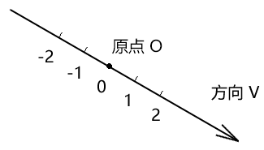
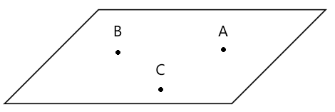
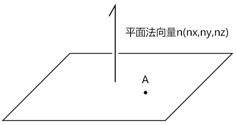
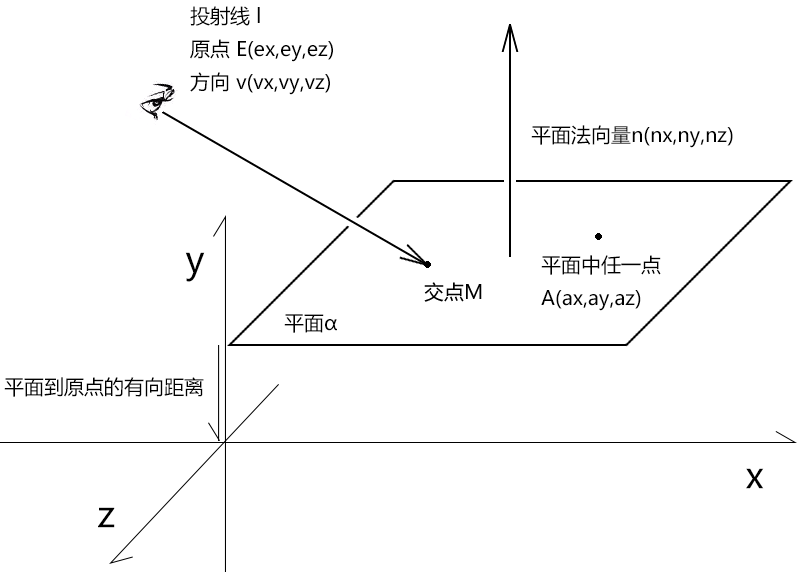
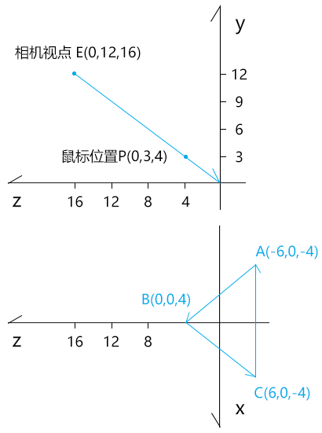
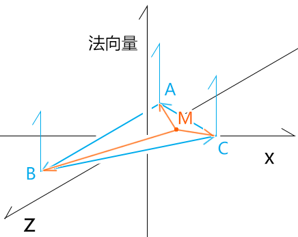

## 案例2-选择三维对象

最近有同学想刷webgl 方向的面试题，图形选择就是面试中出现频率最高的问题。

在上一个案例里，咱们通过图片的变换说了鼠标选择二维图形和顶点的方法。

在接下来这个案例里，咱们就说一下鼠标选择三维图形的方法。

注：我这里所说的二维图形和三维图形都是由三角网构成的。


### 1-选择三维对象的基本原理

首先我们知道几个概念：

- 从相机视点位射向鼠标点可以做一条射线。
- 构成三角形的三个顶点可以确定一个平面。
- 在由三角网构成的三维模型中，选中一个三角形，就是选中了三维模型。

因此，我们要判断鼠标是否选正了模型，就得按以下几步走：

1. 获取从相机视点位射向鼠标点的射线ray。
2. 获取射线ray 与三角形所在的平面的交点M。
3. 判断交点M 是否在三角形中。

为了让大家理解起来更加顺滑，咱们先详细解释一下上面所说的两个概念。


#### 1-1-射线

首先声明，射线和向量不是一回事，虽然它们都有方向。

向量是有方向，有长度的量。

在用坐标位(x,y,z)表示的向量中，其起点就是原点。

比如已知A、B两点，那么向量AB=B-A，其图像性质就是A这个起点最终会被对齐到原点上。

而射线是有方向，长度无限，原点可变的线。

咱们看一下射线的定义。

射线（ray），是指由线段的一端无限延长所形成的线。射线仅有一个端点，无法测量长度。

其图像如下：



我们可以想象手电筒发出的光线：

- 手电筒的位置就是原点O，也是光源的位置，这个位置是可变的。
- 手电筒所照射的方向就是射线的方向v，我们可以转动手电筒，改变射线的方向。

若我们在射线上基于某个基底做刻度，那么：

- 在V 方向上的刻度大小和刻度到原点的距离成正比。
- 在V 的反方向上的刻度大小和刻度到原点的距离成反比。

通过射线的特性，我们可以想到，齐次坐标系里的x、y、z轴就是射线。

在three.js 里就有一个射线对象Ray( origin : Vector3, direction : Vector3 )

- origin 射线原点
- direction 射线方向。


#### 1-2-平面

首先，我们要知道确定一个平面的几种常见方法：

- 不共线的三点确定一个平面   




- 平面法线+平面内任意一点




- 平面法线+平面到原点的有向距离


在three.js 里就有一个平面对象Plane( normal : Vector3, constant : Float)，其构造参数中：

- normal 就是上面的平面法向量，简称法线
- constant 则是平面到原点的有向距离

从此之外，Plane也提供了通过前两种方式建立平面的方法：

- setFromCoplanarPoints ( a : Vector3, b : Vector3, c : Vector3 )  不共线的三点确定平面
- setFromNormalAndCoplanarPoint ( normal : Vector3, point : Vector3 )  平面法线+平面内任意一点确定平面


### 2-射线与平面的交点

在我们计算图形关系的时候，若没有足够的经验和把握，那就建议先中规中矩的把数学解走通。

#### 2-1-数学解





已知：

- 平面α
  - 点A(ax,ay,az)为平面α 中任一点
  - 向量n(nx,ny,nz)为平面α的法向量
- 射线l
  - 射线l 的原点为点E(ex,ey,ez) 
  - 射线l 的方向为v(vx,vy,vz)

求：射线l与平面α的交点M

解：

因为：

α⊥n⇒α 中的所有直线⊥n

(M-A)∈α

所以，由垂直向量的关系得：

```js
(M-A)·n=0 
```

由向量的数乘得：

```js
EM=λ*v
```

所以：

```js
M-E=λ*v
```

因为：

向量的加减运算符合交换律

所以：

```js
M=λv+E
```

接下来求出λ，便可得M 值。

对比上面求出的两个等式：

```js
(M-A)·n=0  ①
M=λv+E     ②
```

- M 是我们最终要求的因变量
- λ 是我们下一步要求的未知数
- 其余的射线方向v、平面法线n、射线原点E，都是已知常量

所以，上面的两个等式就是一个二元一次方程式组，M、λ 就其中的二元。

用消元法把等式②代入等式① 中 消掉M，得到λ：

```js
(λv+E-A)·n=0
λv·n=(A-E)·n
λ=(A-E)·n/v·n
```

将λ 代入等式②中，得到M：

```js
M=((A-E)·n/v·n)*v+E
```

上面的公式便是射线与平面的交点公式了。

数学原理已通，接下来咱们用代码实现一下。


#### 2-2-代码实现

拿勾股定理中的特殊数据举例。



已知：

```js
// 三角形ABC
const A = new Vector3(-6, 0, -4)
const B = new Vector3(0, 0, 4)
const C = new Vector3(6, 0, -4)
// 视点
const E = new Vector3(0, 12, 16)
// 鼠标点
const P = new Vector3(0, 3, 4)
```

求：以相机视点为原点且指向鼠标位置的射线与三角形ABC所在的平面的交点M

解：

通过勾股定理可知，其交点M必然是零点，接下来咱们用代码测一下。

先求一下三角形ABC的法线

```js
const AB = new Vector3().subVectors(B, A)
const BC = new Vector3().subVectors(C, B)
const n = new Vector3().crossVectors(AB, BC)
```

通过视点和鼠标点计算射线方向

```js
const v = new Vector3().subVectors(P, E).normalize()
```

射线与平面的交点公式求交点

```js
// M=((A-E)·n/v·n)*v+E
const M = v.clone().multiplyScalar(
    A.clone().sub(E).dot(n) / v.clone().dot(n)
).add(E)
```

最后输出一下M：

```js
console.log('M', M);
// Vector3 {x: 0, y: -1.7763568394002505e-15, z: -3.552713678800501e-15}
```

上面的y、z分量受到了浮点数的误差影响，不好分辨其具体大小。

我们可以可用取其小数点后5位看看：

```js
console.log(
    M.x.toFixed(5),
    M.y.toFixed(5),
    M.z.toFixed(5)
);
// 0.00000 -0.00000 -0.00000
```

由上可知交点M就是零点。

其实，我们也可以用老办法-three.js 来测试我上面的算法对不对。


#### 2-3-three.js测试

1.用不共线的三点建平面

```js
const plane = new Plane().setFromCoplanarPoints(A, B, C)
```

2.计算射线方向

```js
const v = new Vector3().subVectors(P, E).normalize()
```

3.用基点和射线方向建立射线

```js
const ray = new Ray(E, v)
```

4.用射线对象的intersectPlane() 方法求射线与平面的交点

```js
const M = new Vector3()
ray.intersectPlane(plane, M)
```

5.输出M

```js
console.log('M', M);
//M Vector3 {x: 0, y: 0, z: 0}
```

其交点是零点，与咱们之前算过的一样。

建议大家课后可以看一下three.js 里的相关源码，我这里就不再多说了。

接下来，我们还可以再拿几个在勾股定理之内的特殊高度的三角形来试一下。

比如高度为6、9的三角形：

```js
const A = new Vector3(-6, 6, -4)
const B = new Vector3(0, 6, 4)
const C = new Vector3(6, 6, -4)
```

```js
const A = new Vector3(-6, 9, -4)
const B = new Vector3(0, 9, 4)
const C = new Vector3(6, 9, -4)
```

个人亲测，都是没问题的。

现在，我们知道了射线和三角形所在平面的交点，接下来便可以判断一下这个交点是否在三角形中了。


### 3-在空间中判断点是否在三角形中

之前咱们在二维平面中用叉乘判断过点是否在三角形中，在三维空间中也是要用叉乘来判断的。

只不过，三维向量的叉乘结果还是向量，无法像二维向量的叉乘那样，用一个实数结果判断其大于零还是小于零。

因此，在空间中判断点是否在三角形中，还得再加一步操作。至于这一步是啥，咱们一步步来说。

#### 3-1-代码实现




由上一个例子的三角形ABC和空间点M为已知条件。

判断：点M是否在三角形ABC中

解：

```js
// 三角形
const triangle = [A, B, C]
// 是否在三角形中
function inTriangle(M, triangle) {
    let bool = true
    for (let i = 0; i < 3; i++) {
        const j = (i + 1) % 3
        const [a, b] = [triangle[i], triangle[j]]
        const ma = a.clone().sub(M)
        const ab = b.clone().sub(a)
        const d = ma.clone().cross(ab)
        const len = d.dot(n)
        if (len < 0) {
            bool = false
            break
        }
    }
    return bool
}
const bool = inTriangle(M, triangle)
console.log(bool);
```

详细解释一下上面的inTriangle()方法

1.for 循环遍历三角形的三条边

```js
const j = (i + 1) % 3
const [a, b] = [triangle[i], triangle[j]]
```

2.分别将点和三角形的三条边做叉乘运算

```js
const ma = a.clone().sub(M)
const ab = b.clone().sub(a)
// ma和ab的垂直向量
const d = ma.clone().cross(ab)
```

上面的叉乘结果可以理解为一条垂直向量，此垂直向量垂直三角的三条边，且垂直于M点到三角形三条边的连线。

我们重点要知道，这条垂直向量是有方向的，它可能与三角形的法线同向，也可能与三角形的法线异向。

当M点在三角形中是，M点连接三角形三边得到的垂直向量会有一个特点，要么都在三角形法线的正方向上，要么都与三角形法线的负方向上。

至于什么时候在正方向上，什么时候在负方向上，这跟鼠标点和三角形三条边的连接顺序，以及三角形的绘图顺序有关。

3.判断垂直向量在三角形的哪一侧

```js
const len = d.dot(n)
if (len < 0) {
    bool = false
    break
}
```

在上面，利用两个向量的点积可以将两个向量的方向关系转换为一个实数。

至于其具体原理，在高中课本的点积里有说，我在这里就先简单说一下了。

已知：向量a、b

则：

```
a·b=|a|*|b|*cos<a,b>
cos<a,b>=a·b/|a|*|b|
```

以向量a 为坐标基线，则：

- 当cos<a,b>大于0时，<a,b>∈(-90°,90°)，a在向量b 的正方向上
- 当cos<a,b>小于0时，<a,b>∈(90°,180°)∪(-90°,-180°)，a在向量b 的负方向上

因为，我们之前是按照三角形的绘图顺序让鼠标点与三角形的三条边进行的连接，然后分别求出了三条垂直向量。

所以，当三角形是逆时针画的，且鼠标点在三角形中时，三条垂直向量都在三角形法线的正方向上。

若有一条垂直向量不在三角形法线的正方向上，那就说明M点不在三角形中。

接下来，我们依旧可以用three.js 测试一下。


#### 3-2-three.js 测试

射线对象直接有一个intersectTriangle() 方法，用于判断射线是否穿过了一个三角形。

```js
{
    const plane = new Plane().setFromCoplanarPoints(A, B, C)
    const dir = new Vector3().subVectors(P, E).normalize()
    const ray = new Ray(E, dir)
    const M = new Vector3()
    ray.intersectTriangle(
        A, B, C,
        true,
        M
    )
}
```

intersectTriangle ( a : Vector3, b : Vector3, c : Vector3, backfaceCulling : Boolean, target : Vector3 )

- a, b, c - 组成三角形的三个Vector3。
- backfaceCulling - 是否使用背面剔除。
- target — 结果将会被复制到这一Vector3中。

注：使用intersectTriangle()方法时，若射线没有穿过三角形，会返回零点。这个有点坑，万一射线和三角形的交点就是零点，那就没法判断射线有没有穿过三角形了。

接下来，咱们整体的举一个鼠标选择立方体的例子。


### 4-鼠标选择立方体

在这个案例中所涉及的知识点我们以前都说过，所以咱们直接上代码。

之前咱们用顶点索引画过一个彩色的立方体，咱们就在这基础上做选择了。

#### 4-1-声明必备变量

先将投影视图矩阵、顶点集合和顶点索引提取出来，以备后用。

```js
// 投影视图矩阵
const pvMatrix = new Matrix4()

// 旋转状态
let selected = false
    
// 顶点集合
const vertices = new Float32Array([
    1, 1, 1,
    -1, 1, 1,
    -1, -1, 1,
    1, -1, 1,
    1, -1, -1,
    1, 1, -1,
    -1, 1, -1,
    -1, -1, -1,
])

// 顶点索引
const indexes = new Uint8Array([
    0, 1, 2, 0, 2, 3,    // front
    0, 3, 4, 0, 4, 5,    // right
    0, 5, 6, 0, 6, 1,    // up
    1, 6, 7, 1, 7, 2,    // left
    7, 4, 3, 7, 3, 2,    // down
    4, 7, 6, 4, 6, 5     // back
])
```


#### 4-2-鼠标移动事件

在鼠标移动的时候，更新投影视图矩阵，并选择对象。

```js
canvas.addEventListener('pointermove', event => {
    orbit.pointermove(event)
    pvMatrix.copy(orbit.getPvMatrix())
    selectObj(event)
})
```

我们重点看一下选择对象的方法selectObj(event)

```js
function selectObj(event) {
    // 鼠标世界位
    const mp = worldPos(event)
    // 射线
    const ray = new Ray(camera.position).lookAt(mp)
    // 选择状态
    selected = false
    // 遍历三维对象里的所有三角形
    for (let i = 0; i < indexes.length; i += 3) {
        //三角形
        const triangle = [
            getVector3(indexes[i]),
            getVector3(indexes[i + 1]),
            getVector3(indexes[i + 2]),
        ]
        //射线与三角形的交点。若有交点，返回交点；若无交点返回null
        const interPos = intersectTriangle(ray, triangle)
        //只要一个三角形被选中，则三维对象被选中
        if (interPos) {
            selected = true
            break
        }
    }
}
```


1.worldPos()获取鼠标世界位，这个方法咱们之前在基点变换中写过

```js
function worldPos({ clientX, clientY }) {
    const [hw, hh] = [canvas.width / 2, canvas.height / 2]
    // 裁剪空间位
    const cp = new Vector3(
        (clientX - hw) / hw,
        -(clientY - hh) / hh,
        0
    )
    // 鼠标在世界坐标系中的位置
    return cp.applyMatrix4(
        pvMatrix.clone().invert()
    )
}
```


2.建立射线的Ray对象是three.js里的，其lookAt()方法可以让射线射向某个点位，从而改变射线的方向。

```js
const ray = new Ray(camera.position).lookAt(mp)
```


3.变量立方体中的所有三角形的时候，是先以三个点位单位遍历的顶点索引，然后再基于顶点索引从顶点集合中寻找相应的顶点数据。

```js
for (let i = 0; i < indexes.length; i += 3) {
    //三角形
    const triangle = [
        getVector3(indexes[i]),
        getVector3(indexes[i + 1]),
        getVector3(indexes[i + 2]),
    ]
    ……
}
```

- getVector3() 基于顶点索引从顶点集合中寻找相应的顶点数据

```js
function getVector3(j) {
    const i = j * 3
    return new Vector3(
        vertices[i],
        vertices[i + 1],
        vertices[i + 2]
    )
}
```


4.获取射线与三角形的交点。若有交点，返回交点；若无交点返回null

```js
const interPos = intersectTriangle(ray, triangle)
```

- intersectTriangle() 方法的实现原理，咱们之前已经写过

```js
function intersectTriangle(ray, triangle) {
    const { origin: E, direction: v } = ray
    const [A, B, C] = triangle
    // 三角形的法线
    const AB = new Vector3().subVectors(B, A)
    const BC = new Vector3().subVectors(C, B)
    const n = new Vector3().crossVectors(AB, BC)

    // 射线和平面的交点
    const M = v.clone().multiplyScalar(
        A.clone().sub(E).dot(n) / v.clone().dot(n)
    ).add(E)

    // 判断点M是否在三角形中
    let bool = true
    for (let i = 0; i < 3; i++) {
        const j = (i + 1) % 3
        const [a, b] = [triangle[i], triangle[j]]
        const ma = a.clone().sub(M)
        const ab = b.clone().sub(a)
        const d = ma.clone().cross(ab)
        const len = d.dot(n)
        if (len < 0) {
            bool = false
            break
        }
    }
    if (bool) {
        return M
    } else {
        return null
    }
}
```


5.更新选择状态，只要一个三角形被选中，则三维对象被选中

```js
if (interPos) {
    selected = true
    break
}
```

鼠标选择三维对象的基本原理就是这样。

以前，我遇到一个需求：场景里有一架大风车，当用户把鼠标放在风车的风扇上时，风扇就转动。

接下来，咱们就把这个立方体当成风扇，当鼠标放上去的时候，风扇既能转动，还能变色。


6.声明必备变量

```js
// 模型矩阵
const modelMatrix = new Matrix4()
// 插值-用于修改片元颜色
let time = 0
// 弧度-用于旋转模型矩阵
let ang = 0
```


7.在获取顶点的时候，用模型矩阵将其转换成世界位

```js
function getVector3(j) {
    const i = j * 3
    return new Vector3(
        vertices[i],
        vertices[i + 1],
        vertices[i + 2]
    ).applyMatrix4(modelMatrix)
}
```

我们之前强调过，判断图形关系的时候，一定要统一坐标系。

之前我们获取的鼠标位是世界位，所以模型顶点也一定要是世界位。


8.在连续渲染的时候，若鼠标选中了对象，就让立方体既能旋转，也能变色。

```js
!(function ani() {
    scene.setUniform(
        'u_PvMatrix',
        pvMatrix.elements
    )
    if (selected) {
        time += 20
        ang += 0.05
        mat.setData('u_Time',{value: time})
        mat.setData(
            'u_ModelMatrix',
            {
                value: new Matrix4().makeRotationY(ang).elements
            }
        )
    }
    scene.draw()
    requestAnimationFrame(ani)
})()
```

关于三维对象的旋转，咱们就说到这。

我当前所说的都是底层原理，虽然也有现成的轮子能快速实现，但在复杂多变的图形项目中，轮子与汽车不匹配的情况会必然存在。

理解了底层原理后，才能让整个项目运转自然。


