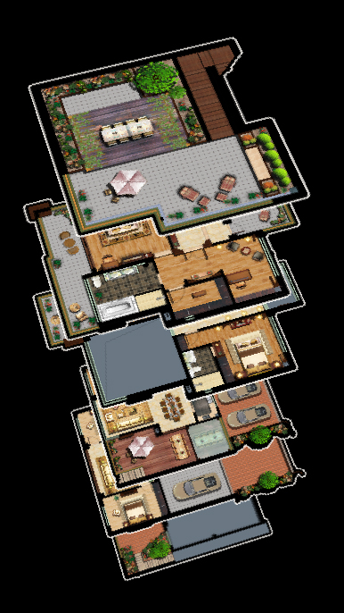
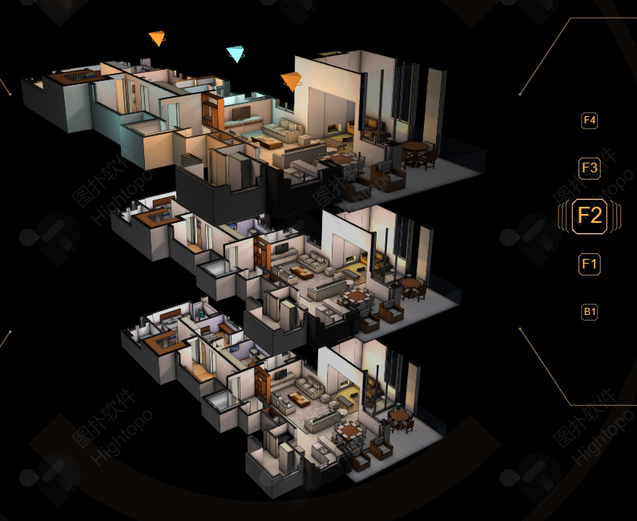

## 案例3-别墅室内布局图

接下来，我们要做一栋别墅室内布局图的空间展示。




此案例会每隔一段时间，依次对楼层进行特写。

楼层的特写要通过两个矩阵实现：

- 模型矩阵：让当前楼层向前一步走，然后放大。
- 视图矩阵：把镜头拉向当前楼层。

上面的效果不是瞬间完成的，它还需要一个补间动画去过渡。

因此，在这个案例里，我们重点要说的知识点是相机轨道的补间动画。

相机轨道的补间动画，是我们实际工作中不可避免的。

我们可以想象到许许多多与之相关的场景。

比如在4s店里，一辆汽车模型的展示。我可以通过一个交互操作，将相机从外部打入内部，看一下汽车的内部结构。

接下来，咱们就先完善一下之前的webgl 框架，以方便我们更好的去举例子。


### 1-完善webgl 框架

我们当前这个webgl 框架是以需求为驱动的，没有一下子跟大家说得尽善尽美，那样会有太多功能用不上，也不好理解。

在我们对其做进一步完善之前，先通过一个例子回顾一下当前webgl 框架的运作原理。

已知：

- 程序点对象A，属于此程序对象的三维对象有两个
  - 三维对象A1
  - 三维对象A2
- 程序点对象B，属于此程序对象的三维对象有两个
  - 三维对象B1
  - 三维对象B2

绘图逻辑：

1. 清理画布

2. 绘制三维对象A1
  - 应用程序对象A
  - 更新attribute 变量
  - 更新uniform 变量
  - 绘图

3. 绘制三维对象A2
  - 应用程序对象A
  - 更新attribute 变量
  - 更新uniform 变量
  - 绘图

4. 绘制三维对象B1
  - 应用程序对象B
  - 更新attribute 变量
  - 更新uniform 变量
  - 绘图

5. 绘制三维对象B2
  - 应用程序对象B
  - 更新attribute 变量
  - 更新uniform 变量
  - 绘图

观察上面的绘图逻辑，我们可以知道：

- 同一材质的三维对象，可以共用以下数据：
  - 程序对象
  - attribute变量名
  - uniform 变量名
- 不同的三维对象，独立具备以下数据：
  - attribute 数据
  - uniform 数据
  - buffer 缓冲区对象

因此我们可以将材质提取出来，相同材质的对象一起渲染，逻辑如下：

1. 清理画布

2. 应用程序对象A

   - 绘制三维对象A1

   - 绘制三维对象A2

3. 应用程序对象B

   - 绘制三维对象B1

   - 绘制三维对象B2

上面便是基本的优化思路，接下来咱们用代码写一下。


#### 1-1-Scene 场景对象

整体代码

```js
const defAttr = () => ({
  gl:null,
  children: new Set(),
  programs:new Map(),
  children2Draw: new Set(),
})
export default class Scene{
  constructor(attr){
    Object.assign(this,defAttr(),attr)
  }
  registerProgram(name, { program, attributeNames, uniformNames}) {
    const { gl,programs } = this
    const attributes = new Map()
    const uniforms = new Map()
    gl.useProgram(program)
    attributeNames.forEach(name => {
      attributes.set(name,gl.getAttribLocation(program, name))
    })
    uniformNames.forEach(name => {
      uniforms.set(name,gl.getUniformLocation(program, name))
    })
    programs.set(name,{program,attributes,uniforms})
  }
  add(...objs) {
    this.children=new Set([...this.children,...objs])
    this.setObjs(objs)
  }
  unshift(...objs) {
    this.children=new Set([...objs,...this.children,])
    this.setObjs(objs)
  }
  setObjs(objs) {
    objs.forEach(obj => {
      obj.parent=this
      obj.init(this.gl)
    })
    this.updateChildren2Draw()
  }
  remove(obj) {
    this.children.delete(obj)
    this.updateChildren2Draw()
  }
  updateChildren2Draw() {
    const { children} = this
    if (!children.size) { return }
    const children2Draw = new Map()
    children.forEach(child => {
      const { program:name } = child.mat
      if (children2Draw.has(name)) {
        children2Draw.get(name).add(child)
      } else {
        children2Draw.set(name, new Set([child]))
      }
    })
    this.children2Draw=children2Draw
  }
  setUniform(key, val) {
    this.children.forEach(({ mat }) => {
      mat.setData(key,val)
    })
  }
  draw() {
    const {gl,children2Draw,programs}=this
    gl.clear(gl.COLOR_BUFFER_BIT)
    for(let [key,objs] of children2Draw.entries()){
      const { program, attributes, uniforms } = programs.get(key)
      gl.useProgram(program)
      objs.forEach(obj => {
        const { geo: { drawType,count},mat:{mode}}=obj
        obj.update(gl, attributes, uniforms)
        if (typeof mode === 'string') {
          this[drawType](gl,count,mode)
        } else {
          mode.forEach(m => {
            this[drawType](gl,count,m)
          })
        }
      })
    }
  }
  drawArrays(gl, count, mode) {
    gl.drawArrays(gl[mode],0,count)
  }
  drawElements(gl, count, mode) {
    gl.drawElements(gl[mode],count,gl.UNSIGNED_BYTE,0)
  }
}
```


1.默认属性

```js
const defAttr = () => ({
  gl:null,
  children: new Set(),
  programs:new Map(),
  children2Draw: new Map(),
})
```

- children 变成了Set对象，以避免三维对象的重复添加。
- programs 程序对象集合

```js
{
  程序对象的名称:{
    program:程序对象,
    attributes:attribute变量名集合
    uniforms:uniform变量名集合
  }
}
```

- children2Draw 用于绘图的程序对象和三维对象的集合，数据结构如下：

```js
{
  程序对象的名称:[属于此程序对象的所有三维对象]
}
```


2.建立一个注册程序对象的方法，方便将具有相同程序对象的三维对象一起渲染。

```js
registerProgram(name, { program, attributeNames, uniformNames}) {
  const { gl,programs } = this
  const attributes = new Map()
  const uniforms = new Map()
  gl.useProgram(program)
  attributeNames.forEach(name => {
    attributes.set(name,gl.getAttribLocation(program, name))
  })
  uniformNames.forEach(name => {
    uniforms.set(name,gl.getUniformLocation(program, name))
  })
  programs.set(name,{program,attributes,uniforms})
}
```

- name：程序对象的名称
- option：{}
  - program：程序对象
  - attributeNames：attribute变量名集合，如['a_Position','a_Pin',……]
  - uniformNames：uniform变量名集合，如['u_PvMatrix','u_ModelMatrix',……]


3.之前的init 初始化方法可以删掉了，因为Scene对象的registerProgram方法和Object 对象的init() 方法已经分摊了此功能。


4.增删三维对象，其原理和之前一样

```js
add(...objs) {
    this.children=new Set([...this.children,...objs])
    this.setObjs(objs)
}
unshift(...objs) {
    this.children=new Set([...objs,...this.children,])
    this.setObjs(objs)
}
setObjs(objs) {
    objs.forEach(obj => {
        obj.parent=this
        obj.init(this.gl)
    })
    this.updateChildren2Draw()
}
remove(obj) {
    this.children.delete(obj)
    this.updateChildren2Draw()
}
```

在增删三维对象时，需要同步更新children2Draw 集合

```js
updateChildren2Draw() {
  const { children} = this
  if (!children.size) { return }
  const children2Draw = new Map()
  children.forEach(child => {
    const { program:name } = child.mat
    if (children2Draw.has(name)) {
      children2Draw.get(name).add(child)
    } else {
      children2Draw.set(name, new Set([child]))
    }
  })
  this.children2Draw=children2Draw
}
```


5.批量设置所有模型的uniform 变量

```js
setUniform(key, val) {
    this.children.forEach(({ mat }) => {
        mat.setData(key,val)
    })
}
```


6.绘图

```js
draw() {
  const {gl,children2Draw,programs}=this
  gl.clear(gl.COLOR_BUFFER_BIT)
  for(let [key,objs] of children2Draw.entries()){
    const { program, attributes, uniforms } = programs.get(key)
    gl.useProgram(program)
    objs.forEach(obj => {
      const { geo: { drawType,count},mat:{mode}}=obj
      obj.update(gl, attributes, uniforms)
      if (typeof mode === 'string') {
        this[drawType](gl,count,mode)
      } else {
        mode.forEach(m => {
          this[drawType](gl,count,m)
        })
      }
    })
  }
}
drawArrays(gl, count, mode) {
  gl.drawArrays(gl[mode],0,count)
}
drawElements(gl, count, mode) {
  gl.drawElements(gl[mode],count,gl.UNSIGNED_BYTE,0)
}
```


#### 1-2-Geo 几何体对象

整体代码：

```js
const defAttr = () => ({
  data: {},
  count: 0,
  index: null,
  drawType:'drawArrays'
})
export default class Geo{
  constructor(attr){
    Object.assign(this,defAttr(),attr)
  }
  init(gl){
    this.initData(gl)
    this.initIndex(gl)
  }
  initData(gl) {
    for (let attr of Object.values(this.data)) {
      attr.buffer = gl.createBuffer()
      gl.bindBuffer(gl.ARRAY_BUFFER, attr.buffer)
      gl.bufferData(gl.ARRAY_BUFFER, attr.array, gl.STATIC_DRAW)
      gl.bindBuffer(gl.ARRAY_BUFFER, null)
      attr.needUpdate=true
    }
  }
  initIndex(gl) {
    const { index } = this
    if (index) {
      this.count = index.array.length
      this.drawType='drawElements'
      index.buffer = gl.createBuffer()
      gl.bindBuffer(gl.ELEMENT_ARRAY_BUFFER,index.buffer)
      gl.bufferData(gl.ELEMENT_ARRAY_BUFFER, index.array, gl.STATIC_DRAW)
      gl.bindBuffer(gl.ELEMENT_ARRAY_BUFFER, null)
      index.needUpdate=true
    } else {
      const { array, size } = this.data['a_Position']
      this.count = array.length / size
      this.drawType='drawArrays'
    }
  }
  update(gl,attrs) {
    this.updateData(gl,attrs)
    this.updateIndex(gl,attrs)
  }
  updateData(gl,attrs) {
    for (let [key,attr] of Object.entries(this.data)) {
      const { buffer, size, needUpdate, array } = attr
      const location=attrs.get(key)
      gl.bindBuffer(gl.ARRAY_BUFFER,buffer)
      if (needUpdate) {
        attr.needUpdate = false
        gl.bufferData(gl.ARRAY_BUFFER,array,gl.STATIC_DRAW)
      }
      gl.vertexAttribPointer(location, size, gl.FLOAT, false, 0, 0)
      gl.enableVertexAttribArray(location)
    }
  }
  updateIndex(gl) {
    const { index } = this
    if (index) {
      gl.bindBuffer(gl.ELEMENT_ARRAY_BUFFER,index.buffer)
      if (index.needUpdate) {
        index.needUpdate = false
        gl.bufferData(gl.ELEMENT_ARRAY_BUFFER,index.array,gl.STATIC_DRAW)
      }
    }
  }
  setData(key,val) {
    const obj = this.data[key]
    if(!obj){return}
    obj.needUpdate = true
    Object.assign(obj,val)
  }
  setIndex(val) {
    const { index } = this
    if (val) {
      index.needUpdate = true
      index.array=val
      this.count = val.length
      this.drawType='drawElements'
    } else {
      const {array,size}=this.data['a_Position']
      this.count=array.length/size
      this.drawType='drawArrays'
    }
  }
}
```

解释一下上面的代码。


1.初始化方法

- 删掉之前的useProgram 方法，因为此方法已经在Scene对象中统一执行。
- 在初始化方法中，只建立存储attribute 数据和顶点索引集合的WebGLBuffer 缓冲区。

```js
init(gl){
  this.initData(gl)
  this.initIndex(gl)
}
initData(gl) {
  for (let attr of Object.values(this.data)) {
    attr.buffer = gl.createBuffer()
    gl.bindBuffer(gl.ARRAY_BUFFER, attr.buffer)
    gl.bufferData(gl.ARRAY_BUFFER, attr.array, gl.STATIC_DRAW)
    gl.bindBuffer(gl.ARRAY_BUFFER, null)
    attr.needUpdate=true
  }
}
initIndex(gl) {
  const { index } = this
  if (index) {
    this.count = index.array.length
    this.drawType='drawElements'
    index.buffer = gl.createBuffer()
    gl.bindBuffer(gl.ELEMENT_ARRAY_BUFFER,index.buffer)
    gl.bufferData(gl.ELEMENT_ARRAY_BUFFER, index.array, gl.STATIC_DRAW)
    gl.bindBuffer(gl.ELEMENT_ARRAY_BUFFER, null)
    index.needUpdate=true
  } else {
    const { array, size } = this.data['a_Position']
    this.count = array.length / size
    this.drawType='drawArrays'
  }
}
```


2.更新方法和之前的差异不大。在更新attribute 数据时，location需要从Scene 对象的programs中获取。

```js
update(gl,attrs) {
  this.updateData(gl,attrs)
  this.updateIndex(gl,attrs)
}
updateData(gl,attrs) {
  for (let [key,attr] of Object.entries(this.data)) {
    const { buffer, size, needUpdate, array } = attr
    const location=attrs.get(key)
    gl.bindBuffer(gl.ARRAY_BUFFER,buffer)
    if (needUpdate) {
      attr.needUpdate = false
      gl.bufferData(gl.ARRAY_BUFFER,array,gl.STATIC_DRAW)
    }
    gl.vertexAttribPointer(location, size, gl.FLOAT, false, 0, 0)
    gl.enableVertexAttribArray(location)
  }
}
updateIndex(gl) {
  const { index } = this
  if (index) {
    gl.bindBuffer(gl.ELEMENT_ARRAY_BUFFER,index.buffer)
    if (index.needUpdate) {
      index.needUpdate = false
      gl.bufferData(gl.ELEMENT_ARRAY_BUFFER,index.array,gl.STATIC_DRAW)
    }
  }
}
```


3.设置attribute 数据和索引集合的方法和之前一样。


#### 1-3-Mat 材质对象

整体代码。

```js
const defAttr = () => ({
  program:'', 
  data: {},
  mode: 'TRIANGLES',
  maps: {},
})
export default class Mat{
  constructor(attr){
    Object.assign(this,defAttr(),attr)
  }
  init(gl) {
    Object.values(this.maps).forEach((map, ind) => {
      map.texture = gl.createTexture()
      this.updateMap(gl, map, ind)
    })
  }
  updateMap(gl,map, ind) {
    const {
      format = gl.RGB,
      image,
      wrapS,
      wrapT,
      magFilter,
      minFilter,
    } = map
    gl.pixelStorei(gl.UNPACK_FLIP_Y_WEBGL, 1)
    gl.activeTexture(gl[`TEXTURE${ind}`])
    gl.bindTexture(gl.TEXTURE_2D, map.texture)
    gl.texImage2D(
      gl.TEXTURE_2D,
      0,
      format,
      format,
      gl.UNSIGNED_BYTE,
      image
    )
    wrapS&&gl.texParameteri(
      gl.TEXTURE_2D,
      gl.TEXTURE_WRAP_S,
      wrapS
    )
    wrapT&&gl.texParameteri(
      gl.TEXTURE_2D,
      gl.TEXTURE_WRAP_T,
      wrapT
    )
    magFilter&&gl.texParameteri(
      gl.TEXTURE_2D,
      gl.TEXTURE_MAG_FILTER,
      magFilter
    )
    if (!minFilter || minFilter > 9729) {
      gl.generateMipmap(gl.TEXTURE_2D)
    }
    minFilter&&gl.texParameteri(
      gl.TEXTURE_2D,
      gl.TEXTURE_MIN_FILTER,
      minFilter
    )
    gl.bindTexture(gl.TEXTURE_2D, null)
  }
  update(gl,uniforms) {
    this.updateData(gl,uniforms)
    this.updateMaps(gl,uniforms)
  }
  updateData(gl,uniforms) {
    for (let [key,obj] of Object.entries(this.data)) {
      const location = uniforms.get(key)
      const { type, value } = obj
      if (type.includes('Matrix')) {
        gl[type](location,false,value)
      } else {
        gl[type](location,value)
      }
    }
  }
  updateMaps(gl,uniforms) {
    Object.entries(this.maps).forEach((arr, ind) => {
      const [key,map]=arr
      if (map.needUpdate) {
        map.needUpdate=false
        this.updateMap(gl,map, ind)
      } else {
        gl.bindTexture(gl.TEXTURE_2D, map.texture)
      }
      gl.uniform1i(uniforms.get(key), ind)
    })
  }
  setData(key,val) {
    const obj = this.data[key]
    if(!obj){return}
    Object.assign(obj,val)
  }
  setMap(key, val) {
    const obj = this.maps[key]
    if (!obj) { return }
    obj.needUpdate=true
    Object.assign(obj,val)
  }
}
```

解释一下上面的代码。


1.在默认属性中，program属性对应程序对象的注册名，实际的程序对象需要通过注册名从Scene对象的programs 中获取。

```js
const defAttr = () => ({
  program:'', 
  data: {},
  mode: 'TRIANGLES',
  maps: {},
})
```


2.改变默认属性中data 的数据结构。

之前data 的数据结果如下：

```js
{
  u_Color: {
    value:1,
    type: 'uniform1f',    
    location:null,
    needUpdate:true,
  },
  ……    
}
```

- location 已经放在了Scene 对象的programs中，所以可以删掉。

- needUpdate 只适用于一个程序对象对应一个三维对象的情况。

  在一个程序对象对应多个三维对象的时候，在每个三维对象绘制前，都需要更新uniform数据。

  所以，needUpdate 刻意删掉
  
  

3.在maps 数据结构中，写入texture和needUpdate 属性，让贴图在需要更新的时候再更新。

```js
{
  u_Sampler:{
    image,
    format,
    wrapS,
    wrapT,
    magFilter,
    minFilter,
    texture,  
    needUpdate,
  },
  ……
}
```


4.在初始化方法中，只对贴图数据做一下缓存。

```js
init(gl) {
  Object.values(this.maps).forEach((map, ind) => {
    map.texture = gl.createTexture()
    this.updateMap(gl, map, ind)
  })
}
```

updateMap()更新贴图的方法会设置WebGLTexture 对象的各种属性。

```js
updateMap(gl,map, ind) {
  const {
    format = gl.RGB,
    image,
    wrapS,
    wrapT,
    magFilter,
    minFilter,
  } = map
  gl.pixelStorei(gl.UNPACK_FLIP_Y_WEBGL, 1)
  gl.activeTexture(gl[`TEXTURE${ind}`])
  gl.bindTexture(gl.TEXTURE_2D, map.texture)
  gl.texImage2D(
    gl.TEXTURE_2D,
    0,
    format,
    format,
    gl.UNSIGNED_BYTE,
    image
  )
  wrapS&&gl.texParameteri(
    gl.TEXTURE_2D,
    gl.TEXTURE_WRAP_S,
    wrapS
  )
  wrapT&&gl.texParameteri(
    gl.TEXTURE_2D,
    gl.TEXTURE_WRAP_T,
    wrapT
  )
  magFilter&&gl.texParameteri(
    gl.TEXTURE_2D,
    gl.TEXTURE_MAG_FILTER,
    magFilter
  )
  if (!minFilter || minFilter > 9729) {
    gl.generateMipmap(gl.TEXTURE_2D)
  }
  minFilter&&gl.texParameteri(
    gl.TEXTURE_2D,
    gl.TEXTURE_MIN_FILTER,
    minFilter
  )
  gl.bindTexture(gl.TEXTURE_2D, null)
}
```


5.更新方法

```js
update(gl,uniforms) {
  this.updateData(gl,uniforms)
  this.updateMaps(gl,uniforms)
}
updateData(gl,uniforms) {
  for (let [key,obj] of Object.entries(this.data)) {
    const location = uniforms.get(key)
    const { type, value } = obj
    if (type.includes('Matrix')) {
      gl[type](location,false,value)
    } else {
      gl[type](location,value)
    }
  }
}
updateMaps(gl,uniforms) {
  Object.entries(this.maps).forEach((arr, ind) => {
    const [key,map]=arr
    if (map.needUpdate) {
      map.needUpdate=false
      this.updateMap(gl,map, ind)
    } else {
      gl.bindTexture(gl.TEXTURE_2D, map.texture)
    }
    gl.uniform1i(uniforms.get(key), ind)
  })
}
```


6.设置uniform数据和贴图数据的方法

```js
setData(key,val) {
  const obj = this.data[key]
  if(!obj){return}
  Object.assign(obj,val)
}
setMap(key, val) {
  const obj = this.maps[key]
  if (!obj) { return }
  obj.needUpdate=true
  Object.assign(obj,val)
}
```


#### 1-4-Obj3D 三维对象

Obj3D 三维对象的整体代码和之前的差异不大。

```js
const defAttr = () => ({
  geo:null,
  mat:null,
})
export default class Obj3D{
  constructor(attr){
    Object.assign(this,defAttr(),attr)
  }
  init(gl){
    this.geo.init(gl)
    this.mat.init(gl)
  }
  update(gl,attributes,uniforms) {
    this.geo.update(gl,attributes)
    this.mat.update(gl,uniforms)
  }
}
```


对于webgl框架的搭建，大家简单理解一下其实现原理和过程就可以了。

我并不建议大家在webgl框架刻意花费太多的时间，原因有两点：

- 与webgl框架相比，图形学才是重点。因为我们若不懂图形学，是无法灵活驾驭three.js 这种现有框架的。
- 未来WebGPU 会替代WebGL。


### 2-绘制别墅的楼层布局图

当前这栋别墅有六层楼，咱们先将这六层楼的布局图画出来。

1.着色器

```html
<script id="vs" type="x-shader/x-vertex">
    attribute vec4 a_Position;
    attribute vec2 a_Pin;
    uniform mat4 u_PvMatrix;
    uniform mat4 u_ModelMatrix;
    varying vec2 v_Pin;
    void main(){
      gl_Position = u_PvMatrix*u_ModelMatrix*a_Position;
      v_Pin=a_Pin;
    }
</script>
<script id="fs" type="x-shader/x-fragment">
    precision mediump float;
    uniform sampler2D u_Sampler;
    varying vec2 v_Pin;
    void main(){
      gl_FragColor=texture2D(u_Sampler,v_Pin);
    }
</script>
```


2.引入各种组件

```js
import { createProgram, imgPromise } from '/jsm/Utils.js';
import { Matrix4, PerspectiveCamera, Vector3 } from 'https://unpkg.com/three/build/three.module.js';
import OrbitControls from './jsm/OrbitControls.js'
import Mat from './jsm/Mat.js'
import Geo from './jsm/Geo.js'
import Obj3D from './jsm/Obj3D.js'
import Scene from './jsm/Scene.js'
```


3.获取webgl上下文对象，设置其清理画布的颜色，开启深度测试和透明度。

```js
const canvas = document.getElementById('canvas');
canvas.width = window.innerWidth;
canvas.height = window.innerHeight;
let gl = canvas.getContext('webgl');
gl.clearColor(0, 0, 0, 1);
gl.enable(gl.BLEND);
gl.blendFunc(gl.SRC_ALPHA, gl.ONE_MINUS_SRC_ALPHA);
gl.enable(gl.DEPTH_TEST);
```


4.建立加载图片的promise集合，等所有图片都加载成功后再渲染。

```js
const promises = [-2, -1, 1, 2, 3, 4].map(ele => {
  const image = new Image()
  image.src = `./images/${ele}.png`
  return imgPromise(image)
})
```


5.声明每层楼之间的高度

```js
// 层高
const fh = 0.5
```


6.建立轨道控制器

```js
//视点相对于目标点的位置
const dist = new Vector3(-0.5, 2.8, 1.5)
// 目标点
const target = new Vector3(0, 2, 0.6)
//视点
const eye = target.clone().add(dist)
const [fov, aspect, near, far] = [
  45, canvas.width / canvas.height,
  1, 20
]
// 透视相机
const camera = new PerspectiveCamera(fov, aspect, near, far)
camera.position.copy(eye)
// 轨道控制器
const orbit = new OrbitControls({ camera, target, dom: canvas, })
```


7.建立场景对象，然后注册程序对象。

```js
// 场景
const scene = new Scene({ gl })
// 注册程序对象
scene.registerProgram(
  'img',
  {
    program: createProgram(
      gl,
      document.getElementById('vs').innerText,
      document.getElementById('fs').innerText
    ),
    attributeNames: ['a_Position', 'a_Pin'],
    uniformNames: ['u_PvMatrix', 'u_ModelMatrix', 'u_Sampler']
  }
)
```


8.当所有图片都加载成功后再绘图

```js
Promise.all(promises).then(imgs => {
  imgs.forEach((img, ind) => scene.add(crtObj(img, ind)))
  render()
});
```


- crtObj(img, ind)  基于图片和图片索引建立三维对象

```js
function crtObj(image, ind) {
  const y = fh * ind
  const modelMatrix = new Matrix4()
  modelMatrix.elements[13] = y
  const mat = new Mat({
    program: 'img',
    data: {
      u_PvMatrix: {
        value: orbit.getPvMatrix().elements,
        type: 'uniformMatrix4fv',
      },
      u_ModelMatrix: {
        value: modelMatrix.elements,
        type: 'uniformMatrix4fv',
      },
    },
    maps: {
      u_Sampler: {
        image,
        format: gl.RGBA
      }
    },
    mode: 'TRIANGLE_STRIP'
  })
  const geo = new Geo({
    data: {
      a_Position: {
        array: new Float32Array([
          -0.5, 0, 0.5,
          -0.5, 0, -0.5,
          0.5, 0, 0.5,
          0.5, 0, -0.5,
        ]),
        size: 3
      },
      a_Pin: {
        array: new Float32Array([
          0, 0,
          0, 1,
          1, 0,
          1, 1,
        ]),
        size: 2
      }
    }
  })
  return new Obj3D({ geo, mat })
}
```


- render() 连续渲染方法

```js
function render() {
  scene.setUniform('u_PvMatrix', {
    value: orbit.getPvMatrix().elements
  })
  scene.draw()
  requestAnimationFrame(render)
}
```


9.orbit轨道控制器的交互事件和之前都一样

```js
/* 取消右击菜单的显示 */
canvas.addEventListener('contextmenu', event => {
  event.preventDefault()
})
/* 指针按下时，设置拖拽起始位，获取轨道控制器状态。 */
canvas.addEventListener('pointerdown', event => {
  orbit.pointerdown(event)
})
/* 指针移动时，若控制器处于平移状态，平移相机；若控制器处于旋转状态，旋转相机。 */
canvas.addEventListener('pointermove', event => {
  orbit.pointermove(event)
})
/* 指针抬起 */
canvas.addEventListener('pointerup', event => {
  orbit.pointerup(event)
})
/* 滚轮事件 */
canvas.addEventListener('wheel', event => {
  orbit.wheel(event)
})
```

最终效果如下：


场景已经搭建完成，接下来就要考虑别墅楼层的切换动画了。

别墅楼层的切换，需要一个通过手动设置视点和目标点更新相机轨道的功能。

当前我们自己写的OrbitControls 还有点瑕疵，无法实现此功能，所以需要完善一下。


### 3-完善相机轨道控制器

先回顾一下当前相机轨道控制器的更新方法：

```js
update() {
  const {camera,target,spherical,panOffset} = this
  //基于平移量平移相机
  target.add(panOffset)
  camera.position.add(panOffset)

  //基于球坐标缩放相机
  const rotateOffset = new Vector3()
  .setFromSpherical(spherical)
  camera.position.copy(
    target.clone().add(rotateOffset)
  )

  //更新投影视图矩阵
  camera.lookAt(target)
  camera.updateMatrixWorld(true)

  //重置旋转量和平移量
  spherical.setFromVector3(
    camera.position.clone().sub(target)
  )
  panOffset.set(0, 0, 0)
}
```


上面的基于平移量平移相机，实际上是没意义的。因为相机位置会被后面的球坐标重写。

1.我们若想让相机目标点和视点位置影响轨道控制器，那就得把这个更新方法拆分一下。

```js
//基于平移量更新相机轨道
updatePos() {
  const {camera,target,spherical,panOffset} = this
  target.add(panOffset)
  camera.position.add(panOffset)
  this.updateCamera()
  // 重置偏移量
  this.panOffset.set(0, 0, 0)
}
//基于球坐标更新相机轨道
updateSph() {
  const {camera,target,spherical,panOffset} = this
  const rotateOffset = new Vector3()
  .setFromSpherical(spherical)
  camera.position.copy(
    target.clone().add(rotateOffset)
  )
  this.updateCamera()
  // 重置球坐标
  this.resetSpherical()
}
//更新投影视图矩阵
updateCamera() {
  const {camera,target} = this
  camera.lookAt(target)
  camera.updateMatrixWorld(true)
}
//重置球坐标
resetSpherical() {
  const {spherical,camera,target}=this
  spherical.setFromVector3(
    camera.position.clone().sub(target)
  )
}
```


2.在相机轨道的平移方法中调用updatePos() 方法

```js
panPerspectiveCamera({ x, y }) {
  ……
  this.updatePos()
}

panOrthographicCamera({ x, y }) {
  ……
  this.updatePos()
}
```


3.在相机轨道的缩放和旋转方法中调用updateSph() 方法

```js
dollyPerspectiveCamera(dollyScale) {
  ……
  this.updateSph()
}
dollyOrthographicCamera(dollyScale) {
  ……
  this.updateSph()
}
rotate({ x, y }) {
  ……
  this.updateSph()
}
```


4.构造函数

```js
constructor(attr){
  Object.assign(this, defAttr(), attr)
  this.resetSpherical()
  this.updateCamera()
}
```

关于相机轨道的完善我们就说到这，自己造轮子的好处就是可以基于自己的功能需求随时调整。

接下来我们去做补间动画。


### 4-相机轨道的补间动画

1.引入合成对象和轨道对象

```js
import Compose from '/jsm/Compose.js';
import Track from '/jsm/Track.js';
```


2.声明必备数据

```js
// 当前楼层
let curFloor = 0
//建立合成对象
const compose = new Compose()
// 补间数据
const [z1, z2] = [0, 0.65]
const [s1, s2] = [0.8, 2]
// 所有楼层所对应的补间数据
const floorData = Array.from({ length: promises.length }, () => {
  return { z: z1, s: s1 }
})
// 相机的补间数据
const cameraData = { y: 0 }
// 楼层运动方向
let dir = 1
```


3.每隔一段时间，切换楼层

```js
function changeFloor() {
  if (curFloor > promises.length - 2) {
    dir = -1
  } else if (curFloor < 1) {
    dir = 1
  }
  setFloor(curFloor + dir)
}
```


4.对某个楼层进行特写 setFloor(n)

```js
function setFloor(n) {
  updateFloor(curFloor, z1, s1)
  curFloor = n
  updateFloor(curFloor, z2, s2)
}
```

对以前特写的楼层取消特写，然后再对当前楼层进行特写。


5.更新楼层updateFloor(n, z, s)

- n 层数
- z 楼层z位置
- s 楼层缩放数据

```js
function updateFloor(n, z, s) {
  const floor2 = floorData[n]
  const floor1 = { ...floor2 }
  Object.assign(floor2, { z, s })
  const cameraData1 = { ...cameraData }
  cameraData.y = fh * n
  crtTrack(floor1, floor2)
  crtTrack(cameraData1, cameraData)
}
```

- floor1 楼层补间动画的第1帧
- floor2 楼层补间动画的第2帧
- cameraData1 相机补间动画的第1帧
- cameraData 相机补间动画的第2帧


6.建立时间轨crtTrack(f1,f2)

- f1 补间动画第1帧的数据
- f2 补间动画第2帧的数据

```js
function crtTrack(obj1, obj2) {
  compose.deleteByTarget(obj2)
  const track = new Track(obj2)
  track.start = new Date()
  track.keyMap = new Map([
    ['y',[[0,   obj1.y],[300, obj2.y]]],
    ['z',[[200, obj1.z],[500, obj2.z]]],
    ['s',[[200, obj1.s],[500, obj2.s]]]
  ]);
  compose.add(track)
}
```


7.当所有图片都加载成功后，渲染。

```js
Promise.all(promises).then(imgs => {
  imgs.forEach((img, ind) => scene.add(crtObj(img, ind)))
  setFloor(curFloor)
  render()
  setInterval(changeFloor, 2000)
});
```


8.在渲染方法中，更新合成对象、模型矩阵和相机轨道。

```js
function render() {
  compose.update(new Date())
  updateModelMatrix()
  updateOrbit()
  scene.draw()
  requestAnimationFrame(render)
}
```

- updateModelMatrix() 更新模型矩阵

```js
function updateModelMatrix() {
  floorData.forEach(({ z, s }, n) => {
    const { value } = [...scene.children][n].mat.data.u_ModelMatrix
    value[14] = z
    value[0] = s
    value[5] = s
    value[10] = s
  })
}
```

- updateOrbit() 更新相机轨道

```js
function updateOrbit() {
  const { y } = cameraData
  target.y = y
  camera.position.y = dist.y + y
  orbit.updatePos()
  scene.setUniform('u_PvMatrix', {
    value: orbit.getPvMatrix().elements
  })
}
```


别墅三维布局图的整体代码就写到这。

之后大家还可以再做进一步完善：

- 将平面图变成3d模型图，这就是一个模型导入的问题，很简单，我们后面会说。

- 通过鼠标事件切换楼层。

  - 点击按钮切换楼层。

  - 点击模型切换楼层。模型的选择方法我们之前已经说过，所以我也就不再对楼层做选择了

    




希望大家可以照葫芦画瓢，将课程里底层原理融汇贯通，据为己用。

以后遇到相关需求的项目，都可以快速的抓住本质，有条不紊的开发项目。

即使现有的框架用着不顺手了，也可以自己去改装。

