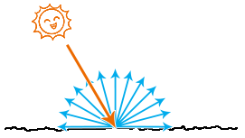
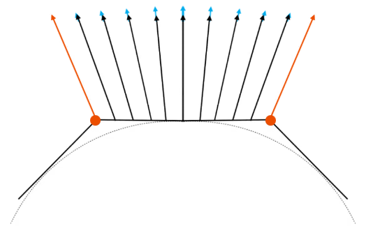

前言

黑夜给了我黑色的眼睛，我却用它寻找光明。

这是一句我很喜欢的诗。

接下来，就让我们一起用黑色的眼睛，寻找光明吧！


### 课堂目标  

1. 为三维物体添加光照效果
2. 让不同材质的三维物体反射不同的光线


### 知识点  

1. 环境光
2. 平行光
3. 点光
4. 漫反射
5. 镜面反射
6. 投影


## 第一章 认识光

光是由光源发出的，光有方向、亮度和颜色。

我们可以想象手电筒打出的一道白色的光。

手电筒是光源，其亮度会受电池的影响，颜色为白色，方向可以由你来控制。

因为光的存在，我们可以看到世界的多姿多彩。

接下咱们就具体看一下光照会对现实世界中的物体产生哪些影响。


### 1-光照对物体的影响

现实世界中的物体被光线照射时，会吸收一部分光，反射一部分光。

当反射的光进入人的眼睛中时，人们便可以看到物体，并识别出它的颜色。

比如，蓝色的星空顶会反射蓝色的光，当蓝色的光进入人的眼睛中时，人们才能看到蓝色的星空顶。


光会对物体产生以下影响：

- 影响物体表面不同位置的明暗程度
- 影响物体的颜色
- 影响物体的投影

物体的明暗差异，可以让我们感觉这个物体是立体的。

比如下图中，左侧的立方体没有明暗差异，给人的感觉就是一个平面；右侧的立方体具有明暗差异，给人的感觉是立体的。


以前，我在学素描的时候，老师就在反复的强调“三大面”、“五调子”。

三大面、五调子就是在描述光对物体的明暗影响，这两个概念可以让我们画出的东西更有体感。

- 三大面：黑、白、灰三个面，描述的就是物体的明暗差异。


- 五调子：高光、中间调、明暗交界线、反光和投影。


物体的颜色会受光色的影响，这个我们之后会详说。

物体的影子就是光源看不见的地方，我们之后会通过算法来计算。

接下来，我们再认识一下光源。


### 2-光源

光源，就是光的源头。

基于光源发出的光线的方向，我们可以将光源分成两种：


- 平行光（directional light）：光线相互平行，射向同一方向。比如从窗外摄入房间的阳光就是平行的。

  注：虽让太阳的光也是向四周发射的，但太阳相对于房间而言太大，光线夹角可以忽略不计，所以就认为从窗外射入室内的阳光是平行的。

- 点光源（point light）：光线从一点向周围放射。比如房间里的的灯泡就是点光源。


若对光源的照射范围做限制，还可以衍生出一些更加具体的光源，比如筒灯、聚光灯等。

现实世界中还有一种间接光源，叫环境光（ambient light），它是经过物体反射后的光。


当光源射出的光线打到物体上时，物体反射的光便是我们识别物体的关键。

接下来，我们再认识一下物体反射的光。


### 3-反射光

反射光：当光源射出的光线打到物体上时，物体反射的光。

物体的反射光是有方向和颜色的，其方向和颜色会受入射光和物体表面的影响。


物体常见的的反射光：

- 漫反射( diffuse reflection)： 物体在接收到直接光源的入射光后，会将光线均匀的反射向四面八方，如下图：

  

  物体表面越粗糙，漫反射就越明显。


- 镜面反射(specular reflection)： 物体在接收到直接光源的入射光后，会将光线以与物体表面的法线对称的方向反射出去。


​		物体表面越光滑，镜面反射就越明显。


- 环境反射（ enviroment ambient reflection）：物体对环境光的反射。

  

关于光的基本概念咱们就先说到这，接下来我们就具体的说一下如何为物体着色。


## 第二章 着色

通俗而言，着色(shading)是绘画时，用线条或色块表示物体明暗或颜色的方式。

- 线条着色


- 色块着色


在计算机图形学中，着色是对不同物体应用不同材质的过程。


我们要在计算机里为模型着色，是很难原封不动的还原现实的。

我们只能让模型更加接近现实。

让模型接近现实的着色方法是有很多种的。

接下来，我会跟大家说一个叫Blinn-Phong 着色方法。

Blinn-Phong 是一种反射模型，不具备严格的物理意义，它是对物理现象的模拟，所以我们不要基于现实情况太过较真。

我们先看一下要对一个物体进行着色需要考虑的条件。


- 着色点
  - 法线normal 
  - 颜色diffuse coefficient
  - 光泽度 shininess
- 光源
  - 光源位置 position
  - 光源强度 intensity
- 着色点到光源的距离r
- 着色点到光源的方向l
- 着色点到视点的方向v

接下来，我们先考虑一下着色点的亮度和上面各种条件的关系。


### 1-光线与着色点法线的夹角

在同样的光源下，入射光线和着色点法线的夹角会影响着色点接收光线的数量。


在上图中，假如第一个着色点能接收6条光线，则当着色点旋转45°后，它就只能接收4条光线了。

因此，我们会用入射光线l 和着色点法线n的夹角的余弦值，来表示着色点的受光程度。

```js
cosθ=l·n
```

解释一下上面的等式是怎么来的。

由点积公式得：

```js
l·n=cosθ*|l|*|n|
```

所以：

```js
cosθ=l·n/|l|*|n|
```

因为：l,n为单位向量

所以：

```js
cosθ=l·n/1*1
cosθ=l·n
```


### 2-光线的衰减

光在传播的过程中会产生衰减。

着色点到光源的距离越远，着色点接收到的光能就越少。

现实世界中影响光线衰减的因素有很多，比如天气情况、空气质量等。

我们这里的图形学可以先不考虑太多，我们可以用一个简单的公式来模拟光线的衰减。


已知：

I是光源的强度

r 是着色点到光源的距离

求：着色点处的光线强度intensity

解：

```js
intensity=I/r²
```

注：

有些光的光线衰减是可以被忽略的，比如从窗外打进房间里的阳光。

其原理就是，无论光线方向还是光线衰减，只要其在一定范围内变化极小，那就可以忽略，从而提高渲染速度。

接下来，我们把上面的已知条件和公式做一下梳理，求一下着色点的漫反射。


### 3-漫反射

#### 3-1-漫反射公式


漫反射的计算公式：

```js
Ld=kd(I/r²)*max(0,n·l)
```

- Ld-diffusely reflected light 漫反射
- kd-diffuse coefficient 漫反射系数，即颜色
- I/r²-着色点处的光线强度
- max(0,n·l)-着色点接收到的光线数量

注：漫反射和视线v没有任何关系，这是因为漫反射是向四面八方反射的。

接下来，咱们利用这个公式为webgl的世界添加一片阳光。


#### 3-2-漫反射示例

已知：

- 球体
  - 漫反射系数 u_Kd
- 球体被阳光照射

- 阳光的特性：
  - 平行光
  - 光线方向为 u_LightDir
  - 光线强度为1，衰减忽略

求：球体的漫反射

解：

1.着色器

```html
<script id="vs" type="x-shader/x-vertex">
    attribute vec4 a_Position;
    attribute vec3 a_Normal;
    uniform mat4 u_ModelMatrix;
    uniform mat4 u_PvMatrix;
    varying vec3 v_Normal;
    void main(){
      gl_Position = u_PvMatrix*u_ModelMatrix*a_Position;
      v_Normal=a_Normal;
    }
</script>
<script id="fs" type="x-shader/x-fragment">
    precision mediump float;
    uniform vec3 u_Kd;
    uniform vec3 u_LightDir;
    varying vec3 v_Normal;
    void main(){
      vec3 diffuse=u_Kd*max(0.0,dot(u_LightDir,v_Normal));
      gl_FragColor=vec4(diffuse,1.0);
    }
</script>
```


2.声明已知条件

```js
//阳光的光线方向
const lightDir = new Vector3(0.5, 1, 1).normalize()
//漫反射系数-颜色
const u_Kd = [0.7, 0.7, 0.7]
// 球体
const sphere = new SphereGeometry(0.5, 6, 4)
// 顶点集合
const { array: vertices } = sphere.getAttribute('position')
// 法线集合
const { array: normals } = sphere.getAttribute('normal')
// 顶点索引集合
const { array: indexes } = sphere.index
```

球体是使用three.js 的SphereGeometry 对象建立的，我们可以直接从这里面提取球体的顶点集合、法线集合和顶点索引，然后为我所用。

之后我会再跟大家说一个用极坐标系来绘制球体的方法，咱们这里先讲灯光。


2.绘图

```js
// 场景
const scene = new Scene({ gl })
// 注册程序对象
scene.registerProgram(
  'Blinn-Phong',
  {
    program: createProgram(
      gl,
      document.getElementById('vs').innerText,
      document.getElementById('fs').innerText
    ),
    attributeNames: ['a_Position', 'a_Normal'],
    uniformNames: [
      'u_PvMatrix', 'u_ModelMatrix', 'u_Kd', 'u_LightDir'
    ]
  }
)

const mat = new Mat({
  program: 'Blinn-Phong',
  data: {
    u_PvMatrix: {
      value: orbit.getPvMatrix().elements,
      type: 'uniformMatrix4fv',
    },
    u_ModelMatrix: {
      value: new Matrix4().elements,
      type: 'uniformMatrix4fv',
    },
    u_LightDir: {
      value: [...lightDir],
      type: 'uniform3fv',
    },
    u_Kd: {
      value: u_Kd,
      type: 'uniform3fv',
    },
  }
})
const geo = new Geo({
  data: {
    a_Position: {
      array: vertices,
      size: 3
    },
    a_Normal: {
      array: normals,
      size: 3
    },
  },
  index: {
    array: indexes
  }
})
const obj = new Obj3D({ geo, mat })
scene.add(obj)
scene.draw()
```


3.微调Scene对象中用顶点索引绘图的方法。

将之前的gl.UNSIGNED_BYTE变成gl.UNSIGNED_SHORT。

```js
gl.drawElements(gl[mode],count, gl.UNSIGNED_SHORT,0)

```

解释一下这么做的原因。

我们之前用顶点索引绘图时，用的数据类型是gl.UNSIGNED_BYTE，如：

```js
gl.drawElements(gl.TRIANGLES,3,gl.UNSIGNED_BYTE,0)

```

此数据类型只能用Uint8Array对象建立顶点索引集合，如：

```js
index: {
  array: new Uint8Array([……])
}

```

然而，Uint8Array 有个弊端，其数据的取值范围只能是[0,255]，这就导致了一个模型的顶点数量不能超过256。

因此，我们需要扩大顶点索引的取值范围，比如用Uint16Array 建立顶点索引。

Uint16Array数据的取值范围是[0,65535 ]，这对于一般模型而言，已经够用了。

在three.js  里，其顶点索引用的就是Uint16Array 。

使用Uint16Array 后，drawElements() 方法里的数据类型就需要变成gl.UNSIGNED_SHORT。

注：

当前我这个webgl 架子还可以再做深度封装的，比如像three.js 那样为其内置几种程序对象和几何体对象，需要的时候直接调用。

因为我当前把重点放在图形学，就不再做深度封装了，只要够用既可以。

虽然这个webgl 框架用起来要比three.js 麻烦很多，但至少要比原生手写便捷，而且也能辅助大家更好的理解底层原理。

效果如下：


当前的球体像一个石膏球，因为漫反射就是这样，其反射光射向四面八方，比较均匀，没有高光。

接下来咱们思考一个问题，我想把这个石膏球变成塑料球，应该怎么办呢？

这时候，我们就需要镜面反射了。


### 4-镜面反射

#### 4-1-镜面反射公式

塑料和石膏的差异在于其表面比较光滑，更加接近镜面，会有明显的高光存在。

我们通过镜面反射考虑一下，我们的眼睛什么时候可以看见物体的高光。


在上图中，方向R便是光线I 在物体表面的镜面反射方向，R和l 基于法线n 对称。

当视线v 接近R的时候，便可以看见高光。

因此，Phone 提出了通过∠<v,R> 的夹角来判断眼睛能否看见高光的方法。

然而，要基于光线l 和法线n 去求l 的反射向量R，是需要不小的计算量的。

所以，后来Blinn 就对Phone 的方案作出了改进，设计出了 更简便的 Blinn-Phone 材质。

接下来，咱就看一下Blinn-Phone 材质的设计思路。 


上图中，向量h 是∠<v,v+l> 的角平分线。

通过观察，我们可以知道：

随视线的变换，∠<h,n> 和∠<v,R> 的大小是成正比的。

也就说，当视线v 越接近镜面反射R ，角平分线h就越接近法线n。

Blinn-Phone 计算镜面反射的公式如下：

```js
h=(v+l)/|v+l|
Ls=ks*(I/r²)*pow(max(0,n·h),p)

```

- h：∠<v,v+l> 的角平分线
- |v+l|：(v+l) 的长度
- Ls：镜面反射 specularly reflected light
- ks：镜面反射系数 specularly coefficient
- max(0,n·h)：cos∠<h,n>
- pow(max(0,n·h),p)：cos∠<h,n>的p次方

解释一下cos∠<h,n>的p次方的意义。

若只用cos∠<h,n> 来计算高光，会得到较大的高光，而我们平时所见的高光一般都是比较小的。

因此，我们可以对cos∠<h,n>做一下幂运算。


#### 4-1-镜面反射示例

接下来，我们还是基于之前的那个球体来做一下镜面反射。

已知：

- 球体
  - 漫反射系数 u_Kd
  - 镜面反射系数 u_Ks
- 球体被阳光照射

- 阳光的特性：
  - 平行光
  - 光线方向为 u_LightDir
  - 光线强度为 1，衰减忽略
- 视点位置：u_Eye

求：球体的镜面反射

解：

1.声明已知条件。

```js
// 阳光的光线方向
const LightDir = new Vector3(0.5, 1, 1).normalize()
// 漫反射系数-颜色
const u_Kd = [0.7, 0.7, 0.7]
// 镜面反射系数-颜色
const u_Ks = [0.3, 0.3, 0.3]

```


2.注册程序对象。

```js
scene.registerProgram(
  'Blinn-Phong',
  {
    program: createProgram(
      gl,
      document.getElementById('vs').innerText,
      document.getElementById('fs').innerText
    ),
    attributeNames: ['a_Position', 'a_Normal'],
    uniformNames: [
      'u_PvMatrix', 'u_ModelMatrix', 'u_Kd', 'u_LightDir',
      'u_Ks', 'u_Eye'
    ]
  }
)

```


3.向材质中添加新增的uniform 变量。

```js
const mat = new Mat({
  program: 'Blinn-Phong',
  data: {
    u_PvMatrix: {
      value: orbit.getPvMatrix().elements,
      type: 'uniformMatrix4fv',
    },
    u_ModelMatrix: {
      value: new Matrix4().elements,
      type: 'uniformMatrix4fv',
    },
    u_LightDir: {
      value: Object.values(LightDir),
      type: 'uniform3fv',
    },
    u_Kd: {
      value: u_Kd,
      type: 'uniform3fv',
    },
    u_Ks: {
      value: u_Ks,
      type: 'uniform3fv',
    },
    u_Eye: {
      value: Object.values(camera.position),
      type: 'uniform3fv',
    },
  },
  mode: 'TRIANGLES',
})

```


4.连续渲染时，更新视点

```js
!(function render() {
  orbit.getPvMatrix()
  scene.setUniform('u_Eye', {
    value: Object.values(camera.position)
  })
  scene.draw()
  requestAnimationFrame(render)
})()

```


5.在着色器中计算镜面反射。

```html
<script id="vs" type="x-shader/x-vertex">
    attribute vec4 a_Position;
    attribute vec3 a_Normal;
    uniform mat4 u_ModelMatrix;
    uniform mat4 u_PvMatrix;
    varying vec3 v_Normal;
    varying vec3 v_Position;
    void main(){
      gl_Position = u_PvMatrix*u_ModelMatrix*a_Position;
      v_Normal=a_Normal;
      v_Position=vec3(a_Position);
    }
</script>
<script id="fs" type="x-shader/x-fragment">
    precision mediump float;
    uniform vec3 u_Kd;
    uniform vec3 u_Ks;
    uniform vec3 u_LightDir;
    uniform vec3 u_Eye;
    varying vec3 v_Normal;
    varying vec3 v_Position;

    void main(){
      //眼睛看向当前着色点的视线
      vec3 eyeDir=normalize(u_Eye-v_Position);
      //视线与光线之和
      vec3 el=eyeDir+u_LightDir;
      //视线与光线的角平分线
      vec3 h=el/length(el);
      //漫反射
      vec3 diffuse=u_Kd*max(0.0,dot(v_Normal,u_LightDir));
      //镜面反射
      vec3 specular=u_Ks*pow(
        max(0.0,dot(v_Normal,h)),
        64.0
      );
      //Blinn-Phong反射
      vec3 l=diffuse+specular;
      gl_FragColor=vec4(l,1.0);
    }
</script>

```

效果如下:


### 5-环境反射

#### 5-1-环境反射的公式

```js
La=ka*Ia

```

- La：环境反射 reflected ambient light

- ka：环境光系数 ambient coefficient

- Ia：环境光强度 ambient intensity

  

#### 5-2-环境反射示例

已知：

- 球体
  - 漫反射系数 u_Kd
  - 镜面反射系数 u_Ks
- 球体被阳光照射

- 阳光的特性：
  - 平行光
  - 光线方向为 u_LightDir
  - 光线强度为 1，衰减忽略
- 视点位置：camera.position
- 环境光系数：u_Ka
- 环境光强度：1

求：球体的环境反射

解：

1.声明已知条件。

```js
// 阳光的光线方向
const LightDir = new Vector3(0.5, 1, 1).normalize()
// 漫反射系数-颜色
const u_Kd = [0.7, 0.7, 0.7]
// 镜面反射系数-颜色
const u_Ks = [0.2, 0.2, 0.2]
// 环境光系数-颜色
const u_Ka = [0.2, 0.2, 0.2]

```


2.注册程序对象。

```js
scene.registerProgram(
  'Blinn-Phong',
  {
    program: createProgram(
      gl,
      document.getElementById('vs').innerText,
      document.getElementById('fs').innerText
    ),
    attributeNames: ['a_Position', 'a_Normal'],
    uniformNames: [
      'u_PvMatrix', 'u_ModelMatrix', 'u_Kd', 'u_LightDir',
      'u_Ks', 'u_Eye', 'u_Ka'
    ]
  }
)

```


3.向材质中添加新增的uniform 变量。

```js
const mat = new Mat({
  program: 'Blinn-Phong',
  data: {
    u_PvMatrix: {
      value: orbit.getPvMatrix().elements,
      type: 'uniformMatrix4fv',
    },
    u_ModelMatrix: {
      value: new Matrix4().elements,
      type: 'uniformMatrix4fv',
    },
    u_LightDir: {
      value: Object.values(LightDir),
      type: 'uniform3fv',
    },
    u_Kd: {
      value: u_Kd,
      type: 'uniform3fv',
    },
    u_Ks: {
      value: u_Ks,
      type: 'uniform3fv',
    },
    u_Ka: {
      value: u_Ka,
      type: 'uniform3fv',
    },
    u_Eye: {
      value: Object.values(camera.position),
      type: 'uniform3fv',
    },
  },
  mode: 'TRIANGLES',
})

```


5.在着色器中计算环境反射。

```html
<script id="vs" type="x-shader/x-vertex">
    attribute vec4 a_Position;
    attribute vec3 a_Normal;
    uniform mat4 u_ModelMatrix;
    uniform mat4 u_PvMatrix;
    varying vec3 v_Normal;
    varying vec3 v_Position;
    void main(){
      gl_Position = u_PvMatrix*u_ModelMatrix*a_Position;
      v_Normal=a_Normal;
      v_Position=vec3(a_Position);
    }
</script>
<script id="fs" type="x-shader/x-fragment">
    precision mediump float;
    uniform vec3 u_Kd;
    uniform vec3 u_Ks;
    uniform vec3 u_Ka;
    uniform vec3 u_LightDir;
    uniform vec3 u_Eye;
    varying vec3 v_Normal;
    varying vec3 v_Position;

    void main(){
      //眼睛看向当前着色点的视线
      vec3 eyeDir=normalize(u_Eye-v_Position);
      //视线与光线之和
      vec3 el=eyeDir+u_LightDir;
      //视线与光线的角平分线
      vec3 h=el/length(el);
      //漫反射
      vec3 diffuse=u_Kd*max(0.0,dot(v_Normal,u_LightDir));
      //反射
      vec3 specular=u_Ks*pow(
        max(0.0,dot(v_Normal,h)),
        64.0
      );
      //Blinn-Phong反射
      vec3 l=diffuse+specular+u_Ka;
      gl_FragColor=vec4(l,1.0);
    }
</script>

```

效果如下:


### 6-Blinn-Phong 反射模型

我们之前将环境光Ambient、漫反射Diffuse 和高光Specular 加在一起的方法，就叫Blinn-Phong 反射模型，即：

```js
L=La+Ld+Ls
L=ka*Ia+kd(I/r²)*max(0,n·l)+ks*(I/r²)*pow(max(0,n·h),p)

```

通过上面的示例，我们可以知道：

- 漫反射可以让物体具有体感；
- 镜面反射可以让物体在我们眼前一亮；
- 环境反射可以让物体看起来更加细腻。

现在大家应该对于着色有了一定的认知，接下来咱们再说一个之前跳过的知识点-着色频率。


## 第三章-着色频率

着色频率与法线是息息相关的，所以咱们得先从法线说起。

法线就是垂直于着色点的一个单位向量，如下图：


然而，我们在webgl 中建立的模型是用三角形拼起来的，而不是用着色点拼起来的，那么我们之前在片元着色器里计算的法线是怎么来的呢？

那是从three.js的SphereGeometry 对象里来的。

那SphereGeometry 对象是怎么算法线的呢？

我们不妨先看一下法线的分布效果。


### 1-法线

1.准备一份用于绘制法线的辅助线的着色器

```html
<script id="vl" type="x-shader/x-vertex">
    attribute vec4 a_Position;
    uniform mat4 u_PvMatrix;
    void main(){
      gl_Position=u_PvMatrix*a_Position;
    }
</script>
<script id="fl" type="x-shader/x-fragment">
    void main(){
      gl_FragColor=vec4(1.0);
    }
</script>

```


2.建立一个获取法线辅助线的顶点数据的方法 (顶点集合,法线集合,长度)

```js
function getNormalHelper(vertices, normals,length=0.2) {
  const normalVertices = []
  for (let i = 0; i < normals.length; i += 3) {
    // 模型的顶点点位
    const p1 = new Vector3(
      vertices[i], vertices[i + 1], vertices[i + 2]
    )
    // 将法线从模型顶点向外延伸
    const p2 = new Vector3(
      normals[i], normals[i + 1], normals[i + 2]
    )
      .setLength(length)
      .add(p1)
    normalVertices.push(...p1, ...p2)
  }
  return new Float32Array(normalVertices)
}

```


3.绘制法线辅助线

```js
scene.registerProgram(
  'line',
  {
    program: createProgram(
      gl,
      document.getElementById('vl').innerText,
      document.getElementById('fl').innerText
    ),
    attributeNames: ['a_Position'],
    uniformNames: ['u_PvMatrix']
  }
)
const matN = new Mat({
  program: 'line',
  data: {
    u_PvMatrix: {
      value: orbit.getPvMatrix().elements,
      type: 'uniformMatrix4fv',
    },
  },
  mode: 'LINES',
})
const geoN = new Geo({
  data: {
    a_Position: {
      array: getNormalHelper(vertices, normals),
      size: 3
    },
  },
})
const objN = new Obj3D({ geo: geoN, mat: matN })
scene.add(objN)
```


渲染效果：


由此可见，three.js 里的这个SphereGeometry对象的法线是由球心向四周反射。

然而，模型的法线法线除了像上面这样分布，还有没有其它的分布方法呢？

这就涉及着色频率的问题，接下来咱们就通过着色频率说一下模型法线常见的设置方法。


### 2-认识着色频率


常见的着色频率有三种：

- 逐三角形着色(flat shading)：模型的每个面都拥有统一的法线，效果比较硬朗。

- 逐顶点着色(gouraud shading)：模型的每个顶点都拥有各自的法线。

  每三个点构成的三角形的内部的点的法线会通过三角形的插值算法计算出来。

  webgl 着色器已经通过varying 变量实现了此功能。

  效果比较平滑，但是三角形太大的话，高光就看不见了。

- 逐片元着色(phong shading)：模型的每个片元都拥有各自的法线，由phong 提出。

接下来，我们考虑一下要渲染一个光滑球体，用哪种着色频率合适。


上图自上而下，球体顶点的数量是由少到多的。

由图可知：

- 当顶点数量很少时：
  - 逐三角形着色效果生硬，渲染速度最快。
  - 逐顶点着色效果较为平滑，会失去高光，渲染速度适中。
  - 逐片元着色效果最为平滑，渲染速度最慢。
- 当顶点数量适中时，若对效果要求不苛刻，适合用顶点着色。因为其具有平滑的效果和高光，渲染速度也适中。
- 当顶点达到一定的数量，三种着色频率的着色效果都是一样的，且逐片元着色频率的渲染速度不一定会比其他的两种着色频率慢。

接下来我们用代码写一下上面的着色频率。

为了让大家对着色频率有一个深刻的认知，我们先自己写个球体。


### 3-球体

对于球体的绘制原理，将其展开就很好理解了。


上图是一个4行6列的球体。

我们在绘制的时候，只要将其分成两部分考虑就可以了：

- 上下两行三角形
- 中间的矩阵

接下来建立一个Sphere对象。

- 属性：
  - r：半径
  - widthSegments：横向段数，最小3段
  - heightSegments：纵向段数，最小3段
  - vertices：顶点集合
  - normals：法线集合
  - indexes：顶点索引集合
  - count：顶点数量
- 方法
  - init() 基于球体的半径和分段，计算其用于顶点索引绘图的数据
  - getTriangles() 基于顶点索引集合解析出相对应的顶点集合，可以用于独立三角形的绘制
  - getVertice(ind) 基于某个顶点索引获取顶点

代码实现：

1.建立Sphere 球体对象

```js
import {Vector3,Spherical} from 'https://unpkg.com/three/build/three.module.js';

/*
属性：
  r：半径
  widthSegments：横向段数，最小3端
  heightSegments：纵向段数，最小3端
  vertices：顶点集合
  normals：法线集合
  indexes：顶点索引集合
  count：顶点数量
*/
export default class Sphere{
  constructor(r=1, widthSegments=16, heightSegments=16){
    this.r=r
    this.widthSegments=widthSegments
    this.heightSegments=heightSegments
    this.vertices=[]
    this.normals=[]
    this.indexes = []
    this.count=0
    this.init()
  }
  init() {
    const { r, widthSegments, heightSegments } = this
    //顶点数量
    this.count = widthSegments * (heightSegments - 1) + 2
    // 球坐标系
    const spherical = new Spherical()
    // theta和phi方向的旋转弧度
    const thetaSize = Math.PI * 2 / widthSegments
    const phiSize = Math.PI / heightSegments

    // 顶点集合，先内置北极点
    const vertices = [0, r, 0]
    // 法线集合，先内置北极法线
    const normals = [0, 1, 0]
    // 顶点索引集合
    const indexes = []
    // 最后一个顶点索引
    const lastInd = this.count-1
    // 逐行列遍历
    for (let y = 0; y < heightSegments; y++) {
      // 球坐标垂直分量
      const phi = phiSize * y
      for (let x1 = 0; x1 < widthSegments; x1++) {
        // x1后的两列
        const x2 = x1 + 1
        const x3 = x2 % widthSegments + 1
        if (y) {
          // 计算顶点和法线
          spherical.set(r, phi, thetaSize * x1)
          const vertice = new Vector3().setFromSpherical(spherical)
          vertices.push(...vertice)
          normals.push(...vertice.normalize())
        } else {
          // 第一行的三角网
          indexes.push(0, x2, x3)
        }
        if (y < heightSegments - 2) {
          // 一个矩形格子的左上lt、右上rt、左下lb、右下rb点
          const lt = y * widthSegments + x2
          const rt = y * widthSegments + x3
          const lb = (y + 1) * widthSegments + x2
          const rb = (y + 1) * widthSegments + x3
          // 第一行和最后一行中间的三角网
          indexes.push(lb, rb, lt, lt, rb, rt)
          if (y === heightSegments - 3) {
            // 最后一行的三角网
            indexes.push(lastInd, rb, lb)
          }
        }
      }
    }
    // 南极顶点
    vertices.push(0, -r, 0)
    // 南极法线
    normals.push(0, -1, 0)

    this.vertices=new Float32Array(vertices)
    this.normals=new Float32Array(normals)
    this.indexes=new Uint16Array(indexes)
  }

  getTriangles() {
    const {indexes}=this
    // 顶点集合
    const vertices = []
    // 通过顶点索引遍历三角形
    for (let i = 0; i < indexes.length; i += 3) {
      // 三角形的三个顶点
      const p0 = this.getVertice(indexes[i])
      const p1 = this.getVertice(indexes[i + 1])
      const p2 = this.getVertice(indexes[i + 2])
      vertices.push(...p0, ...p1, ...p2)
    }
    return new Float32Array(vertices)
  }

  getVertice(ind) {
    const {vertices}=this
    const i = ind * 3
    return new Vector3(vertices[i], vertices[i + 1], vertices[i + 2])
  }
}

```


2.实例化Sphere 对象，将之前three.js 的SphereGeometry对象替换掉

```js
import Sphere from './jsm/Sphere.js'
const sphere = new Sphere(0.5, 6, 4)
const { vertices, indexes,normals } = sphere

```

接下来，咱们就用不同的着色频率为这个球体着色。


### 4-Flat-逐三角形着色

逐三角形着色的法线是比较好算的，直接通过三角形两边的叉乘便可以得到。

1.建立一个专门用于计算着色频率的模块。

- ShadingFrequency.js

```js
import {Vector3} from 'https://unpkg.com/three/build/three.module.js';

// 逐三角形着色
function flatShading(vertices, indexes) {
  // flat 法线集合
  const normals = []
  // 通过顶点索引遍历三角形
  for (let i = 0; i < indexes.length; i += 3) {
    // 三角形的三个顶点
    const p0 = getVertice(vertices, indexes[i])
    const p1 = getVertice(vertices, indexes[i + 1])
    const p2 = getVertice(vertices, indexes[i + 2])
    // 三角面的法线
    const n = p2.clone().sub(p1)
      .cross(
        p0.clone().sub(p1)
      ).normalize()
    
    normals.push(...n, ...n, ...n)
  }
  return new Float32Array(normals)
}

// 获取顶点
function getVertice(vertices, ind) {
  const i = ind * 3
  return new Vector3(vertices[i], vertices[i + 1], vertices[i + 2])
}

export {
  flatShading,
}

```


2.在项目文件中调用上面逐三角形着色的方法。

```js
import { flatShading } from './jsm/ShadingFrequency.js'

// 球体
const sphere = new Sphere(0.5, 12, 12)
// 用独立三角形绘制球体的顶点
const vertices = sphere.getTriangles()
// 逐三角形着色的法线
const normals = flatShading(sphere.vertices, sphere.indexes)

```

因为在逐三角形着色的模型中，每个顶点都有不同的法线，所以不需要再使用顶点索引绘图了，直接用独立三角形gl.TRIANGLES  绘图即可。


3.绘图

```js
// 场景
const scene = new Scene({ gl })
// 注册程序对象
scene.registerProgram(
  'Blinn-Phong',
  {
    program: createProgram(
      gl,
      document.getElementById('vs').innerText,
      document.getElementById('fs').innerText
    ),
    attributeNames: ['a_Position', 'a_Normal'],
    uniformNames: [
      'u_PvMatrix', 'u_ModelMatrix', 'u_Kd', 'u_LightDir',
      'u_Ks', 'u_Eye', 'u_Ka'
    ]
  }
)
const mat = new Mat({
  program: 'Blinn-Phong',
  data: {
    u_PvMatrix: {
      value: orbit.getPvMatrix().elements,
      type: 'uniformMatrix4fv',
    },
    u_ModelMatrix: {
      value: new Matrix4().elements,
      type: 'uniformMatrix4fv',
    },
    u_LightDir: {
      value: Object.values(LightDir),
      type: 'uniform3fv',
    },
    u_Kd: {
      value: u_Kd,
      type: 'uniform3fv',
    },
    u_Ks: {
      value: u_Ks,
      type: 'uniform3fv',
    },
    u_Ka: {
      value: u_Ka,
      type: 'uniform3fv',
    },
    u_Eye: {
      value: Object.values(camera.position),
      type: 'uniform3fv',
    },
  },
  mode: 'TRIANGLES',
})
const geo = new Geo({
  data: {
    a_Position: {
      array: vertices,
      size: 3
    },
    a_Normal: {
      array: normals,
      size: 3
    },
  },
})
const obj = new Obj3D({ geo, mat })
scene.add(obj)

scene.registerProgram(
  'line',
  {
    program: createProgram(
      gl,
      document.getElementById('vl').innerText,
      document.getElementById('fl').innerText
    ),
    attributeNames: ['a_Position'],
    uniformNames: ['u_PvMatrix']
  }
)
const matN = new Mat({
  program: 'line',
  data: {
    u_PvMatrix: {
      value: orbit.getPvMatrix().elements,
      type: 'uniformMatrix4fv',
    },
  },
  mode: 'LINES',
})
const geoN = new Geo({
  data: {
    a_Position: {
      array: getNormalHelper(vertices, normals),
      size: 3
    },
  },
})
const objN = new Obj3D({ geo: geoN, mat: matN })
scene.add(objN)

scene.draw()

```

最终效果如下：


接下来，我们在考虑一下逐顶点着色的法线。

注：

我们在对使用模型矩阵变换模型的时候，需要将顶点的和法线的插值一起变换。

这是我们之前的顶点着色器：

```html
<script id="vs" type="x-shader/x-vertex">
    attribute vec4 a_Position;
    attribute vec3 a_Normal;
    uniform mat4 u_PvMatrix;
    uniform mat4 u_ModelMatrix;
    varying vec3 v_Normal;
    varying vec3 v_Position;
    void main(){
      gl_Position = u_PvMatrix*u_ModelMatrix*a_Position;
      v_Normal=a_Normal;
      v_Position=vec3(a_Position);
    }
</script>

```

我们需要让上面的的v_Normal和v_Position也受模型矩阵u_ModelMatrix的影响。

```html
<script id="vs" type="x-shader/x-vertex">
    ……
    void main(){
      vec4 worldPos=u_ModelMatrix*a_Position;
      gl_Position = u_PvMatrix*worldPos;
      v_Normal=normalize(mat3(u_ModelMatrix)*a_Normal);
      v_Position=vec3(worldPos);
    }
</script>

```

- u_ModelMatrix*a_Position 是模型矩阵对顶点的变换

- mat3(u_ModelMatrix) 是为了提取模型矩阵的变换因子，也就是去掉位移数据

- mat3(u_ModelMatrix)*a_Normal 就是对法线的变换，变换之后，别忘了再用normalize 方法将其归一化

  


### 5-Gouraud-逐顶点着色

#### 5-1-算法原理

three.js 里SphereGeometry 对象的法线，就是用于逐顶点着色的。


然而，如果一个模型不是球体，应该如何计算其逐顶点着色的法线呢？

我们可以这么算：求顶点相邻三角形法线的均值。


以上图中的顶点法线Nv 为例，其计算公式如下：


然而，为了追求更好的效果，我们还可以在求均值的时候，基于三角形的面积做一下加权处理。


#### 5-2-代码实现

1.在之前的ShadingFrequency.js 文件里添加一个gouraudShading() 方法，用于获取逐顶点着色的法线。

gouraudShading(vertices, indexes,type=1)

- vertices 顶点集合
- indexes 顶点索引集合
- type 计算法线的方式
  - 0，相邻三角形的法线的平均值
  - 1，相邻的三角形法线基于面积的加权平均值，默认

```js
function gouraudShading(vertices, indexes,type=1) {
  const normals = []
  for (let i = 0; i < vertices.length / 3; i++) {
    normals.push(...getGouraudNormal(i,vertices,indexes,type))
  }
  return new Float32Array(normals)
}
//基于顶点索引获取顶点的法线
function getGouraudNormal(ind, vertices, indexes, type) {
  // 法线
  const normal = new Vector3()
  if (type) {
    // 与顶点相邻三角形的数据集合
    const triangles = []
    // 与顶点相邻三角形的面积的总和
    let sumArea = 0
    // 寻找相邻三角形
    findTriangles(ind,vertices, indexes, n => {
      const area = n.length()
      sumArea += area
      triangles.push({n,area})
    })
    // 加权平均值
    triangles.forEach(({ n, area }) => {
      normal.add(
        n.setLength(area / sumArea)
      )
    })
  } else {
    // 与顶点相邻三角形的法线的总和
    findTriangles(ind,vertices, indexes, n => {
      normal.add(n.normalize())
    })
    
    
  }
  return normal.normalize()
}

// 寻找与顶点相邻的所有三角形
function findTriangles(ind,vertices, indexes,fn) {
  for (let i = 0; i < indexes.length; i += 3) {
    // 寻找共点三角形
    if (indexes.slice(i, i + 3).includes(ind)) {
      // 三角形的三个顶点
      const p0 = getVertice(vertices, indexes[i])
      const p1 = getVertice(vertices, indexes[i + 1])
      const p2 = getVertice(vertices, indexes[i + 2])
      // 三角面的法线
      const n = p2.clone().sub(p1)
        .cross(
          p0.clone().sub(p1)
      )
      fn(n)
    }
  }
} 

```


2.使用之前的球体测试一下

```js
import { gouraudShading } from './jsm/ShadingFrequency.js'

const sphere = new Sphere(0.5, 12, 12)
const { vertices, indexes } = sphere
const normals = gouraudShading(vertices, indexes)

```

效果如下：


由上图可见，高光没了。

这就是逐顶点着色的弊端，只要面数不够，高光就没了。

若是用逐片元着色来绘图，这个问题就不会出现。


### 6-Phong-逐片元着色

我们之前逐顶点着色时，在片元着色器里计算的法线插值已经不一定是单位向量，而是长度小于等于1的向量。

比如下图中橙色法线之间的黑色向量，其长度已经小于了1，这就是逐顶点着色中高光消失的原因。



我们若想让高光出现，将黑色向量单位化即可，也就是让其长度再加上蓝色的那一段，如此着色的方法就叫逐片元着色。

接下里，我们可以直接基于逐顶点着色的方法改一下片元着色器即可。

```html
<script id="fs" type="x-shader/x-fragment">
    precision mediump float;
    uniform vec3 u_Kd;
    uniform vec3 u_Ks;
    uniform vec3 u_Ka;
    uniform vec3 u_LightDir;
    uniform vec3 u_Eye;
    varying vec3 v_Normal;
    varying vec3 v_Position;

    void main(){
      //法线插值归一化
      vec3 normal=normalize(v_Normal);
      //眼睛看向当前着色点的视线
      vec3 eyeDir=normalize(u_Eye-v_Position);
      //视线与光线之和
      vec3 el=eyeDir+u_LightDir;
      //视线与光线的角平分线
      vec3 h=el/length(el);
      //漫反射
      vec3 diffuse=u_Kd*max(0.0,dot(normal,u_LightDir));
      //反射
      vec3 specular=u_Ks*pow(
        max(0.0,dot(normal,h)),
        64.0
      );
      //Blinn-Phong反射
      vec3 l=diffuse+specular+u_Ka;
      gl_FragColor=vec4(l,1.0);
    }
</script>

```

效果如下：


上面球体的宽、高段数是6和4，面数很低，但其表面效果依旧很细腻，这就是逐片元着色的优势。


## 第四章-光源类型

之前咱们用平行光说了着色频率的概念。

光源除了平行光，还有点光源，若对平行光和点光源的照射范围和衰减做限制，还会衍生出筒灯、聚光灯等类型的灯光。


### 1-筒灯

#### 1-1-筒灯概念

对平行光的照射范围做限制后，其灯光打出的效果便可以如下图一样：


筒灯的照射方式如下：


通过上面的两个图，我们可以知道，要把平行光限制成筒灯，需要以下已知条件：

- 筒灯位置  u_LightPos
- 筒灯目标点  u_LightTarget
- 光照强度 u_Intensity
- 衰减距离 
  - 衰减起始距离 u_Dist1
  - 衰减结束距离 u_Dist2
  - 反向衰减距离 u_Dist3
- 衰减范围
  - 衰减起始范围 u_R1
  - 衰减结束范围 u_R2


#### 1-2-代码实现

下图使我们将要实现的筒灯效果。


为了更好的观察灯光，我们需要先建立一块幕布。

1.幕布 Backdrop.js

```js
/*
属性：
  w：宽
  h：高
  d：深
  vertices：顶点集合
  normals：法线集合
  indexes：顶点索引集合
  count：顶点数量
*/
export default class Backdrop{
  constructor(w,h,d){
    this.w=w
    this.h=h
    this.d=d
    this.vertices=new Float32Array()
    this.normals=new Float32Array()
    this.indexes = new Float32Array()
    this.count = 12
    this.init()
  }
  init() {
    const [x, y, z] = [this.w / 2, this.h, this.d]
    this.vertices = new Float32Array([
      -x, 0, 0,
      -x, 0, z,
      x, 0, 0,
      x, 0, z,
      -x, y, 0,
      -x, 0, 0,
      x, y, 0,
      x, 0, 0,
    ])
    this.normals = new Float32Array([
      0, 1, 0,
      0, 1, 0,
      0, 1, 0,
      0, 1, 0,
      0, 0, 1,
      0, 0, 1,
      0, 0, 1,
      0, 0, 1,
    ])

    this.indexes = new Uint16Array([
      0, 1, 2, 2, 1, 3,
      4, 5, 6, 6, 5, 7
    ])
  }
}

```


2.着色器

```html
  <script id="vs" type="x-shader/x-vertex">
    attribute vec4 a_Position;
    attribute vec3 a_Normal;
    uniform mat4 u_ModelMatrix;
    uniform mat4 u_PvMatrix;
    varying vec3 v_Normal;
    varying vec3 v_Position;
    void main(){
      vec4 worldPos=u_ModelMatrix*a_Position;
      gl_Position = u_PvMatrix*worldPos;
      v_Normal=normalize(mat3(u_ModelMatrix)*a_Normal);
      v_Position=vec3(worldPos);
    }
  </script>
  <script id="fs" type="x-shader/x-fragment">
    precision mediump float;
    //漫反射系数
    uniform vec3 u_Kd;
    //镜面反射系数
    uniform vec3 u_Ks;
    //环境光反射系数
    uniform vec3 u_Ka;

    //视点
    uniform vec3 u_Eye;
    // 筒灯位置
    uniform vec3 u_LightPos;
    // 筒灯目标点 
    uniform vec3 u_LightTarget;
    //灯光强度
    uniform float u_Intensity;
    
    //衰减起始距离
    uniform float u_Dist1;
    //衰减结束距离
    uniform float u_Dist2;
    //反向衰减距离
    uniform float u_Dist3;
    
    //衰减起始范围
    uniform float u_R1;
    //衰减结束范围
    uniform float u_R2;
    
    //法线插值
    varying vec3 v_Normal;
    //点位插值
    varying vec3 v_Position;

    void main(){
      //光线方向
      vec3 lightDir=normalize(u_LightPos-u_LightTarget);
      //法线插值归一化
      vec3 normal=normalize(v_Normal);
      //眼睛看向当前着色点的视线
      vec3 eyeDir=normalize(u_Eye-v_Position);
      //视线与光线的角平分线
      vec3 h=normalize(eyeDir+lightDir);
      //漫反射
      vec3 diffuse=u_Kd*max(0.0,dot(normal,lightDir));
      //镜面反射
      vec3 specular=u_Ks*pow(
        max(0.0,dot(normal,h)),
        64.0
      );

      //着色点到光源的向量
      vec3 pl=u_LightPos-v_Position;
      //着色点到光线的距离
      float r=length(cross(pl,lightDir));
      //光线垂直方向的衰减
      float fallY=1.0-smoothstep(u_R1,u_R2,r);
      //当前着色点到筒灯光源平面的距离
      float dist=dot(pl,lightDir);
      //光线方向的衰减
      float fallX=1.0-smoothstep(u_Dist1,u_Dist2,dist);
      //反向衰减
      float fallB=smoothstep(u_Dist3,0.0,dist);

      //筒灯作用于当前着色点的亮度
      float intensity=u_Intensity*fallY*fallX*fallB;
      //着色点颜色
      vec3 color=intensity*(diffuse+specular)+u_Ka;
      gl_FragColor=vec4(color,1.0);
  </script>
```


2.导入相关组件

```js
import { createProgram} from '/jsm/Utils.js';
import {
  Matrix4, PerspectiveCamera, Vector3
} from 'https://unpkg.com/three/build/three.module.js';
import OrbitControls from './jsm/OrbitControls.js'
import Mat from './lv/Mat.js'
import Geo from './lv/Geo.js'
import Obj3D from './lv/Obj3D.js'
import Scene from './lv/Scene.js'
import Sphere from './lv/Sphere.js'
import Backdrop from './lv/Backdrop.js'
import { gouraudShading } from './lv/ShadingFrequency.js'


```


3.建立webgl上下文对象

```js
const canvas = document.getElementById('canvas');
canvas.width = window.innerWidth;
canvas.height = window.innerHeight;
let gl = canvas.getContext('webgl');
gl.clearColor(0.0, 0.0, 0.0, 1.0);
gl.enable(gl.DEPTH_TEST);

```


4.建立相机轨道

```js
// 视点
const target = new Vector3()
const eye = new Vector3(0, 4, 10)
const [fov, aspect, near, far] = [
  45, canvas.width / canvas.height,
  1, 50
]
// 透视相机
const camera = new PerspectiveCamera(fov, aspect, near, far)
camera.position.copy(eye)
// 轨道控制器
const orbit = new OrbitControls({ camera, target, dom: canvas, })

```


5.实例化球体和幕布

```js
/* 球体 */
const sphere = new Sphere(0.5, 18, 18)
const { vertices, indexes } = sphere
const normals = gouraudShading(vertices, indexes)
//球体模型矩阵
const sphereMatrix = new Matrix4().setPosition(0, sphere.r, 0)

/* 幕布 */
const backdrop = new Backdrop(20, 10, 10)
// 幕布模型矩阵
const backMatrix = new Matrix4().setPosition(0, 0, -1)

```


6.声明模型的颜色系数和灯光数据

```js
// 漫反射系数-颜色
const u_Kd = [0.7, 0.7, 0.7]
// 镜面反射系数-颜色
const u_Ks = [0.2, 0.2, 0.2]
// 环境光系数-颜色
const u_Ka = [0.2, 0.2, 0.2]

// 筒灯位置
const u_LightPos = new Vector3(1.5, 3, 2)
// 筒灯目标点
const u_LightTarget = new Vector3()
// 光照强度
const u_Intensity = 1
// 衰减起始距离
const u_Dist1 = 0
// 衰减结束距离
const u_Dist2 = 10
// 反向衰减距离
const u_Dist3 = -1
// 衰减起始范围
const u_R1 = 2
// 衰减结束范围
const u_R2 = 2.5

```


7.基于上面的已知条件，建立三类uniform数据

```js
// 灯光数据
const lightData = {
  u_LightPos: {
    value: [...u_LightPos],
    type: 'uniform3fv',
  },
  u_LightTarget: {
    value: [...u_LightTarget],
    type: 'uniform3fv',
  },
  u_Intensity: {
    value: 1,
    type: 'uniform1f',
  },
  u_R1: {
    value: u_R1,
    type: 'uniform1f',
  },
  u_R2: {
    value: u_R2,
    type: 'uniform1f',
  },
  u_Dist1: {
    value: u_Dist1,
    type: 'uniform1f',
  },
  u_Dist2: {
    value: u_Dist2,
    type: 'uniform1f',
  },
  u_Dist3: {
    value: u_Dist3,
    type: 'uniform1f',
  },
}
// 材质数据
const matData = {
  u_Kd: {
    value: u_Kd,
    type: 'uniform3fv',
  },
  u_Ks: {
    value: u_Ks,
    type: 'uniform3fv',
  },
  u_Ka: {
    value: u_Ka,
    type: 'uniform3fv',
  },
}
// 相机数据
const cameraData = {
  u_PvMatrix: {
    value: orbit.getPvMatrix().elements,
    type: 'uniformMatrix4fv',
  },
  u_Eye: {
    value: Object.values(camera.position),
    type: 'uniform3fv',
  },
}

```


8.绘图

```js
// 场景
const scene = new Scene({ gl })
// 注册程序对象
scene.registerProgram(
  'Blinn-Phong',
  {
    program: createProgram(
      gl,
      document.getElementById('vs').innerText,
      document.getElementById('fs').innerText
    ),
    attributeNames: ['a_Position', 'a_Normal'],
    uniformNames: [
      'u_PvMatrix', 'u_ModelMatrix', 'u_Eye',
      'u_Kd', 'u_Ks', 'u_Ka',
      'u_LightPos', 'u_LightTarget', 'u_Intensity',
      'u_Dist1', 'u_Dist2', 'u_Dist3',
      'u_R1', 'u_R2',
    ]
  }
)
// 球体
const matSphere = new Mat({
  program: 'Blinn-Phong',
  data: {
    u_ModelMatrix: {
      value: sphereMatrix.elements,
      type: 'uniformMatrix4fv',
    },
    ...cameraData,
    ...lightData,
    ...matData
  },
  mode: 'TRIANGLES',
})
const geoSphere = new Geo({
  data: {
    a_Position: {
      array: vertices,
      size: 3
    },
    a_Normal: {
      array: normals,
      size: 3
    },
  },
  index: {
    array: indexes
  }
})
const objSphere = new Obj3D({ geo: geoSphere, mat: matSphere })
scene.add(objSphere)

// 幕布
const matBack = new Mat({
  program: 'Blinn-Phong',
  data: {
    u_ModelMatrix: {
      value: backMatrix.elements,
      type: 'uniformMatrix4fv',
    },
    ...cameraData,
    ...lightData,
    ...matData
  },
})
const geoBack = new Geo({
  data: {
    a_Position: {
      array: backdrop.vertices,
      size: 3
    },
    a_Normal: {
      array: backdrop.normals,
      size: 3
    },
  },
  index: {
    array: backdrop.indexes
  }
})
const objBack = new Obj3D({ mat: matBack, geo: geoBack })
scene.add(objBack)

!(function render() {
  orbit.getPvMatrix()
  scene.setUniform('u_Eye', {
    value: Object.values(camera.position)
  })
  scene.draw()
  requestAnimationFrame(render)
})()

```


9.相机轨道交互事件

```js
/* 取消右击菜单的显示 */
canvas.addEventListener('contextmenu', event => {
  event.preventDefault()
})
/* 指针按下时，设置拖拽起始位，获取轨道控制器状态。 */
canvas.addEventListener('pointerdown', event => {
  orbit.pointerdown(event)
})
/* 指针移动时，若控制器处于平移状态，平移相机；若控制器处于旋转状态，旋转相机。 */
canvas.addEventListener('pointermove', event => {
  orbit.pointermove(event)
})
/* 指针抬起 */
canvas.addEventListener('pointerup', event => {
  orbit.pointerup(event)
})
/* 滚轮事件 */
canvas.addEventListener('wheel', event => {
  orbit.wheel(event)
})

```


### 2-锥形灯

#### 1-1-锥形灯概念

锥形灯可以理解为对点光源的限制，从侧面看，其打出的光线成锥形。


锥形灯的照射效果如下：


定义锥形灯的条件：

- 锥形灯位置  u_LightPos
- 锥形灯目标点  u_LightTarget
- 光照强度 u_Intensity
- 衰减距离
  - 衰减起始距离 u_Dist1
  - 衰减结束距离 u_Dist2
- 衰减夹角
  - 衰减起始夹角 u_Fov1
  - 衰减结束夹角 u_Fov2


#### 1-2-代码实现

我可以直接在之前筒灯的基础上做一下修改。

1.把之前的衰减范围变成衰减夹角

```js
// 衰减起始范围
const u_Fov1 = 20 * Math.PI / 180
// 衰减结束范围
const u_Fov2 = u_Fov1 + 2 * Math.PI / 180
// 灯光数据
const lightData = {
  ……
  u_Fov1: {
    value: u_Fov1,
    type: 'uniform1f',
  },
  u_Fov2: {
    value: u_Fov2,
    type: 'uniform1f',
  },
  ……
}

```


2.在片元着色器中，根据衰减夹角计算灯光在光线垂直方向的衰减

```js
//衰减范围
float r1=tan(u_Fov1)*dist;
float r2=tan(u_Fov2)*dist;
//着色点到光线的距离
float r=length(cross(pl,lightDir));
//光线垂直方向的衰减
float fallY=1.0-smoothstep(r1,r2,r);
//取消灯光背面的照明
float fallB=step(0.0,dist);

```


对于灯光的类型，咱们就先说这两个。

其实，灯光中是可以绘图的，只是这块知识有点复杂，因为时间原因，咱放课程最后面说。

这里，就先给大家看个小例子。


### 扩展-泉

我们可以基于着色点到光线的距离做一个正弦波衰减。


1.片元着色器中的算法如下：

```js
//衰减范围
float r1=tan(u_Fov1)*dist;
float r2=tan(u_Fov2)*dist;
//着色点到光线的距离
float r=length(cross(pl,lightDir));
//光线垂直方向的衰减
float fallY=1.0-smoothstep(r1,r2,r);

//正弦波衰减弧度
float fallAng=smoothstep(0.0,r2,r)*40.0-u_Time/60.0;
//正弦波衰减
float fallSin=1.0-smoothstep(-0.3,1.0,sin(fallAng));

//取消灯光背面的照明
float fallB=step(0.0,dist);

//光源作用于当前着色点的亮度
float intensity=u_Intensity*fallX*fallY*fallSin*fallB;
//着色点颜色
vec3 color=intensity*(diffuse+specular)+u_Ka;
```


2.调整一下相机和灯光

```js
//相机目标点
const target = new Vector3(0, 1.5, 0)
//相机视点
const eye = new Vector3(0, 4, 10)
……

// 锥形灯位置
const u_LightPos = new Vector3(0, 8, 1)
// 锥形灯目标点
const u_LightTarget = new Vector3()
// 光照强度
const u_Intensity = 15
// 衰减起始距离
const u_Dist1 = 0
// 衰减结束距离
const u_Dist2 = 8.5
// 衰减起始范围
const u_Fov1 = 25 * Math.PI / 180
// 衰减结束范围
const u_Fov2 = u_Fov1 + 10 * Math.PI / 180
……

```


我上面的例子的设计源自于达达主义。

达达主义者主张依靠直觉创造艺术， 杜尚的《泉》便是达达主义的代表作之一。

1917年，杜尚在商店买了个小便池，签了个自己的名字，就送展览馆去了，然后被理所当然的被拒收了。


《泉》的意义在于对艺术的思考：

究竟什么是艺术，或者说艺术的标准是什么？

如果小便池签个名就是艺术，那么还有什么不是艺术，或者说所有的一切皆是艺术。 

在我自己看来，艺术只要不违背原则性问题，比如种族歧视、环境污染等，我们就不可以因为自己的不喜欢，否定别人心中的艺术。

在生活中，一切都可以成为艺术，艺术源自于我们的生活。


## 第五章 帧缓冲区

其实，我接下来想说投影的，然而投影的计算还需要帧缓冲区，所以咱们得先解释一下帧缓冲区的概念。

### 1-帧缓冲区的概念

webgl 绘图过程是：顶点着色器定形，片元着色器逐片元填颜色，然后绘制到canvas画布上。


其实，我们绘图的时候，也可以不把图形绘制到画布上，而是绘制到内存之中，这样我们可以在不显示图像的前提下，获取webgl 绘制的图像数据。

这块在内存中存储webgl 图像的区域，就叫帧缓冲区。


有了帧缓冲区的图像数据之后，我还不显示它，那帧缓冲区有啥用呢？

帧缓冲区的作用非常强大，可以对webgl 的渲染结果做后处理，比如为模型添加描边、光晕等；还可以基于光源生成深度贴图，计算投影……

对于帧缓冲区的基本概念和作用咱们就说到这，接下来咱们用代码敲一下。


### 2-帧缓冲区的代码实现

以前咱们入门webgl 的时候画过一个点，接下咱们把这个点画到帧缓冲区里去。

1.这是在canvas 画布中绘制一个点的方法。

```html
  <script id="vs1" type="x-shader/x-vertex">
    void main(){
      //点位
      gl_Position=vec4(0,0,0,1);
      //尺寸
      gl_PointSize=100.0;
    }
  </script>
  <script id="fs1" type="x-shader/x-fragment">
    void main(){
      gl_FragColor=vec4(1,1,0,1);
    }
  </script>
  <script type="module">
    import { createProgram } from '/jsm/Utils.js';

    const canvas = document.getElementById('canvas');
    canvas.width = 512;
  	canvas.height = 512;
    const gl = canvas.getContext('webgl');

    const vs1 = document.getElementById('vs1').innerText;
    const fs1 = document.getElementById('fs1').innerText;
    const program1 = createProgram(gl, vs1, fs1);
    gl.useProgram(program1)
    
    gl.clearColor(0.4, 0.6, 0.9, 1.0);
    gl.clear(gl.COLOR_BUFFER_BIT);
    gl.drawArrays(gl.POINTS, 0, 1);
  </script>
```

效果如下：


2.在绘制图形的时候做个拦截，把图形画到帧缓冲区里。

```js
……
const vs1 = document.getElementById('vs1').innerText;
const fs1 = document.getElementById('fs1').innerText;
const program1 = createProgram(gl, vs1, fs1);
gl.useProgram(program1)

//纹理对象
gl.pixelStorei(gl.UNPACK_FLIP_Y_WEBGL, 1)
gl.activeTexture(gl.TEXTURE0)
let texture = gl.createTexture();
gl.bindTexture(gl.TEXTURE_2D, texture);
gl.texParameteri(
  gl.TEXTURE_2D,
  gl.TEXTURE_MIN_FILTER,
  gl.LINEAR
);
gl.texImage2D(
  gl.TEXTURE_2D, 0, gl.RGBA, 256, 256,
  0, gl.RGBA, gl.UNSIGNED_BYTE, null
);

//帧缓冲区
const framebuffer = gl.createFramebuffer();
gl.bindFramebuffer(gl.FRAMEBUFFER, framebuffer);
gl.framebufferTexture2D(
  gl.FRAMEBUFFER,
  gl.COLOR_ATTACHMENT0,
  gl.TEXTURE_2D,
  texture, 0
);

//设置渲染尺寸
gl.viewport(0, 0, 256, 256);

//绘图
gl.clearColor(0.2, 0.2, 0.4, 1.0);
gl.clear(gl.COLOR_BUFFER_BIT);
gl.drawArrays(gl.POINTS, 0, 1);
```


运行上面的代码，我们会发现浏览器在没有报错的前提下，成功绘制不出任何东西来了。

解释一下上面的代码。

上面的代码可以分两部分看，一部分是纹理对象，一部分是帧缓冲区。

1.纹理对象是用来装webgl 绘图结果的，我们可以将其理解为像素数据。

```js
gl.pixelStorei(gl.UNPACK_FLIP_Y_WEBGL, 1)
gl.activeTexture(gl.TEXTURE0)
const texture = gl.createTexture();
gl.bindTexture(gl.TEXTURE_2D, texture);
gl.texParameteri(
  gl.TEXTURE_2D,
  gl.TEXTURE_MIN_FILTER,
  gl.LINEAR
);
gl.texImage2D(
  gl.TEXTURE_2D, 0, gl.RGBA, 256, 256,
  0, gl.RGBA, gl.UNSIGNED_BYTE, null
);
```

- createTexture() 创建纹理对象
- bindTexture(target, texture) 将纹理对象绑定到目标对象上，上面代码里的目标对象就是二维纹理对象gl.TEXTURE_2D
- texParameteri() 设置纹理参数
- texImage2D(target, level, internalformat, width, height, border, format, type, ArrayBufferView? pixels) 设置纹理对象的图像源
  - target 纹理目标
  - level  mipmap 图像级别 
  - internalformat 颜色格式
  - width, height 纹理对象的尺寸
  - border 边界宽度，必须为0
  - format  颜色格式， WebGL 1 中必须和internalformat 一致
  - type 纹理数据类型
  - pixels 纹理的像素源


2.帧缓冲区可以理解为用来装纹理对象缓冲区。

```js
const framebuffer = gl.createFramebuffer();
gl.bindFramebuffer(gl.FRAMEBUFFER, framebuffer);
gl.framebufferTexture2D(
  gl.FRAMEBUFFER,
  gl.COLOR_ATTACHMENT0,
  gl.TEXTURE_2D,
  texture, 0
);

```

- createFramebuffer() 建立帧缓冲区
- bindFramebuffer(target, framebuffer) 将帧缓冲区绑定到目标对象上。
  - target 目标对象，用于收集渲染图像的时所需的颜色、透明度、深度和模具缓冲区数据
  - framebuffer 帧缓冲区
- framebufferTexture2D(target, attachment, textarget, texture, level) 将纹理对象添加到帧缓冲区中
  - target 目标对象
  - attachment 设置将纹理对象绑定到哪个缓冲区中
    -  gl.COLOR_ATTACHMENT0 将纹理对象绑定到颜色缓冲区
    -  gl.DEPTH_ATTACHMENT 将纹理对象绑定到深度缓冲区
    -  gl.STENCIL_ATTACHMENT 将纹理对象绑定到模板缓冲区
  - textarget 纹理的目标对象
  - texture 纹理对象
  - level  mipmap 图像级别 


3.渲染方法，把图形渲染进帧缓冲区的纹理对象里。

```
gl.clearColor(0.4, 0.6, 0.9, 1.0);
gl.clear(gl.COLOR_BUFFER_BIT);
gl.drawArrays(gl.POINTS, 0, 1);

```


4.图形在渲染的时候，会有一个VIEWPORT 尺寸，我们可以把这个尺寸理解为渲染尺寸，这个尺寸默认和canvas 画布一致。

我们可以用gl.getParameter(gl.VIEWPORT) 方法获取画布的像素尺寸。

我们也需要知道设置这个渲染尺寸的方法：

```js
//设置渲染尺寸
gl.viewport(0, 0, 256, 256);

//绘图
gl.clearColor(0.4, 0.6, 0.9, 1.0);
gl.clear(gl.COLOR_BUFFER_BIT);
gl.drawArrays(gl.POINTS, 0, 1);

```

- viewport(x,y,w,h)
  - x,y 是VIEWPORT 的左下角点位置
  - w,h 是VIEWPORT 的宽高

在帧缓冲区中，我们一般会把VIEWPORT 尺寸设置的和纹理对象一样大，这样我们最终渲染出的图像就是和纹理对象一样大的图像。

有了帧缓冲区之后，我们就可以把帧缓冲区中的纹理对象当成真的纹理对象来用，把它贴到模型上。


### 3-帧缓冲区的显示

接着上面的代码往后写。

1.写一套纹理着色器，用于显示帧缓冲区里的纹理对象。

```html
<script id="vs2" type="x-shader/x-vertex">
  attribute vec4 a_Position;
  attribute vec2 a_Pin;
  varying vec2 v_Pin;
  void main(){
    gl_Position = a_Position;
    v_Pin=a_Pin;
  }
</script>
<script id="fs2" type="x-shader/x-fragment">
  precision mediump float;
  uniform sampler2D u_Sampler;
  varying vec2 v_Pin;
  void main(){
    gl_FragColor=texture2D(u_Sampler,v_Pin);
  }
</script>

```


2.帧缓冲区绘制完图像后，把帧缓冲区置空，否则下次绘图还是会画到帧缓冲区里，而不是画到canvas 画布里。

```js
gl.bindFramebuffer(gl.FRAMEBUFFER, null);

```


3.将viewport 恢复到当前canvas 画布的尺寸。

```js
gl.viewport(0, 0, canvas.width, canvas.height);

```


4.绘制一个矩形面，把帧缓冲区里的纹理对象贴上去。

```
const vs2 = document.getElementById('vs2').innerText;
const fs2 = document.getElementById('fs2').innerText;
const program2 = createProgram(gl, vs2, fs2);
gl.useProgram(program2)

const source = new Float32Array([
-0.5, 0.5, 0, 1,
-0.5, -0.5, 0, 0,
0.5, 0.5, 1, 1,
0.5, -0.5, 1, 0
])
const buffer = gl.createBuffer();
gl.bindBuffer(gl.ARRAY_BUFFER, buffer);
gl.bufferData(gl.ARRAY_BUFFER, source, gl.STATIC_DRAW);
const a_Position = gl.getAttribLocation(program2, 'a_Position');
gl.vertexAttribPointer(a_Position, 2, gl.FLOAT, false, 16, 0);
gl.enableVertexAttribArray(a_Position);
const a_Pin = gl.getAttribLocation(program2, 'a_Pin');
gl.vertexAttribPointer(a_Pin, 2, gl.FLOAT, false, 16, 8);
gl.enableVertexAttribArray(a_Pin);

gl.bindTexture(gl.TEXTURE_2D, texture)
const u_Sampler = gl.getUniformLocation(program2, 'u_Sampler')
gl.uniform1i(u_Sampler, 0)

gl.clearColor(0.0, 0.0, 0.0, 1.0);
gl.clear(gl.COLOR_BUFFER_BIT);
gl.drawArrays(gl.TRIANGLE_STRIP, 0, 4)

```

最终效果如下：


当我们把帧缓冲区里的纹理对象显示出来后，还需要考虑一个深度问题。


### 4-帧缓冲区里的深度测试

#### 4-1-深度测试的概念

在webgl中绘图的时候，若没有开启深度测试 gl.DEPTH_TEST，那它就会像画水粉一样，一层层的往canvas 画布上覆盖颜色，它不会考虑图形在深度上的遮挡问题。


当开启了深度测试，离视点近的图形就会遮挡例视点远的图形。

当然，我这种对于深度测试的解释是有点笼统的，比如像下面的三个三角形，我们就没法判断谁远谁近了。


webgl的深度测试是先基于整个场景生成一张深度贴图，深度贴图里存储了离视点最近的片元的深度信息。

webgl 在逐片元着色时，会判断一下当前片元的的深度是否小于深度贴图里相应片元的深度，若是的话，那webgl就不会对当前片元进行渲染。

从而webgl就通过只绘制在深度上离视点最近的片元的方式，解决了图形遮挡问题。

在代码里给大家演示一下深度测试的原理。


#### 4-2-深度测试的代码实现

1.画两个不同深度的点。

```html
<script id="vs1" type="x-shader/x-vertex">
    attribute vec4 a_Position;
    varying float v_Z;
    void main(){
      gl_Position=a_Position;
      gl_PointSize=200.0;
      v_Z=a_Position.z;
    }
</script>
<script id="fs1" type="x-shader/x-fragment">
    precision mediump float;
    varying float v_Z;
    void main(){
      gl_FragColor=vec4(vec3(v_Z),1);
    }
</script>
<script type="module">
  import { createProgram } from '/jsm/Utils.js';

  const canvas = document.getElementById('canvas');
  canvas.width = 512;
  canvas.height = 512;
  const gl = canvas.getContext('webgl');

  const vs1 = document.getElementById('vs1').innerText;
  const fs1 = document.getElementById('fs1').innerText;
  const program1 = createProgram(gl, vs1, fs1);
  gl.useProgram(program1)

  const source = new Float32Array([
    -0.1, 0.1, 0,
    0.1, -0.1, 0.9,
  ])
  const buffer = gl.createBuffer();
  gl.bindBuffer(gl.ARRAY_BUFFER, buffer);
  gl.bufferData(gl.ARRAY_BUFFER, source, gl.STATIC_DRAW);
  const a_Position = gl.getAttribLocation(program1, 'a_Position');
  gl.vertexAttribPointer(a_Position, 3, gl.FLOAT, false, 0, 0);
  gl.enableVertexAttribArray(a_Position);

  gl.clearColor(0.4, 0.6, 0.9, 1.0);
  gl.clear(gl.COLOR_BUFFER_BIT);
  gl.drawArrays(gl.POINTS, 0, 2);

</script>

```

其效果如下：


再附带上一张裁剪空间的示意图：


通过代码我们可以知道，在裁剪空间中，黑点的深度是0，白点深度是0.9，按理说是应该黑点遮挡白点的。

这就因为在没有开启深度测试的情况下，webgl 会像画油画一样，根据顶点数据的排序，一个个绘制。

```js
const source = new Float32Array([
  //黑点
  -0.1, 0.1, 0,
  //白点
  0.1, -0.1, 0.9,
])

```

在上面的代码里，我们先写入了黑点，又写入了白点，所以webgl先画完了黑点后，又在黑点上面覆盖了一个白点。

注：上面的点位是裁剪空间中的点位，不要将其当成世界坐标系里的点位，裁剪空间和右手规则的世界坐标系的z轴是相反的。


2.为webgl 开启深度测试

```js
gl.enable(gl.DEPTH_TEST);

```

效果如下：


这样webgl 就可以解决不同深度上得图形遮挡问题。

接下来，我们测一下在帧缓冲区里是否也可以用同样的方式解决图形遮挡问题。

```html
<!-- 点 -->
<script id="vs1" type="x-shader/x-vertex">
  attribute vec4 a_Position;
  varying float v_Z;
  void main(){
    gl_Position=a_Position;
    gl_PointSize=200.0;
    v_Z=a_Position.z;
  }
</script>
<script id="fs1" type="x-shader/x-fragment">
  precision mediump float;
  varying float v_Z;
  void main(){
    gl_FragColor=vec4(vec3(v_Z),1);
  }
</script>
<!-- 纹理着色器 -->
<script id="vs2" type="x-shader/x-vertex">
  attribute vec4 a_Position;
  attribute vec2 a_Pin;
  varying vec2 v_Pin;
  void main(){
    gl_Position = a_Position;
    v_Pin=a_Pin;
  }
</script>
<script id="fs2" type="x-shader/x-fragment">
  precision mediump float;
  uniform sampler2D u_Sampler;
  varying vec2 v_Pin;
  void main(){
    gl_FragColor=texture2D(u_Sampler,v_Pin);
  }
</script>
<script type="module">
  import { createProgram } from '/jsm/Utils.js';

  const canvas = document.getElementById('canvas');
  canvas.width = 512;
  canvas.height = 512;
  const gl = canvas.getContext('webgl');

  let texture = null

  {
    const vs1 = document.getElementById('vs1').innerText;
    const fs1 = document.getElementById('fs1').innerText;
    const program1 = createProgram(gl, vs1, fs1);
    gl.useProgram(program1)
    gl.enable(gl.DEPTH_TEST);

    const source = new Float32Array([
      -0.1, 0.1, 0,
      0.1, -0.1, 0.9,
    ])
    const buffer = gl.createBuffer();
    gl.bindBuffer(gl.ARRAY_BUFFER, buffer);
    gl.bufferData(gl.ARRAY_BUFFER, source, gl.STATIC_DRAW);
    const a_Position = gl.getAttribLocation(program1, 'a_Position');
    gl.vertexAttribPointer(a_Position, 3, gl.FLOAT, false, 0, 0);
    gl.enableVertexAttribArray(a_Position);

    gl.pixelStorei(gl.UNPACK_FLIP_Y_WEBGL, 1)
    gl.activeTexture(gl.TEXTURE0)
    texture = gl.createTexture();
    gl.bindTexture(gl.TEXTURE_2D, texture);
    gl.texParameteri(
      gl.TEXTURE_2D,
      gl.TEXTURE_MIN_FILTER,
      gl.LINEAR
    );
    gl.texImage2D(
      gl.TEXTURE_2D, 0, gl.RGBA, 512, 512,
      0, gl.RGBA, gl.UNSIGNED_BYTE, null
    );

    const framebuffer = gl.createFramebuffer();
    gl.bindFramebuffer(gl.FRAMEBUFFER, framebuffer);
    gl.framebufferTexture2D(
      gl.FRAMEBUFFER,
      gl.COLOR_ATTACHMENT0,
      gl.TEXTURE_2D,
      texture, 0
    );

    gl.viewport(0, 0, 512, 512);
    gl.clearColor(0.3, 0.5, 0.8, 1.0);
    gl.clear(gl.COLOR_BUFFER_BIT);
    gl.drawArrays(gl.POINTS, 0, 2);

    gl.bindFramebuffer(gl.FRAMEBUFFER, null);
    gl.viewport(0, 0, canvas.width, canvas.height);
  }

  {
    const vs2 = document.getElementById('vs2').innerText;
    const fs2 = document.getElementById('fs2').innerText;
    const program2 = createProgram(gl, vs2, fs2);
    gl.useProgram(program2)

    const source = new Float32Array([
      -0.5, 0.5, 0, 1,
      -0.5, -0.5, 0, 0,
      0.5, 0.5, 1, 1,
      0.5, -0.5, 1, 0
    ])
    const buffer = gl.createBuffer();
    gl.bindBuffer(gl.ARRAY_BUFFER, buffer);
    gl.bufferData(gl.ARRAY_BUFFER, source, gl.STATIC_DRAW);
    const a_Position = gl.getAttribLocation(program2, 'a_Position');
    gl.vertexAttribPointer(a_Position, 2, gl.FLOAT, false, 16, 0);
    gl.enableVertexAttribArray(a_Position);
    const a_Pin = gl.getAttribLocation(program2, 'a_Pin');
    gl.vertexAttribPointer(a_Pin, 2, gl.FLOAT, false, 16, 8);
    gl.enableVertexAttribArray(a_Pin);

    gl.bindTexture(gl.TEXTURE_2D, texture)
    const u_Sampler = gl.getUniformLocation(program2, 'u_Sampler')
    gl.uniform1i(u_Sampler, 0)
    gl.clearColor(0.0, 0.0, 0.0, 1.0);
    gl.clear(gl.COLOR_BUFFER_BIT);
    gl.drawArrays(gl.TRIANGLE_STRIP, 0, 4)
  }

</script>

```

效果如下：


由此可见，我们在帧缓冲区中开启了帧缓冲区后，依旧无法实现不同深度的图形遮挡。

这是因为我们还需要为帧缓冲区绑定深度缓冲区。


#### 4-3-深度缓冲区

在帧缓冲区绘图之前，再建立一个渲染缓冲区，然后将其添加到帧缓冲区中。

渲染缓冲区可以用于存储深度缓冲区。

```js
const depthbuffer = gl.createRenderbuffer();
gl.bindRenderbuffer(gl.RENDERBUFFER, depthbuffer);
gl.renderbufferStorage(
  gl.RENDERBUFFER, gl.DEPTH_COMPONENT16,
  512, 512
);
gl.framebufferRenderbuffer(
  gl.FRAMEBUFFER, gl.DEPTH_ATTACHMENT,
  gl.RENDERBUFFER, depthbuffer
);

gl.viewport(0, 0, 512, 512);
gl.clearColor(0.3, 0.5, 0.8, 1.0);
gl.clear(gl.COLOR_BUFFER_BIT);
gl.drawArrays(gl.POINTS, 0, 2);

```

- createRenderbuffer() 建立渲染缓冲区，渲染缓冲区可以用于存储渲染数据
- renderbufferStorage(target, internalFormat, width, height) 初始化渲染缓冲区
  - target 渲染缓冲区的目标对象，只能是 gl.RENDERBUFFER 
  - internalFormat 数据格式，gl.DEPTH_COMPONENT16便是针对深度数据的
  - width, height  渲染缓冲区的宽、高
- framebufferRenderbuffer(target, attachment, renderbuffertarget, renderbuffer) 向帧缓冲区中添加渲染缓冲区
  - target 帧缓冲区的目标对象
  - attachment 要为帧缓冲区绑定的缓冲区
    - gl.DEPTH_ATTACHMENT 深度缓冲区
    - ……
  - renderbuffertarget 渲染缓冲区的目标对象，只能是gl.RENDERBUFFER
  - renderbuffer 渲染缓冲区

最终效果如下：


注：webgl 的有些API 读起来有些晦涩，这里面有些是webgl 的历史遗留问题。有些API，大家先知道其实现原理和功能即可，有些参数不必太过深究。


## 第六章 投影

当生活有了光的时候，也会有投影的存在。

投影可以更好的衬托光明，让生活变得立体，有节奏。

接下来，就让我们一起探索投影，发现未知。在光影沉浮之中，寻找生活的节奏感。

### 1-投影的概念

投影就是光源照射不到的地方。

我们可以把光源想象成视点，光源看不见它所照射的物体的影子。

在webgl里，要知道一个地方有没有投影，只要知道视点所看的地方有没有被光源看见到即可。


以上图的锥形灯为例，说一下如何判断一个地方有没有投影：

1. 把光源当成相机，渲染一张投影贴图塞进帧缓冲区里。投影贴图是存储图形到相机距离的图像。
2. 在实际相机中逐片元渲染时，对比当前片元与投影贴图中相应位置的片元的深度大小。若当前片元的深度小于投影贴图中相应片元的深度，就说明当前片元在投影中。

看了上面的步骤，大家可能会有很多的疑问：

- 投影贴图怎么做？
- 如何把图形到光源的深度数据存入投影贴图中？
- 如何找到渲染时，当前片元在投影贴图中所对应的片元？
- ……

接下来，咱们带着疑问，看一下其代码实现过程。


### 2-投影的代码实现

在下面的代码里，我要通过锥形灯给一个三角形添加投影。

为了直击重点，我们先不考虑三角形对光的反射，我们只关注三角形的投影。

其效果如下：


#### 2-1-在帧缓冲区中绘制投影贴图

1.在帧缓冲区绘制投影贴图的着色器

```html
<script id="vs1" type="x-shader/x-vertex">
  attribute vec4 a_Position;
  uniform mat4 u_PvMatrix;
  uniform mat4 u_ModelMatrix;
  void main(){
    gl_Position=u_PvMatrix*u_ModelMatrix*a_Position;
  }
</script>
<script id="fs1" type="x-shader/x-fragment">
  precision mediump float;
  void main(){
    gl_FragColor=vec4(gl_FragCoord.z,0.0,0.0,0.0);
  }
</script>

```

在顶点着色器里，u_PvMatrix 是基于把锥形灯当成相机后，获取的投影视图矩阵。

在片元着色器里，gl_FragCoord.z 是片元的深度信息，这个信息被写进了gl_FragColor 片元颜色里。

gl_FragCoord 对应的是片元坐标的意思，我们需要知道片元坐标和裁剪坐标的映射关系。

我之前说过，裁剪空间在x,y,z 方向的边界都是(-1,1)，这三个方向的边界映射到片元坐标后就是(0,1)，如下图所示：


2.在js 中准备相机、灯光和模型数据

```js
import { createProgram } from '/jsm/Utils.js';
import {
  Matrix4, PerspectiveCamera, Vector3,
} from '/three/build/three.module.js';

const canvas = document.getElementById('canvas');
const ratio = window.innerWidth / window.innerHeight
canvas.width = window.innerWidth
canvas.height = window.innerHeight
const gl = canvas.getContext('webgl');

// 灯光
const light = new PerspectiveCamera(70, ratio, 0.1, 10.0)
light.position.set(0, 0.3, 0)
light.lookAt(0, 0, 0)
light.updateMatrixWorld(true)
const pvMatrixLight = light.projectionMatrix.clone()
.multiply(light.matrixWorldInverse)

// 相机
const camera = new PerspectiveCamera(45, ratio, 0.1, 10.0)
camera.position.set(0, 0.3, 0.9)
camera.lookAt(0, 0.0, 0.0)
camera.updateMatrixWorld(true)
const pvMatrix = camera.projectionMatrix.clone()
.multiply(camera.matrixWorldInverse)

// 三角形数据
const triangleVertice = new Float32Array([
  -0.1, 0.1, -0.1,
  0.1, 0.1, -0.1,
  0.0, 0.1, 0.1
])
// 地面数据
const floorVertice = new Float32Array([
  -0.2, 0, 0.2,
  0.2, 0, 0.2,
  -0.2, 0, -0.2,
  0.2, 0, -0.2,
])

```


3.在帧缓冲区中绘图

```js
// 纹理尺寸
const width = 1024, height = 1024
// 纹理对象
let texture = null

/* 帧缓冲区内绘图 */
{
  // 程序对象
  const program = createProgram(
    gl,
    document.getElementById('vs1').innerText,
    document.getElementById('fs1').innerText
  )
  gl.useProgram(program)
  gl.enable(gl.DEPTH_TEST)

  // 纹理对象
  gl.pixelStorei(gl.UNPACK_FLIP_Y_WEBGL, 1)
  gl.activeTexture(gl.TEXTURE0)
  texture = gl.createTexture()
  gl.bindTexture(gl.TEXTURE_2D, texture)
  gl.texParameteri(
    gl.TEXTURE_2D,
    gl.TEXTURE_MIN_FILTER,
    gl.LINEAR
  );
  gl.texImage2D(
    gl.TEXTURE_2D, 0, gl.RGBA,
    width, height,
    0, gl.RGBA, gl.UNSIGNED_BYTE, null
  );

  // 帧缓冲区
  const framebuffer = gl.createFramebuffer();
  gl.bindFramebuffer(gl.FRAMEBUFFER, framebuffer);
  gl.framebufferTexture2D(
    gl.FRAMEBUFFER,
    gl.COLOR_ATTACHMENT0,
    gl.TEXTURE_2D,
    texture, 0
  );
  
  // 渲染缓冲区，存储深度数据
  const depthbuffer = gl.createRenderbuffer();
  gl.bindRenderbuffer(gl.RENDERBUFFER, depthbuffer);
  gl.renderbufferStorage(
    gl.RENDERBUFFER, gl.DEPTH_COMPONENT16,
    width, height
  );
  gl.framebufferRenderbuffer(
    gl.FRAMEBUFFER, gl.DEPTH_ATTACHMENT,
    gl.RENDERBUFFER, depthbuffer
  );

  // 视口尺寸
  gl.viewport(0, 0, width, height);

  // 清理画布
  gl.clearColor(0, 0, 0, 1.0);
  gl.clear(gl.COLOR_BUFFER_BIT);

  // 灯光的投影视图矩阵
  const u_PvMatrixLight = gl.getUniformLocation(program, 'u_PvMatrix');
  gl.uniformMatrix4fv(u_PvMatrixLight, false, pvMatrixLight.elements);

  // 三角形的模型矩阵
  const u_ModelMatrix = gl.getUniformLocation(program, 'u_ModelMatrix');
  gl.uniformMatrix4fv(u_ModelMatrix, false, new Matrix4().elements);

  // 绘制三角形
  drawObj(program, triangleVertice, 3)

  // 绘制平面
  drawObj(program, floorVertice, 4)

  //还原
  gl.bindBuffer(gl.ARRAY_BUFFER, null);
  gl.bindFramebuffer(gl.FRAMEBUFFER, null);
  gl.viewport(0, 0, canvas.width, canvas.height);
}

//绘制图形
function drawObj(program, vertice, count) {
  const verticesBuffer = gl.createBuffer();
  gl.bindBuffer(gl.ARRAY_BUFFER, verticesBuffer);
  gl.bufferData(gl.ARRAY_BUFFER, vertice, gl.STATIC_DRAW);
  const attribute = gl.getAttribLocation(program, 'a_Position');
  gl.vertexAttribPointer(attribute, 3, gl.FLOAT, false, 0, 0);
  gl.enableVertexAttribArray(attribute);
  gl.drawArrays(gl.TRIANGLE_STRIP, 0, count);
}

```

在帧缓冲区中绘图的原理，我们已经说过，这里就不再过多解释。


#### 2-2-在canvas 画布上绘图

1.着色器

```html
<script id="vs2" type="x-shader/x-vertex">
  attribute vec4 a_Position;
  uniform mat4 u_PvMatrix;
  uniform mat4 u_ModelMatrix;
  
  uniform mat4 u_PvMatrixLight;
  varying vec4 v_ClipPosLight;
  void main(){
    vec4 worldPos=u_ModelMatrix*a_Position;
    gl_Position=u_PvMatrix*worldPos;
    v_ClipPosLight=u_PvMatrixLight*worldPos;
  }
</script>
<script id="fs2" type="x-shader/x-fragment">
  precision mediump float;
  uniform sampler2D u_ShadowMap;
  varying vec4 v_ClipPosLight;
  bool isInShadow(){
    vec3 fragPos=(v_ClipPosLight.xyz/v_ClipPosLight.w)/2.0 + 0.5;
    vec4 shadowFrag = texture2D(u_ShadowMap, fragPos.xy);
    return fragPos.z>shadowFrag.r+1.0/256.0;
  }
  void main(){
    float darkness=isInShadow()?0.7:1.0;
    gl_FragColor=vec4(vec3(darkness),1.0);
  }
</script>

```

在顶点着色器中，用到了两种点位，两种投影视图矩阵。

- a_Position 当前模型的顶点点位。
- u_ModelMatrix 当前模型的模型矩阵。
- u_PvMatrix 相机的投影视图矩阵。
- u_PvMatrixLight 灯光的投影视图矩阵。
- v_ClipPosLight 以锥形灯为相机时，顶点在裁剪空间里的位置。

在片元着色器里，isInShadow() 即使判断当前片元是否在投影里的方法。

fragPos就是当前片元在灯光相机里的片元位。

fragPos的x,y 值就是当前片元在投影贴图里的x,y位置。

基于fragPos的x,y 值，就可以找到投影贴图里的相应片元，即shadowFrag。

因为shadowFrag的r 值里面存储了离光源最近的片元的深度，所以将其和fragPos.z 做大小判断，就可以知道当前片元是否在投影中了。

按理说，我用fragPos.z>shadowFrag.r  便可以判断两个深度值的大小。

但是，我还让shadowFrag.r 加上了1.0/256.0，这是为了解决数据的精度问题。

fragPos.z 属于float 浮点数，其精度是mediump 中等精度，其范围(-pow(2,14),pow(2,14))

shadowFrag.r 属于像素数据，其精度只有1/pow(2,8)，即1/256=0.00390625

低精度的数据在存储时，会发生数据丢失。

举个例子：

```js
gl_FragColor.r=1.0/256.0-0.0000000001;
float z=1.0/256.0;
if(z==gl_FragColor.r){
  //绿色
  gl_FragColor=vec4(0.0,1.0,0.0,1.0); 
}else if(z>gl_FragColor.r){
  //红色
  gl_FragColor=vec4(1.0,0.0,0.0,1.0);
}

```

按理说，z肯定是要比gl_FragColor.r 大的。

但是，因为精度问题，gl_FragColor.r 依旧等于1.0/256.0

所以，最终gl_FragColor是绿色。

这也就导致了，本应该显示出来的投影不会显示。

所以，我又为gl_FragColor.r 加上了一个精度。


2.在canvas画布上绘图

```js
{
  // 程序对象
  const program = createProgram(
    gl,
    document.getElementById('vs2').innerText,
    document.getElementById('fs2').innerText
  );
  gl.useProgram(program)
  gl.enable(gl.DEPTH_TEST);

  // 清理画布
  gl.clearColor(0, 0, 0, 1.0);
  gl.clear(gl.COLOR_BUFFER_BIT);

  // 纹理
  gl.bindTexture(gl.TEXTURE_2D, texture)
  const u_Sampler = gl.getUniformLocation(program, 'u_ShadowMap')
  gl.uniform1i(u_Sampler, 0)

  //相机的投影视图矩阵
  const u_PvMatrix = gl.getUniformLocation(program, 'u_PvMatrix');
  gl.uniformMatrix4fv(u_PvMatrix, false, pvMatrix.elements);

  //灯光的投影视图矩阵
  const u_PvMatrixLight = gl.getUniformLocation(program, 'u_PvMatrixLight');
  gl.uniformMatrix4fv(u_PvMatrixLight, false, pvMatrixLight.elements);

  // 三角形的模型矩阵
  const u_ModelMatrix = gl.getUniformLocation(program, 'u_ModelMatrix');
  gl.uniformMatrix4fv(u_ModelMatrix, false, new Matrix4().elements);

  // 绘制三角形
  drawObj(program, triangleVertice, 3)

  // 绘制平面
  drawObj(program, floorVertice, 4)
}

```

上面的绘图逻辑咱们之前都说过，所以就不再赘述了。


### 3-提高深度数据的精度

当着色点间的深度差异较小，在gl_FragColor的1/256的精度下，可能就难以其深度差异。

比如，我把之前的光源高度调高，阴影就会消失。

```
light.position.set(0, 2, 0)

```

效果如下：


对于这种问题，我们可以通过把深度数据存储到gl_FragColor 的所有分量里，从而提高深度数据的存储精度。


#### 3-1-算法

1/256的精度不太直观，我拿1/10的精度举例子。

已知：

- 深度n=0.1234
- 四维向量v(r,g,b,a)
- 向量v 中每个分量的精度都是1/10

求：

- 在不丢失数据的前提下，将实数n 存入向量v 的方法
- 从向量v 中读取完整数据的方法

思路：

根据已知条件可知，向量v中的每个分量只能存储小数点后的一位数，即0.0到0.9。

若我们给v.x一个0.11的数字，那么向量v 会将0.11 解析为小数点后的一位数。

至于解析方式是四舍五入、还是银行家舍入，那都不重要，我们只需要知道向量v中的每个分量只能存储小数点后的一位数即可。

根据目测，我们可以知道，将实数n 小数点后的1,2,3,4 分别存入向量v 即可，因此v=(0.1,0.2,0.3,0.4)

解：

```
a=(pow(10,0), pow(10,1), pow(10,2), pow(10,3))
a=(1,10,100,1000)

b=n*a
b=(0.1234, 1.234, 12.34, 123.4)

c=fract(b)
c=(0.1234, 0.234, 0.34, 0.4)

d=(1/10, 1/10, 1/10, 0)

e=(c.gba,0)*d
e=(0.0234, 0.034, 0.04,0)

v=c-e
v=(0.1,0.2,0.3,0.4)

```

上面的运算过程，就是在不丢失数据的前提下，将实数n 存入向量v 的方法。

接下来，我们再从向量v 中提取完整数据。

```js
a=(1/pow(10,0), 1/pow(10,1), 1/pow(10,2), 1/pow(10,3))
a=(1,1/10,1/100,1/1000)

n=v·a
n=0.1+0.02+0.003+0.0004
n=0.1234

```

这就是把一个实数存入特定精度的向量，并取出的方法。

当向量v 中每个分量的精度不是1/10，而是256 的时候，我只要将10 替换成256 即可。


#### 3-2-代码

1.在帧缓冲区绘制投影贴图时，把深度存入gl_FragColor 的所有分量里。

```html
<script id="fs1" type="x-shader/x-fragment">
  precision mediump float;
  void main(){
    const vec4 bitShift = vec4(
      1.0, 
      256.0, 
      256.0 * 256.0, 
      256.0 * 256.0 * 256.0
    );
    const vec4 bitMask = vec4(vec3(1.0/256.0), 0.0);
    vec4 depth = fract(gl_FragCoord.z * bitShift);
    depth -= depth.gbaa * bitMask;
    gl_FragColor=depth;
  }
</script>	

```


2.在canvas 画布上绘图时，从投影贴图中提取投影数据。

```html
<script id="fs2" type="x-shader/x-fragment">
  precision mediump float;
  uniform sampler2D u_ShadowMap;
  varying vec4 v_ClipPosLight;
  bool isInShadow(){
    vec3 fragPos=(v_ClipPosLight.xyz/v_ClipPosLight.w)/2.0 + 0.5;
    vec4 shadowFrag = texture2D(u_ShadowMap, fragPos.xy);
    const vec4 bitShift = vec4(
      1.0, 
      1.0/256.0, 
      1.0/(256.0*256.0), 
      1.0/(256.0*256.0*256.0)
    );
    float depth = dot(shadowFrag, bitShift);
    return fragPos.z>depth+1.0/(256.0*4.0);
  }
  void main(){
    float darkness=isInShadow()?0.7:1.0;
    gl_FragColor=vec4(vec3(darkness),1.0);
  }
</script>

```

这样就可以正常绘制出投影：


帧缓冲区以及帧缓冲区在投影中的应用咱们就说到这，接下来咱们封装个帧缓冲区出来。


### 4-帧缓冲区的封装

帧缓冲区和我们之前建立的Scene 场景对象是差不多的。只是在其基础上，我们要额外告诉webgl，在绘图的时候，不要再画到canvas 画布上了，而是要画到帧缓冲区里。

所以，我们可以建立一个Frame 对象，继承自Scene对象，然后再为其新增帧缓冲区相关的方法。

#### 4-1-完善Scene 对象

1.先给Scene 对象添加两个属性：

- backgroundColor 背景色
- depthTest 是否开启深度测试

```js
const defAttr = () => ({
  ……
  backgroundColor: [0, 0, 0, 1],
  depthTest:true
})

```

之前我们是把这两个属性写在Scene外面的，但有了帧缓冲区后，这就不合适了。比如，帧缓冲区和Scene 对象可能有两种不一样的背景色。


2.在绘图方法中，更新背景色和深度测试。

```js
draw() {
  const { gl, children2Draw, programs,backgroundColor,depthTest } = this
  gl.clearColor(...backgroundColor)
  depthTest ? gl.enable(gl.DEPTH_TEST) : gl.disable(gl.DEPTH_TEST)
	……
}

```


#### 4-2-建立Frame 对象

Frame.js 代码如下：

```js
import Scene from './Scene.js'

const defAttr = () => ({
  texture: null,
  framebuffer: null,
  depthbuffer: null,
  width: 1024,
  height: 1024,
})
export default class Frame extends Scene{
  constructor(attr) {
    super(Object.assign(defAttr(),attr))
    this.init()
  }
  // 初始化帧缓冲区
  init() {
    const { gl } = this
    this.texture = gl.createTexture()
    this.framebuffer = gl.createFramebuffer();
    this.depthbuffer = gl.createRenderbuffer();
  }
  // 更新化帧缓冲区
  update() {
    const { gl, width, height } = this
    // 纹理对象
    gl.pixelStorei(gl.UNPACK_FLIP_Y_WEBGL, 1)
    gl.activeTexture(gl.TEXTURE0)
    gl.bindTexture(gl.TEXTURE_2D, this.texture)
    gl.texParameteri(
      gl.TEXTURE_2D,
      gl.TEXTURE_MIN_FILTER,
      gl.LINEAR
    );
    gl.texImage2D(
      gl.TEXTURE_2D, 0, gl.RGBA,
      width, height,
      0, gl.RGBA, gl.UNSIGNED_BYTE, null
    );

    // 帧缓冲区
    gl.bindFramebuffer(gl.FRAMEBUFFER, this.framebuffer);
    gl.framebufferTexture2D(
      gl.FRAMEBUFFER,
      gl.COLOR_ATTACHMENT0,
      gl.TEXTURE_2D,
      this.texture, 0
    );

    // 渲染缓冲区，存储深度数据
    gl.bindRenderbuffer(gl.RENDERBUFFER, this.depthbuffer);
    gl.renderbufferStorage(
      gl.RENDERBUFFER, gl.DEPTH_COMPONENT16,
      width, height
    );
    gl.framebufferRenderbuffer(
      gl.FRAMEBUFFER, gl.DEPTH_ATTACHMENT,
      gl.RENDERBUFFER, this.depthbuffer
    );
    
    // 视口尺寸
    gl.viewport(0, 0, width, height);
  }
  
  //清理缓冲区，重置视口
  reset() {
    const { gl } = this
    const { canvas: { width,height}}=gl
    gl.bindFramebuffer(gl.FRAMEBUFFER, null)
    gl.bindRenderbuffer(gl.RENDERBUFFER, null)
    gl.bindTexture(gl.TEXTURE_2D, null)
    gl.viewport(0, 0, width, height);
  }
  
  draw() {
    this.update()
    super.draw()
    this.reset() 
  }
}

```

属性：

- texture 纹理对象
- framebuffer 帧缓冲区
- depthbuffer 深度缓冲区
- width 纹理对象的宽度
- height 纹理对象的高度

方法：

- init() 初始化
- update() 绑定帧缓冲区
- reset() 清理缓冲区，重置视口
- draw() 绘图方法

Frame对象执行了draw() 方法后，便可以将渲染结果存储到texture 对象里。

之后在canvas 画布中绘图的时候，需要texture 交给Scene场景中三维物体的Mat对象，如下：

```js
const mat=new Mat({
  program: 'Blinn-Phong',
  data:{……},
  maps:{
    u_ShadowMap: {
      texture: frame.texture
    }
  }
})

```

以前我们在maps 中是通过image 图像源建立的texture 纹理对象，而现在texture 纹理对象已经有了，所需要对之前的Mat 材质对象也做下调整。


#### 4-3-调整Mat 对象

1.在init() 初始化方法中，若map贴图没有texture 纹理对象，再去建立纹理对象。

```js
init(gl){
  Object.values(this.maps).forEach((map, ind) => {
    if (!map.texture) {
      map.texture = gl.createTexture()
    }
    this.updateMap(gl,map,ind)
  })
}

```


2.在updateMap() 方法中，若image 图像源存在，再执行图像源的设置方法。

```js
updateMap(gl, map, ind) {
  ……
  image&&gl.texImage2D(
    gl.TEXTURE_2D,
    0,
    format,
    format,
    gl.UNSIGNED_BYTE,
    image
  )
  ……
}

```

完成了帧缓冲区的封装，接下来将其实例化，测试一下。


#### 4-4-实例化帧缓冲区对象

我们可以在之前锥形灯的基础上，为小球添加一个投影，效果如下：


1.着色器

```html
<!-- 在帧缓冲区绘制投影贴图 -->
<script id="vShadow" type="x-shader/x-vertex">
  attribute vec4 a_Position;
  uniform mat4 u_PvMatrix;
  uniform mat4 u_ModelMatrix;
  void main(){
    gl_Position=u_PvMatrix*u_ModelMatrix*a_Position;
  }
</script>
<script id="fShadow" type="x-shader/x-fragment">
  precision mediump float;
  void main(){
    const vec4 bitShift = vec4(
      1.0, 
      256.0, 
      256.0 * 256.0, 
      256.0 * 256.0 * 256.0
    );
    const vec4 bitMask = vec4(vec3(1.0/256.0), 0.0);
    vec4 depth = fract(gl_FragCoord.z * bitShift);
    depth -= depth.gbaa * bitMask;
    gl_FragColor=depth;
  }
</script>

<!-- Blinn-Phong -->
<script id="vs" type="x-shader/x-vertex">
  ……
  uniform mat4 u_PvMatrixLight;
  varying vec4 v_ClipPosLight;
  void main(){
    ……
    v_ClipPosLight=u_PvMatrixLight*worldPos;
  }
</script>
<script id="fs" type="x-shader/x-fragment">
  ……   
  //投影贴图
  uniform sampler2D u_ShadowMap;
  //当前着色点在灯光里的裁剪坐标
  varying vec4 v_ClipPosLight;
  
  //当前着色点是否在投影中
  bool isInShadow(){
    vec3 fragPos=(v_ClipPosLight.xyz/v_ClipPosLight.w)/2.0 + 0.5;
    vec4 shadowFrag = texture2D(u_ShadowMap, fragPos.xy);
    const vec4 bitShift = vec4(
      1.0, 
      1.0/256.0, 
      1.0/(256.0*256.0), 
      1.0/(256.0*256.0*256.0)
    );
    float depth = dot(shadowFrag, bitShift);
    return fragPos.z>depth+1.0/(256.0*4.0);
  }

  void main(){
    ……
    //投影
    float darkness=isInShadow()?0.4:1.0;
    //着色点颜色
    vec3 color=intensity*darkness*(diffuse+specular)+u_Ka;
    
    gl_FragColor=vec4(color,1.0);
  }
</script>

```


2.引入缓冲区对象

```js
import Frame from './lv/Frame.js'

```


3.建立webgl上下文对象

```js
const canvas = document.getElementById('canvas');
canvas.width = window.innerWidth;
canvas.height = window.innerHeight;
let gl = canvas.getContext('webgl');
//gl.clearColor(0.0, 0.0, 0.0, 1.0);
//gl.enable(gl.DEPTH_TEST);

```


4.建立相机和相机轨道

```js
// 目标点
const target = new Vector3(0,1.5,0)
//视点
const eye = new Vector3(0, 4, 10)
const [fov, aspect, near, far] = [
  45, canvas.width / canvas.height,
  1, 50
]
// 透视相机
const camera = new PerspectiveCamera(fov, aspect, near, far)
camera.position.copy(eye)
// 轨道控制器
const orbit = new OrbitControls({ camera, target, dom: canvas, })

```


5.实例化球体和幕布

```js
/* 球体 */
const sphere = new Sphere(0.5, 18, 18)
const { vertices, indexes,normals } = sphere
//球体模型矩阵
const sphereMatrix = new Matrix4().setPosition(0, sphere.r, 0)

/* 幕布 */
const backdrop = new Backdrop(20, 10, 10)
// 幕布模型矩阵
const backMatrix = new Matrix4().setPosition(0, 0, -1)

```


6.用透视相机建立灯光对象，并从中获取透视视图矩阵，存入灯光数据中。

```js
const light = new PerspectiveCamera(70, ratio, 0.5, 8)
light.position.copy(u_LightPos)
light.lookAt(u_LightTarget)
light.updateMatrixWorld(true)
const pvMatrixLight = light.projectionMatrix.clone()
.multiply(light.matrixWorldInverse)

// 灯光数据
const lightData = {
  ……
  u_PvMatrixLight: {
    value: pvMatrixLight.elements,
    type: 'uniformMatrix4fv',
  },
}

```


7.实例化帧缓冲区对象

```js
// 帧缓冲区
const frame = new Frame({ gl })
frame.registerProgram(
  'shadow',
  {
    program: createProgram(
      gl,
      document.getElementById('vShadow').innerText,
      document.getElementById('fShadow').innerText
    ),
    attributeNames: ['a_Position'],
    uniformNames: ['u_PvMatrix', 'u_ModelMatrix']
  }
)

```


8.实例化场景对象

```js
// 场景
const scene = new Scene({ gl })
// 注册程序对象
scene.registerProgram(
  'Blinn-Phong',
  {
    ……
    uniformNames: [
      ……
      'u_PvMatrixLight', 'u_ShadowMap'
    ]
  }
)

```


9.建立球体和幕布所对应的Geo和Mat

```js
// 球体
const matSphere = new Mat({
  program: 'Blinn-Phong',
  data: {
    u_ModelMatrix: {
      value: sphereMatrix.elements,
      type: 'uniformMatrix4fv',
    },
    ...cameraData,
    ...lightData,
    ...matData
  },
})
const geoSphere = new Geo({
  data: {
    a_Position: {
      array: vertices,
      size: 3
    },
    a_Normal: {
      array: normals,
      size: 3
    },
  },
  index: {
    array: indexes
  }
})

// 幕布
const matBack = new Mat({
  program: 'Blinn-Phong',
  data: {
    u_ModelMatrix: {
      value: backMatrix.elements,
      type: 'uniformMatrix4fv',
    },
    ...cameraData,
    ...lightData,
    ...matData
  },
})
const geoBack = new Geo({
  data: {
    a_Position: {
      array: backdrop.vertices,
      size: 3
    },
    a_Normal: {
      array: backdrop.normals,
      size: 3
    },
  },
  index: {
    array: backdrop.indexes
  }
})

```


10.基于球体和幕布所对应的Geo和Mat，在帧缓冲区中绘制投影贴图。

```js
// 在帧缓冲区中绘图
frame.add(
  new Obj3D({
    geo: new Geo({
      data: {
        a_Position: geoSphere.data.a_Position,
      },
      index: geoSphere.index
    }),
    mat: new Mat({
      program: 'shadow',
      data: {
        u_ModelMatrix: matSphere.data.u_ModelMatrix,
        u_PvMatrix: matSphere.data.u_PvMatrixLight,
      },
    })
  }),
  new Obj3D({
    geo: new Geo({
      data: {
        a_Position: geoBack.data.a_Position,
      },
      index: geoBack.index
    }),
    mat: new Mat({
      program: 'shadow',
      data: {
        u_ModelMatrix: matBack.data.u_ModelMatrix,
        u_PvMatrix: matBack.data.u_PvMatrixLight,
      },
    })
  })
)
frame.draw()

```


11.将帧缓冲区里的纹理对象交给球体和幕布的材质对象，用于渲染投影。

```js
const maps = {
  u_ShadowMap: {
    texture: frame.texture
  }
}
matSphere.maps = maps
matBack.maps = maps

```


12.在canvas 画布中绘图。

```js
const objSphere = new Obj3D({ geo: geoSphere, mat: matSphere })
scene.add(objSphere)
const objBack = new Obj3D({ mat: matBack, geo: geoBack })
scene.add(objBack)

!(function render() {
  orbit.getPvMatrix()
  scene.setUniform('u_Eye', {
    value: Object.values(camera.position)
  })
  scene.draw()
  requestAnimationFrame(render)
})()

```


13.我们也可以为小球添加一个弹跳动画，测试一下异步渲染。

```js
!(function render(time = 0) {
  const y = Math.sin(time / 200) * 2 + 2 + sphere.r
  sphereMatrix.elements[13] = y
  frame.draw()
  orbit.getPvMatrix()
  scene.setUniform('u_Eye', {
    value: Object.values(camera.position)
  })
  scene.draw()
  requestAnimationFrame(render)
})()

```


关于投影和帧缓冲区的用法，我们就先说到这。

对于投影的模糊，以及帧缓冲区的其它玩法，等我们走完了整个课程，再做深度剖析。

到目前为止，我们都是用纯色定义的模型的反射系数。

在实际项目中，纹理是不可或缺的，因此我们还需要说一下纹理映射。


