第七章 纹理映射

纹理映射就是将纹理中的像素映射到模型相应位置的着色点上。

纹理中所存储的像素信息，可以用来表示模型的漫反射、镜面反射、透明度、凹凸等。

纹理映射是通过UV 坐标实现的。

在实际项目中，若模型是由建模师提供的，那我们可以跟他要一份贴图的UV 坐标。

然而，有些模型是需要我们动态建模的，这种模型所需的UV 坐标就需要我们自己来计算了。

接下来我们说两个常见纹理映射。


### 1-等距圆柱投影

#### 1-1-概念

之前我们画过一个球体：


然后我还从基维百科上找了一张地球的等距圆柱投影贴图：

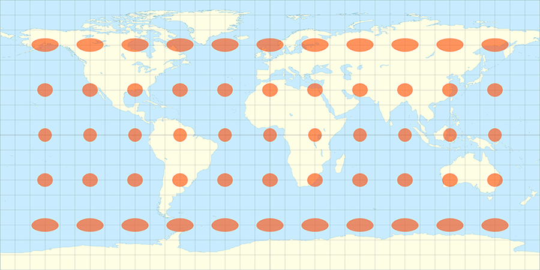


接下来我便可以利用等距投影规则把上面的贴图贴到球体上：

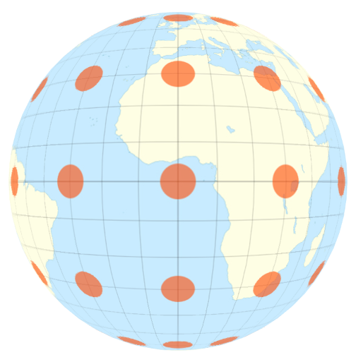

实现上面这个效果的关键就是纹理映射，我所使用的纹理映射方法就是等距圆柱投影。

等距的意思就是上面的贴图里，每个格子的宽(纬线)、高(经线)尺寸都是相等的。

圆柱投影的意思是，用圆柱包裹球体，圆柱的面与球体相切。在球体中心放一个点光源，点光源会把球体投射到圆柱上，从而得到球体的圆柱投影。

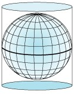


等距圆柱投影贴图也可以理解为球体展开后的样子。

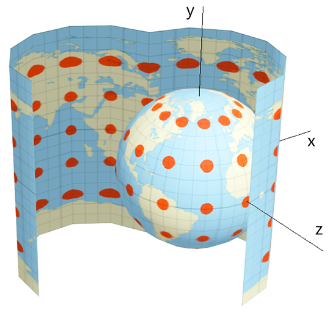


等距圆柱投影除了可以画地球，它在VR 中也得到了广泛的应用。

现在市面上的720°全景相机拍摄出的全景图片，一般都是等距圆柱投影图片。

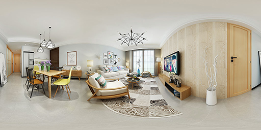


等距圆柱投影的计算挺简单的，咱们之前说球坐标系的时候就已经为其打好了基础。


#### 1-2-地理坐标系

地理坐标系(Geographic coordinate system) 就是一种球坐标系(Spherical coordinate system)。

地理坐标系和three.js 里的Spherical 球坐标系差不多，只是在θ和φ的定义上略有差异。

Spherical 球坐标系里的方位角θ和极角φ的定义规则：

- θ 起始于z轴的正半轴，逆时针旋转，旋转量越大θ 值越大，0 ≤ θ  < 2π
- φ 起始于y轴的正半轴，向下旋转，旋转量越大φ 值越大，0 ≤ φ < π

下图是地理坐标系：

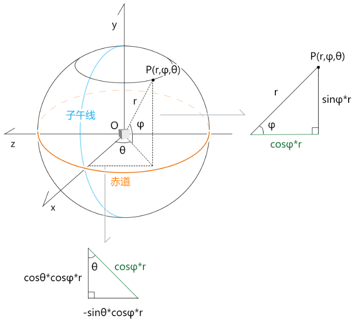


- θ 对应经度，起始于x轴的正半轴，即本初子午线的位置，θ=0
  - 从0° 逆时针旋转，旋转量越大θ 值越大，旋转到180°结束，是为东经，0 ≤ θ  < π
  - 从0° 顺时针旋转，旋转量越大θ 值越小，旋转到-180°结束，是为西经，0 ≤ θ  < -π
- φ 对应维度，起始于赤道，φ=0
  - 从0° 向上旋转，旋转量越大φ 值越大，旋转到90°结束，是为北纬，0 ≤ φ < π/2
  - 从0° 向下旋转，旋转量越大φ 值越小，旋转到-90°结束，是为南纬，0 ≤ φ < -π/2

对于已知一点的经纬度，求此点的三维直角坐标位的方法，上图已经详细画出。


#### 1-3-经纬度与等距圆柱投影贴图的线性映射

通过上面经纬度的定义规则，我们可以知道：

- 经度和U值相映射
- 维度和V值相映射

其具体的映射映射方式如下图所示：

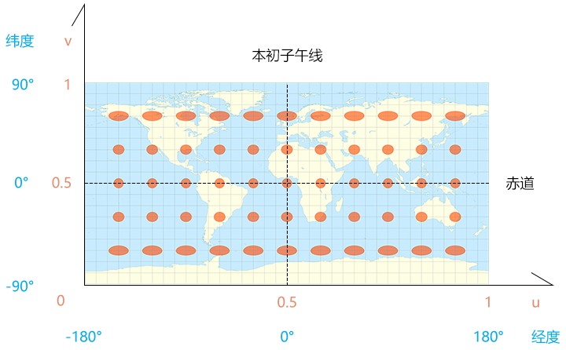


- 经度[-π,π] 映射u[0,1]
- 维度[-π/2,π/2] 映射v[0,1]


#### 1-4-绘制地球

1.建立一个地理坐标系Geography对象，方便把经纬度转三维直角坐标。

```js
import {Vector3} from 'https://unpkg.com/three/build/three.module.js';

/*
属性：
  r：半径
  longitude：经度(弧度)
  latitude：纬度(弧度)
  position：三维坐标位

构造参数：
  r,longitude,latitude 
  或者
  position
*/
export default class Geography{
  constructor(r=1,longitude=0, latitude=0){
    this.r=r
    this.longitude=longitude
    this.latitude = latitude
    this.position=new Vector3()
    this.updatePos()
  }
  //克隆
  clone() {
    const { r, longitude, latitude } = this
    return new Geography(r, longitude, latitude)
  }
  //设置半径，更新三维直角坐标位
  setR(r) {
    this.r = r
    this.updatePos()
    return this
  }
  //根据经纬度更新三维直角坐标位
  updatePos() {
    const { r,longitude,latitude } = this
    const len = Math.cos(latitude) * r
    this.position.set(
      Math.cos(longitude)*len,
      Math.sin(latitude)*r,
      -Math.sin(longitude)*len
    )
  }
}

```


2.建模

之前我们画过一个球体Sphere.js，只不过这个球体的南极和北极共用一个顶点，不适合做柱状投影贴图。

接下来，咱们在其基础上再改装一个球体Earth出来，这个Earth对象是按照矩形网格建模的，如下图所示：

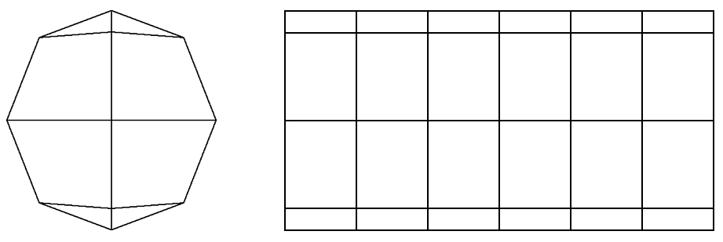


当前这个Earth对象是直接按照矩形网格建模的。

```js
import Geography from './Geography.js'

/*
属性：
  r：半径
  widthSegments：横向段数，最小3端
  heightSegments：纵向段数，最小2端
  vertices：顶点集合
  normals：法线集合
  indexes：顶点索引集合
  uv：uv坐标
  count：顶点数量
*/
export default class Earth{
  constructor(r=1, widthSegments=3, heightSegments=2){
    this.r=r
    this.widthSegments=widthSegments
    this.heightSegments=heightSegments
    this.vertices=[]
    this.normals=[]
    this.indexes = []
    this.uv=[]
    this.count=0
    this.init()
  }
  init() {
    const {r,widthSegments, heightSegments } = this
    //网格线的数量
    const [width,height]=[widthSegments+1,heightSegments +1]
    //顶点数量
    this.count = width*height
    // theta和phi方向的旋转弧度
    const thetaSize = Math.PI * 2 / widthSegments
    const phiSize = Math.PI / heightSegments

    // 顶点集合
    const vertices = []
    // 法线集合
    const normals = []
    // 顶点索引集合
    const indexes = []
    //uv 坐标集合
    const uv=[]
    // 逐行列遍历
    for (let y = 0; y < height; y++) {
      // 维度 
      const phi = Math.PI/2-phiSize * y
      for (let x = 0; x < width; x++) {
        //经度，-Math.PI是为了让0°经线经过x轴的正半轴
        const theta = thetaSize * x-Math.PI
        // 计算顶点和法线
        const vertice = new Geography(r,theta,phi).position
        vertices.push(...Object.values(vertice))
        normals.push(...Object.values(vertice.normalize()))
        const [u, v] = [
          x / widthSegments,
          1-y/heightSegments
        ]
        uv.push(u, v)
        // 顶点索引
        if (y && x) {
          // 一个矩形格子的左上lt、右上rt、左下lb、右下rb点
          const lt = (y-1) * width + (x-1)
          const rt = (y-1) * width + x
          const lb = y * width + (x-1)
          const rb = y * width + x
          indexes.push(lb, rb, lt, lt, rb, rt)
        }
      }
    }
    this.vertices=new Float32Array(vertices)
    this.normals=new Float32Array(normals)
    this.uv=new Float32Array(uv)
    this.indexes=new Uint16Array(indexes)
  }
}

```


3.着色器

```html
<script id="vs" type="x-shader/x-vertex">
  attribute vec4 a_Position;
  attribute vec2 a_Pin;
  uniform mat4 u_PvMatrix;
  uniform mat4 u_ModelMatrix;
  varying vec2 v_Pin;
  void main(){
    gl_Position=u_PvMatrix*u_ModelMatrix*a_Position;
    v_Pin=a_Pin;
  }
</script>
<script id="fs" type="x-shader/x-fragment">
  precision mediump float;
  uniform sampler2D u_Sampler;
  varying vec2 v_Pin;
  void main(){
    gl_FragColor=texture2D(u_Sampler,v_Pin);
  }
</script>

```


3.贴图

```js
import { createProgram, } from "/jsm/Utils.js";
import {
  Matrix4, PerspectiveCamera, Vector3
} from 'https://unpkg.com/three/build/three.module.js';
import OrbitControls from './lv/OrbitControls.js'
import Mat from './lv/Mat.js'
import Geo from './lv/Geo.js'
import Obj3D from './lv/Obj3D.js'
import Scene from './lv/Scene.js'
import Earth from './lv/Earth.js'

const canvas = document.getElementById('canvas');
canvas.width = window.innerWidth
canvas.height = window.innerHeight
const gl = canvas.getContext('webgl');

// 球体
const earth = new Earth(0.5, 64, 32)

// 目标点
const target = new Vector3()
//视点
const eye = new Vector3(2, 0, 0)
const [fov, aspect, near, far] = [
  45, canvas.width / canvas.height,
  0.1, 5
]
// 透视相机
const camera = new PerspectiveCamera(fov, aspect, near, far)
camera.position.copy(eye)
// 轨道控制器
const orbit = new OrbitControls({ camera, target, dom: canvas, })

// 场景
const scene = new Scene({ gl })
//注册程序对象
scene.registerProgram(
  'map',
  {
    program: createProgram(
      gl,
      document.getElementById('vs').innerText,
      document.getElementById('fs').innerText,
    ),
    attributeNames: ['a_Position', 'a_Pin'],
    uniformNames: ['u_PvMatrix', 'u_ModelMatrix','u_Sampler']
  }
)

//地球
const matEarth = new Mat({
  program: 'map',
  data: {
    u_PvMatrix: {
      value: orbit.getPvMatrix().elements,
      type: 'uniformMatrix4fv',
    },
    u_ModelMatrix: {
      value: new Matrix4().elements,
      type: 'uniformMatrix4fv',
    },
  },
})
const geoEarth = new Geo({
  data: {
    a_Position: {
      array: earth.vertices,
      size: 3
    },
    a_Pin: {
      array: earth.uv,
      size: 2
    }
  },
  index: {
    array: earth.indexes
  }
})

//加载图片
const image = new Image()
image.src = './images/earth.jpg'
image.onload = function () {
  matEarth.maps.u_Sampler = { image }
  scene.add(new Obj3D({
    geo: geoEarth,
    mat: matEarth
  }))
  render()
}

// 连续渲染
function render(time = 0) {
  orbit.getPvMatrix()
  scene.draw()
  requestAnimationFrame(render)
}

/* 取消右击菜单的显示 */
canvas.addEventListener('contextmenu', event => {
  event.preventDefault()
})
/* 指针按下时，设置拖拽起始位，获取轨道控制器状态。 */
canvas.addEventListener('pointerdown', event => {
  orbit.pointerdown(event)
})
/* 指针移动时，若控制器处于平移状态，平移相机；若控制器处于旋转状态，旋转相机。 */
canvas.addEventListener('pointermove', event => {
  orbit.pointermove(event)
})
/* 指针抬起 */
canvas.addEventListener('pointerup', event => {
  orbit.pointerup(event)
})
/* 滚轮事件 */
canvas.addEventListener('wheel', event => {
  orbit.wheel(event)
})

```

效果如下：


到现在，大家应该对等距圆柱投影有了一个整体的认知。

接下我们就可以再做一下扩展，根据经纬度，为某个地点做标记。


#### 1-5-标记点

我在百度地图里拿到了天安门的经纬度(116.404,39.915)，其意思就是东经116.404°, 北纬39.915°

我们使用Geography 对象便可以将经纬度转三维直角坐标位，然后再根据这个三维直角坐标位做个标记即可。

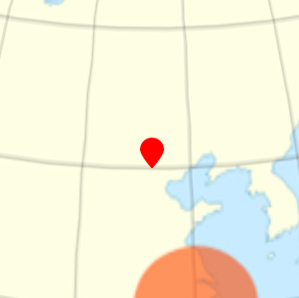

标记点的制作思路有两种：

- 用之类的HTML标签实现。
  - 优点：制作便捷，尤其是要为其添加文字的时候。
  - 缺点：要将标记点在webgl 裁剪空间坐标位转换到css 坐标位。需要额外考虑标记点与模型的遮挡问题。
- 在webgl 中实现。
  - 优点：标记点操作方便，模型遮挡实现便捷。
  - 缺点：若标记点中存在文字，需做额外考量。

对于文字标记的显示问题，我们这里先不说，后面会单独详解。

接下来，我们先用webgl 在地图上显示一个不带文字的标记点。

1.建立一个矩形面对象，方便之后把标记点作为贴图贴上去。

```js
import {Vector2} from 'https://unpkg.com/three/build/three.module.js';

/*
属性：
  size:尺寸
  orign:基点，百分比，默认左下角
  vertices：顶点集合
  normals：法线集合
  indexes：顶点索引集合
  uv：uv坐标
*/
export default class Rect{
  constructor(w=1, h=1,x=0,y=0){
    this.size=new Vector2(w,h)
    this.orign=new Vector2(x,y)
    this.vertices=[]
    this.normals=[]
    this.indexes = []
    this.uv=[]
    this.update()
  }
  update() {
    const { size, orign } = this
    const l=-orign.x*size.x
    const b =-orign.y * size.y
    const r=size.x+l
    const t=size.y+b
    
    this.vertices = new Float32Array([
      l, t, 0,
      l, b, 0,
      r, t, 0,
      r, b, 0,
    ])
    this.normals = new Float32Array([
      0,0,1,
      0,0,1,
      0,0,1,
      0,0,1,
    ])
    this.uv = new Float32Array([
      0, 1,
      0, 0,
      1, 1,
      1, 0
    ])
    this.indexes = new Uint16Array([
      0, 1, 2,
      2,1,3
    ])
  }
}

```

接下来，基于之前圆柱投影文件略作调整。


2.实例化Rect 对象

```js
import Rect from './lv/Rect.js'
……
gl.enable(gl.BLEND);
gl.blendFunc(gl.SRC_ALPHA, gl.ONE_MINUS_SRC_ALPHA);
……
// 矩形面
const rect = new Rect(0.02, 0.02, 0.5, 0)

```


3.基于天安门经纬度，建立Geography 对象。

```js
const rad = Math.PI / 180
const geography = new Geography(
  earth.r,
  116.404 * rad,
  39.915 * rad
)

```


4.让相机的视点直视天门。

```js
const eye = geography.clone()
      .setR(earth.r + 1)
      .position

```


5.基于标记点的三维直角坐标位构建一个模型矩阵

```js
const modelMatrix = new Matrix4()
	.setPosition(geography.position)

```


6.建立标记点的Mat和Geo 对象

```js
const matMark = new Mat({
  program: 'map',
  data: {
    u_PvMatrix: {
      value: orbit.getPvMatrix().elements,
      type: 'uniformMatrix4fv',
    },
    u_ModelMatrix: {
      value: modelMatrix.elements,
      type: 'uniformMatrix4fv',
    },
  },
})
const geoMark = new Geo({
  data: {
    a_Position: {
      array: rect.vertices,
      size: 3
    },
    a_Pin: {
      array: rect.uv,
      size: 2
    }
  },
  index: {
    array: rect.indexes
  }
})

```


7.当所有贴图都加载成功后，将贴图传给相应的Mat 对象。然后建立地球和标记点所对应的Obj3D对象，将其添加到Scene 场景中，进行渲染。

```js
//加载图形
const imgPromises = ['earth.jpg', 'mark.png'].map(name => {
  const img = new Image()
  img.src = `./images/${name}`
  return imgPromise(img)
})
Promise.all(imgPromises).then((imgs) => {
  matEarth.maps.u_Sampler = { image: imgs[0] }
  matMark.maps.u_Sampler = {
    image: imgs[1],
    format: gl.RGBA
  }
  scene.add(new Obj3D({
    geo: geoEarth,
    mat: matEarth
  }))
  scene.add(new Obj3D({
    geo: geoMark,
    mat: matMark
  }))
  render()
})

// 连续渲染
function render(time = 0) {
  orbit.getPvMatrix()
  scene.draw()
  requestAnimationFrame(render)
}

```


8.让标记点贴合到地球表面

```js
const modelMatrix = new Matrix4()
      .setPosition(geography.position)
      .multiply(
        new Matrix4().lookAt(
          geography.position,
          target,
          new Vector3(0, 1, 0)
        )
      )

```

最终效果如下：

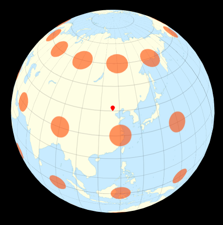

在实际项目中，围绕地球，是可以做很多东西。

比如在球体上绘制柱状图，表示不同地区的经济增长情况；

在两个地点之间绘制3D路径，以表示两地之间存在的联系；

对于这些效果，我们就先不做扩展了，等结课了再跟大家慢慢说。

接下来，我在把相机塞进地球里，做一个VR的效果。


### 2-VR

VR(Virtual Reality) 的意思就是虚拟现实，可以通过VR 眼镜给人环境沉浸感。

VR 的制作需要考虑两点：

- 搭建场景，当前比较常见的搭建场景的方法就是将全景图贴到立方体，或者球体上。
- 场景变换，一般会把透视相机塞进立方体，或者球体里，然后变换场景。

接下来咱们 具体说一下其实现步骤。

#### 2-1-搭建场景

1.用720°全景相机拍摄一张室内全景图。


2.在之前地球文件的基础上做修改，把地图替换成上面的室内全景图。

```js
const image = new Image()
image.src = './images/room.jpg'

```


3.把相机打入球体之中

```js
// 目标点
const target = new Vector3()
//视点
const eye = new Vector3(0.15, 0, 0)
const [fov, aspect, near, far] = [
  60, canvas.width / canvas.height,
  0.1, 1
]

```

效果如下：

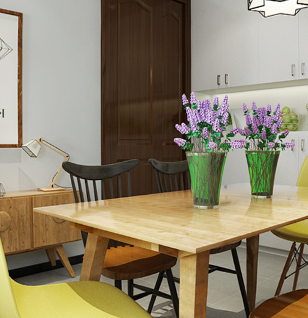

现在VR的效果就已经有了，接下来我们还需要考虑VR 场景的变换。


#### 2-2-VR 场景的变换

VR 场景的变换通过相机轨道控制器便可以实现。

当前相机轨道控制器已经具备了旋转、缩放和平移功能。

只不过，针对VR 还得对相机轨道控制器做一下微调。

1.取消相机的平移，以避免相机跑到球体之外。

为相机轨道控制器 OrbitControls 添加一个是否启用平移的功能。

```js
const defAttr = () => ({
  ……
  enablePan: true,
})


```

在平移方法中，做个是否平移的判断：

```js
pointermove({ clientX, clientY }) {
  const { dragStart, dragEnd, state,enablePan, camera: { type } } = this
  dragEnd.set(clientX, clientY)
  switch (state) {
    case 'pan':
      enablePan&&this[`pan${type}`] (dragEnd.clone().sub(dragStart))
      break
    ……
  }
  dragStart.copy(dragEnd)
}

```

这样就可以在实例化OrbitControls 对象的时候，将enablePan 设置为false，从而禁止相机平移。

```js
const orbit = new OrbitControls({
  camera,
  target,
  dom: canvas,
  enablePan: false
})

```


2.使用透视相机缩放VR 场景时，不再使用视点到目标的距离来缩放场景，因为这样的放大效果不太明显。所以，可以直接像正交相机那样，缩放裁剪面。

为OrbitControls 对象的wheel 方法添加一个控制缩放方式的参数。

```js
wheel({ deltaY },type=this.camera.type) {
  const { zoomScale} = this
  let scale=deltaY < 0?zoomScale:1 / zoomScale
  this[`dolly${type}`] (scale)
  this.updateSph()
}

```

这样就可以像缩放正交相机那样缩放透视相机。

```js
canvas.addEventListener('wheel', event => {
  orbit.wheel(event, 'OrthographicCamera')
})

```


3.在缩放的时候，需要限制一下缩放范围，免得缩放得太大，或者缩小得超出了球体之外。

为OrbitControls 添加两个缩放极值：

- minZoom 缩放的最小值
- maxZoom 缩放的最大值

```js
const defAttr = () => ({
  ……
  minZoom:0,
  maxZoom: Infinity,
})

```

在相应的缩放方法中，对缩放量做限制：

```js
dollyOrthographicCamera(dollyScale) {
  const {camera,maxZoom,minZoom}=this
  const zoom=camera.zoom*dollyScale
  camera.zoom = Math.max(
    Math.min(maxZoom, zoom),
    minZoom
  )
  camera.updateProjectionMatrix()
}

```

在实例化OrbitControls 对象时，设置缩放范围：

```js
const orbit = new OrbitControls({
  ……
  maxZoom: 15,
  minZoom: 0.4
})

```


#### 2-3-陀螺仪

VR 的真正魅力在于，你可以带上VR 眼镜，体会身临其境的感觉。

VR 眼镜之所以能给你身临其境的感觉，是因为它内部有一个陀螺仪，可以监听设备的转动，从而带动VR 场景的变换。

目前市场上常见的VR 眼镜有两种：需要插入手机的VR眼镜和一体机。

一般手机里都是有陀螺仪的，因此我们可以用手机来体验VR。

接下来，咱们可以先整个小例子练练手。

我要画个立方体，然后用陀螺仪旋转它。

为了更好的理解陀螺仪。我们把之前的球体变成立方体，在其上面贴上画有东、西、南、北和上、下的贴图。然后在其中打入相机，用陀螺仪变换相机视点，如下图：

 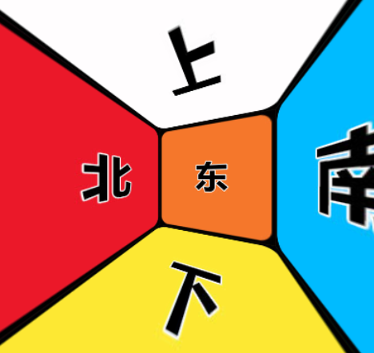


1.建立立方体对象Box

```js
/*
属性：
  w：宽
  h：高
  d：深
  vertices：顶点集合
  normals：法线集合
  indexes：顶点索引集合
  uv：uv坐标集合
  count：顶点数量
*/
export default class Box{
  constructor(w=1,h=1,d=1){
    this.w=w
    this.h=h
    this.d=d
    this.vertices=null
    this.normals=null
    this.indexes = null
    this.uv = null
    this.count = 36
    this.init()
  }
  init() {
    const [x, y, z] = [this.w / 2, this.h / 2, this.d / 2]
    this.vertices = new Float32Array([
      // 前 0 1 2 3
      -x, y, z, -x, -y, z, x, y, z, x, -y, z,
      // 右 4 5 6 7
      x, y, z, x, -y, z, x, y, -z, x, -y, -z,
      // 后 8 9 10 11
      x, y, -z, x, -y, -z, -x, y, -z, -x, -y, -z,
      // 左 12 13 14 15 
      -x, y, -z, -x, -y, -z, -x, y, z, -x, -y, z,
      // 上 16 17 18 19
      -x, y, -z, -x, y, z, x, y, -z, x, y, z,
      // 下 20 21 22 23 
      -x,-y,z,-x,-y,-z,x,-y,z,x,-y,-z,
    ])
    this.normals = new Float32Array([
      0, 0, 1, 0, 0, 1, 0, 0, 1, 0, 0, 1,
      1, 0, 0, 1, 0, 0, 1, 0, 0, 1, 0, 0,
      0, 0, -1, 0, 0, -1, 0, 0, -1, 0, 0, -1, 
      -1, 0, 0, -1, 0, 0, -1, 0, 0, -1, 0, 0,
      0, 1, 0, 0, 1, 0, 0, 1, 0, 0, 1, 0,
      0,-1,0,0,-1,0,0,-1,0,0,-1,0,
    ])
    /* this.uv = new Float32Array([
      0,1,0,0,1,1,1,0,
      0,1,0,0,1,1,1,0,
      0,1,0,0,1,1,1,0,
      0,1,0,0,1,1,1,0,
      0,1,0,0,1,1,1,0,
      0,1,0,0,1,1,1,0,
    ]) */
    this.uv = new Float32Array([
      0,1, 0,0.5, 0.25,1, 0.25,0.5,
      0.25,1, 0.25,0.5, 0.5,1, 0.5,0.5,
      0.5,1, 0.5,0.5, 0.75,1, 0.75,0.5,
      0,0.5,0,0,0.25,0.5,0.25,0,
      0.25,0.5,0.25,0,0.5,0.5,0.5,0,
      0.5,0.5,0.5,0,0.75,0.5,0.75,0,
    ])
    this.indexes = new Uint16Array([
      0, 1, 2, 2, 1, 3,
      4, 5, 6, 6, 5, 7,
      8, 9, 10, 10, 9, 11,
      12, 13, 14, 14, 13, 15,
      16, 17, 18, 18, 17, 19, 
      20,21,22,22,21,23
    ])
  }
}

```


2.在Google浏览器中打开传感器，模拟陀螺仪的旋转。

一我们在电脑里做测试的时候，需要用浏览器里的开发者工具

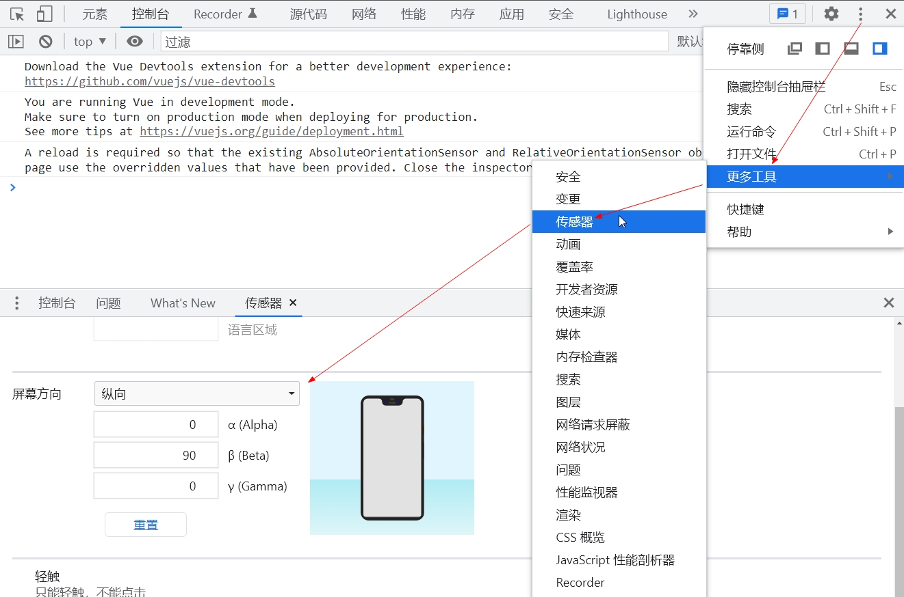


之后我们可以在js中通过deviceorientation 事件监听陀螺仪的变化。

从deviceorientation 事件的回调参数event里，可以解构出alpha, beta, gamma 三个参数。

```js
window.addEventListener('deviceorientation', (event) => {
  const { alpha, beta, gamma }=event
})

```

alpha, beta, gamma对应了陀螺仪欧拉旋转的三个参数。

在右手坐标系中，其概念如下：

- alpha：绕世界坐标系的y轴逆时针旋转的角度，旋转范围是[-180°,180°)

- beta：绕本地坐标系的x轴逆时针旋转的角度，旋转范围是[-180°,180°)

- gamma ：绕本地坐标系的z轴顺时针旋转的角度，旋转范围是[-90°,90°)


注：alpha, beta, gamma具体是绕哪个轴旋转，跟我们当前程序所使用的坐标系有关。所以大家之后若是看到有些教程在说陀螺仪时，跟我说的不一样，也不要惊奇，只要在实践中没有问题就可以。

陀螺仪欧拉旋转的顺序是'YXZ'，而不是欧拉对象默认的'XYZ'。

欧拉旋转顺序是很重要的，如果乱了，就无法让VR旋转与陀螺仪相匹配了。

接下来，基于之前VR.html 文件做下调整。


3.建立立方体对象

```js
import Box from './lv/Box.js'
const box = new Box(1, 1, 1)

```


4.调整相机数据

```js
// 目标点
const target = new Vector3()
//视点
const eye = new Vector3(0, 0.45, 0.0001)
const [fov, aspect, near, far] = [
  120, canvas.width / canvas.height,
  0.01, 2
]
// 透视相机
const camera = new PerspectiveCamera(fov, aspect, near, far)
camera.position.copy(eye)

```

相机的视线是根据陀螺仪的初始状态设置的。

在陀螺仪的alpha, beta, gamma皆为0的情况下，手机成俯视状态。

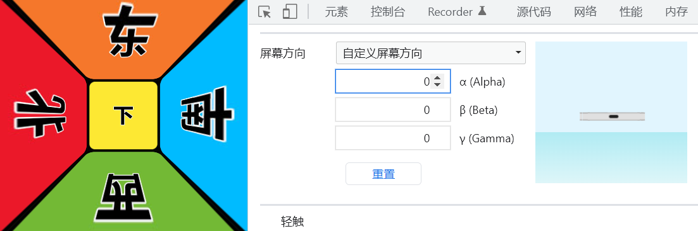

所以，相机也要成俯视状态，因此视点的y值设置为0.45。

然而，视线也不能完全垂直，因为这样视点绕y轴旋转就会失效。

所以，视点的z值给了一个较小的数字0.0001。


5.场景的渲染和之前是一样。

```js
// 轨道控制器
const orbit = new OrbitControls({
  camera,
  target,
  dom: canvas,
  enablePan: false,
  maxZoom: 15,
  minZoom: 0.4
})

// 场景
const scene = new Scene({ gl })
//注册程序对象
scene.registerProgram(
  'map',
  {
    program: createProgram(
      gl,
      document.getElementById('vs').innerText,
      document.getElementById('fs').innerText,
    ),
    attributeNames: ['a_Position', 'a_Pin'],
    uniformNames: ['u_PvMatrix', 'u_ModelMatrix','u_Sampler']
  }
)

//立方体
const matBox = new Mat({
  program: 'map',
  data: {
    u_PvMatrix: {
      value: orbit.getPvMatrix().elements,
      type: 'uniformMatrix4fv',
    },
    u_ModelMatrix: {
      value: new Matrix4().elements,
      type: 'uniformMatrix4fv',
    },
  },
})
const geoBox = new Geo({
  data: {
    a_Position: {
      array: box.vertices,
      size: 3
    },
    a_Pin: {
      array: box.uv,
      size: 2
    }
  },
  index: {
    array: box.indexes
  }
})

//加载图片
const image = new Image()
image.src = './images/magic.jpg'
image.onload = function () {
  matBox.maps.u_Sampler = {
    image,
    magFilte: gl.LINEAR,
    minFilter: gl.LINEAR,
  }
  scene.add(new Obj3D({
    geo: geoBox,
    mat: matBox
  }))
  render()
}

function render() {
  orbit.getPvMatrix()
  scene.draw()
  requestAnimationFrame(render)
}

```

效果如下：


7.监听陀螺仪事件时，需要考虑三件事：

- 判断当前设备里是否有陀螺仪。

- 让用户触发浏览器对陀螺仪事件的监听，可通过click 之类的事件触发。
- 若系统是ios，需要请求用户许可。

css 样式：

```css
html {height: 100%;}
body {
  margin: 0;
  height: 100%;
  overflow: hidden
}
.wrapper {
  display: flex;
  position: absolute;
  justify-content: center;
  align-items: center;
  width: 100%;
  height: 100%;
  top: 0;
  background-color: rgba(0, 0, 0, 0.4);
  z-index: 10;
}
#playBtn {
  padding: 24px 24px;
  border-radius: 24px;
  background-color: #00acec;
  text-align: center;
  color: #fff;
  cursor: pointer;
  font-size: 24px;
  font-weight: bold;
  border: 6px solid rgba(255, 255, 255, 0.7);
  box-shadow: 0 9px 9px rgba(0, 0, 0, 0.7);
}

```

html 标签：

```html
<canvas id="canvas"></canvas>
<div class="wrapper">
  <div id="playBtn">开启VR之旅</div>
</div>

```

js 代码：

```js
// 遮罩
const wrapper = document.querySelector('.wrapper')
// 按钮
const btn = document.querySelector('#playBtn')
// 判断设备中是否有陀螺仪
if (window.DeviceMotionEvent) {
  // 让用户触发陀螺仪的监听事件
  btn.addEventListener('click', () => {
    //若是ios系统，需要请求用户许可
    if (DeviceMotionEvent.requestPermission) {
      requestPermission()
    } else {
      rotate()
    }
  })
} else {
  btn.innerHTML = '您的设备里没有陀螺仪！'
}

//请求用户许可
function requestPermission() {
  DeviceMotionEvent.requestPermission()
    .then(function (permissionState) {
    // granted:用户允许浏览器监听陀螺仪事件
    if (permissionState === 'granted') {
      rotate()
    } else {
      btn.innerHTML = '请允许使用陀螺仪🌹'
    }
  }).catch(function (err) {
    btn.innerHTML = '请求失败！'
  });
}

//监听陀螺仪
function rotate() {
  wrapper.style.display = 'none'
  window.addEventListener('deviceorientation', ({ alpha, beta, gamma }) => {
    const rad = Math.PI / 180
    const euler = new Euler(
      beta * rad,
      alpha * rad,
      -gamma * rad,
      'YXZ'
    )
    camera.position.copy(
      eye.clone().applyEuler(euler)
    )
    orbit.updateCamera()
    orbit.resetSpherical()
  })
}

```

关于陀螺仪的基本用法我们就说到这。

我之前在网上看了一些陀螺仪相关的教程，很多都没说到点上，因为若是不知道欧拉旋转的概念，就说不明白陀螺仪。

所以，我们一定不要舍不得花时间学习图形学，图形学关系着我们自身发展的潜力。

接下来我们可以在VR.html 文件里，以同样的原理把陀螺仪写进去，并结合项目的实际需求做一下优化。


#### 2-4-VR+陀螺仪

我们可以先把陀螺仪封装一下，以后用起来方便。

1.封装一个陀螺仪对象Gyro.js

```js
import {Euler} from 'https://unpkg.com/three/build/three.module.js';

const rad = Math.PI / 180

const defAttr = () => ({
  //用于触发事件的按钮
  btn: null,
  //没有陀螺仪
  noDevice: () => { },
  //当点击按钮时
  onClick: () => { },
  //可以使用陀螺仪时触发一次
  init: () => { },
  //用户拒绝开启陀螺仪
  reject: () => { },
  //请求失败
  error: () => { },
  //陀螺仪变换
  change: () => { },
})

export default class Gyro {
  constructor(attr) {
    Object.assign(this, defAttr(), attr)
  }
  start() {
    const { btn } = this
    if (window.DeviceMotionEvent) {
      // 让用户触发陀螺仪的监听事件
      btn.addEventListener('click', () => {
        this.onClick()
        //若系统是ios，需要请求用户许可
        if (DeviceMotionEvent.requestPermission) {
          this.requestPermission()
        } else {
          this.translate()
        }
      })
    } else {
      this.noDevice()
    }
  }
  //请求用户许可
  requestPermission() {
    DeviceMotionEvent.requestPermission()
      .then((permissionState) => {
      // granted:用户允许浏览器监听陀螺仪事件
      if (permissionState === 'granted') {
        this.translate()
      } else {
        this.reject()
      }
    }).catch((err) => {
      this.error(err)
    });
  }
  // 监听陀螺仪
  translate() {
    this.init()
    window.addEventListener('deviceorientation', ({ beta, alpha, gamma }) => {
      this.change(new Euler(
        beta * rad,
        alpha * rad,
        -gamma * rad,
        'YXZ'
      ))
    })
  }
}

```


2.把陀螺仪对象引入VR文件

```js
import Gyro from './lv/Gyro.js'

// 遮罩
const wrapper = document.querySelector('.wrapper')
// 按钮
const btn = document.querySelector('#playBtn')
// 陀螺仪
const gyro = new Gyro({
  btn,
  noDevice: () => {
    btn.innerHTML = '您的设备里没有陀螺仪！'
  },
  reject: () => {
    btn.innerHTML = '请允许使用陀螺仪🌹'
  },
  error: () => {
    btn.innerHTML = '请求失败！'
  },
  init: () => {
    wrapper.style.display = 'none'
  },
  change: (euler) => {
    camera.position.copy(
      eye.clone().applyEuler(euler)
    )
    orbit.updateCamera()
    orbit.resetSpherical()
  }
})
gyro.start()

```


3.优化图像的加载。

在实际开发中，为了让用户看到比较清晰的效果，往往需要使用比较大的全景图，比如4096*2048 的尺寸。

大尺寸的图片加载起来会很慢，为了减少用户的等待，我们可以先加载一个较小的图片，然后慢慢的过度到大图。

比如，我们可以从小到大准备4张不同尺寸的全景图：

- 512*256
- 1024*512
- 2048*1024
- 4096*2048

接下来先加载第一张小图，将其显示出来后，再依次加载后面的大图。

```js
//图片序号
let level = 0
//加载图片
loadImg()
function loadImg() {
  const image = new Image()
  image.src = `./images/room${level}.jpg`
  image.onload = function () {
    if (level === 0) {
      firstRender(image)
    } else {
      //更新贴图
      matEarth.setMap('u_Sampler', { image })
    }
    if (level < 3) {
      level++
      loadImg()
    }
  }
}
// 第一次渲染
function firstRender(image) {
  btn.innerHTML = '开启VR之旅'
  matEarth.maps.u_Sampler = {
    image,
    magFilte: gl.LINEAR,
    minFilter: gl.LINEAR,
  }
  scene.add(new Obj3D({
    geo: geoEarth,
    mat: matEarth
  }))
  render()
}

```

与此同时，我们还得微调一下Mat.js里的更新贴图方法：

```js
updateMap(gl,map,ind) {
  ……
  //gl.bindTexture(gl.TEXTURE_2D, null)
}

```

我们需要取消对纹理缓冲区的清理。

以前我们要清理纹理缓冲区，是因为我们不需要对纹理缓冲区里的纹理对象进行更新，将其清理掉还可以节约内存。

而现在我们需要对纹理缓冲区里的纹理对象进行更新，那就不能清理掉了。


#### 2-5-开场动画

开场动画的作用，就是给用户一个吸引眼球的效果，提高项目的趣味性。

开场动画的开场方式有很多，咱们这里就说一个比较常见的：从上帝视角到普通视角的过度。

上帝视角就是一个俯视的视角，视野一定要广，如下图：

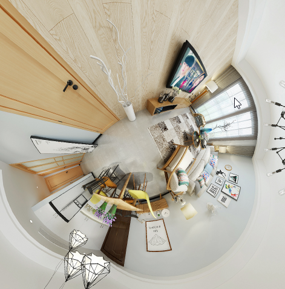


之后，我会用补间动画，将其过度到普通视角，如下图：


从上帝视角到普通视角的变换涉及以下属性：

- 相机视点的位置
- 相机视椎体的垂直视角

接下来我们便可以基于上面的属性做缓动动画。

1.把当前的相机视角调为上帝视角。

```js
// 目标点
const target = new Vector3()
//视点-根据陀螺仪做欧拉旋转
const eye = new Vector3( 0.15,0, 0.0001)
// 透视相机
const [fov, aspect, near, far] = [
  130, canvas.width / canvas.height,
  0.01, 2
]
const camera = new PerspectiveCamera(fov, aspect, near, far)
// 上帝视角
camera.position.set(0, 0.42, 0)
```


2.基于相机的视点和视椎体的垂直夹角建立两个目标变量

```js
const endPos = camera.position.clone()
let endFov = fov
```

上面的两个目标变量默认是和当前相机一致的，之后陀螺仪发生变化时会对其做修改。


3.在陀螺仪发生变化时，设置目标变量

```js
// 陀螺仪
const gyro = new Gyro({
  ……
  change: (euler) => {
    endFov = 60
    endPos.copy(
      eye.clone().applyEuler(euler)
    )
  }
})
```

当前的开场动画是针对有陀螺仪的手机而言的，接下来再做对PC端的开场动画。


4.当鼠标点击“开启VR之旅” 的时候，若浏览器在PC端，将视角调为普通视角。

```js
const pc = isPC()
const gyro = new Gyro({
 	……
  onClick: () => {
    if (pc) {
      endPos.set(0.15, 0, 0.0001)
      endFov = 60
    }
  }
})
```

isPC() 是判断浏览器是否在PC端的方法。

```js
const isPC=()=>!navigator.userAgent.match(/(phone|pad|pod|iPhone|iPod|ios|iPad|Android|Mobile|BlackBerry|IEMobile|MQQBrowser|JUC|Fennec|wOSBrowser|BrowserNG|WebOS|Symbian|Windows Phone)/i)

```


5.建立缓动动画方法

```js
function tween(ratio = 0.05) {
  //若当前设备为PC,缓动结束后就不再缓动，之后的变换交给轨道控制器
  if (pc && camera.fov < endFov + 1) { return }

  camera.position.lerp(endPos, ratio)
  camera.fov += (endFov - camera.fov) * ratio
  camera.updateProjectionMatrix()
  orbit.updateCamera()
  orbit.resetSpherical()
}
```

- camera.updateProjectionMatrix() 更新投影矩阵。

  因为上面更新了视椎体的垂直夹角，所以相机的投影矩阵也要做同步的更新，具体原理参见之前的透视投影矩阵。

- orbit.updateCamera() 更新相机，将相机的视点位置和视线写入相机的本地矩阵里。

- orbit.resetSpherical() 重置球坐标。用鼠标旋转相机的时候会将旋转信息写入球坐标。


6.在连续渲染时执行缓动动画

```js
function render() {
  tween()
  orbit.getPvMatrix()
  scene.draw()
  requestAnimationFrame(render)
}
```


#### 2-6-添加标记点

标记点可以告诉用户不同区域的名称，或者为用户指引方向。

在添加标记点的时候，我们要考虑两点：

- 如何添加标记点
- 如何制作标记点

接下来我会在VR 场景中添加HTML类型的标记点，这种方法是比较常见的。

在VR中添加HTML类型标记点的核心问题是：如何让HTML 标记点随VR 场景同步变换。

解决这个问题要按以下几步走：

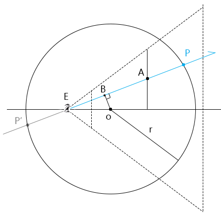

1.鼠标点击canvas 画布时，将此点的canvas坐标转世界坐标A。

​	注：canvas坐标转世界坐标的原理在“进入三维世界”的选择立方体里说过。

2.以视点为起点，A点位方向做射线EA。

3.求射线EA与球体的交点P，此点便是标记点在世界坐标系内的世界坐标。

4.在变换VR场景时，将标记点的世界坐标转canvas坐标，然后用此坐标更新标记点的位置。

在上面的步骤中，第3步是关键，我们详细讲解以下。

已知：

- 射线 EA
- 球体球心为O，半径为 r

求：射线 EA与球体的交点P

解：

先判断射线的基线与球体的关系。

设：EA的单位向量为v

用EO叉乘EA的单位向量，求得球心O 到直线的距离|OB|

```js
|OB|=|EO^v|
```

基于|OB|和半径r，可以知道基线与球体的关系：

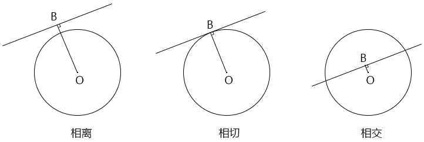

- |OB|>r，直线与球体相离，没有交点
- |OB|=r，直线与球体相切，1个交点 ，交点为B点

```js
B=v*(EO·v)

```

- |OB|<r，直线与球体相交，2个交点，其算法如下：


在直线EA上的点可以写做：

```js
E+λv, λ∈R

```

直线和球体相交的点满足：

```js
(E+λv-O)²=r²

```

(λv+OE)²可理解为向量OP的长度的平方。

E-O可写做OE：

```js
(λv+OE)²=r²

```

展开上式：

```js
λ²v²+2λv·OE+OE²=r²

```

因为：单位向量与其自身的点积等于1

所以：

```js
λ²+2λv·OE+OE²=r²
λ²+2λv·OE+OE²-r²=0

```

解一元二次方程式，求λ：

为了方便书写，设：

```js
b=2v·OE
c=OE²-r²

```

则：

```js
λ²+λb+c=0
λ²+bλ+(b/2)²=-c+(b/2)²
(λ+b/2)²=(b²-4c)/4
λ+b/2=±sqrt(b²-4c)/2
λ=(-b±sqrt(b²-4c))/2

```

知道了λ ，也就可以直线与球体的交点。

```
λv+OE

```

注：当λ小于0时，交点在射线EA的反方向，应该舍弃。

关于射线与球体的交点，咱们就说到这。

接下来咱们基于之前的VR.html 代码，在VR球体上打一个标记点。

1.建立一个标记点。当前先不考虑标记点的文字内容的编辑，只关注标记点的位置。

```html
<style>
  #mark {
    position: absolute;
    top: 0;
    left: 0;
    color: #fff;
    background-color: rgba(0, 0, 0, 0.6);
    padding: 6px 12px;
    border-radius: 3px;
    user-select: none;
  }
</style>

<div id="mark">标记点</div>

```


2.获取标记点，建立markWp变量，用于记录标记点的世界坐标。

```js
// 标记
const mark = document.querySelector('#mark')
// 标记点的世界位
let markWp = null

```


3.当鼠标双击canvas 画布的时候，添加标记点。

```js
canvas.addEventListener('dblclick', event => {
  addMark(event)
})

```

addMark() 方法做了3件事情：

- worldPos() 把鼠标点击在canvas画布上的canvas坐标转换为世界坐标.

  此方法咱们之前写过，从Utils.js 中引入即可。

- getMarkWp() 根据鼠标点的世界坐标设置标记点的世界坐标。

  这便是参照之前射线和球体交点的数学公式来写的。

  注：鼠标点的世界坐标并不是标记点的世界坐标。

- setMarkCp() 设置标记点的canvas坐标位。

```js
function addMark(event) {
  //鼠标点的世界坐标
  const A = worldPos(event, canvas, pvMatrix)
  //获取标记点的世界坐标
  markWp =getMarkWp(camera.position, A, target, earth.r)
  //设置标记点的canvas坐标位
  setMarkCp(event.clientX, event.clientY)
}

/* 获取射线和球体的交点
  E 射线起点-视点
  A 射线目标点
  O 球心
  r 半径
*/
function getMarkWp(E, A, O, r) {
  const v = A.clone().sub(E).normalize()
  const OE = E.clone().sub(O)
  //b=2v·OE
  const b = v.clone().multiplyScalar(2).dot(OE)
  //c=OE²-r²
  const c = OE.clone().dot(OE) - r * r
  //λ=(-b±sqrt(b²-4c))/2
  const lambda = (-b + Math.sqrt(b * b - 4 * c)) / 2
  //λv+OE
  return v.clone().multiplyScalar(lambda).add(OE)
}

//设置标记点的canvas坐标位
function setMarkCp(x, y) {
  mark.style.left = `${x}px`
  mark.style.top = `${y}px`
}

```


4.当旋转和缩放相机的时候，对标记点进行同步变换。

```js
canvas.addEventListener('pointermove', event => {
  orbit.pointermove(event)
  updateMarkCp()
})
canvas.addEventListener('wheel', event => {
  orbit.wheel(event, 'OrthographicCamera')
  updateMarkCp()
})

//更新标记点的位置
function updateMarkCp() {
  if (!markWp) { return }

  //判断标记点在相机的正面还是背面
  const {position}=camera
  const dot = markWp.clone().sub(position).dot(
    target.clone().sub(position)
  )
  if (dot > 0) {
    mark.style.display = 'block'
  } else {
    mark.style.display = 'none'
  }

  // 将标记点的世界坐标转裁剪坐标
  const { x, y } = markWp.clone().applyMatrix4(pvMatrix)
  // 将标记点的裁剪坐标转canvas坐标
  setMarkCp(
    (x + 1) * canvas.width / 2,
    (-y + 1) * canvas.height / 2
  )
}

```

之后围绕标记点还可以再进一步优化：

- 使标记点的文字内容可编辑
- 优化标记点样式
- 使标记点可拖拽
- 添加多个标记点
- ……

这些都是正常的前端业务逻辑，我这里就只重点说图形学相关的知识了。

之后大家可以参考一个叫“[720云](https://720yun.com/)”的网站，它就是专业做VR的。

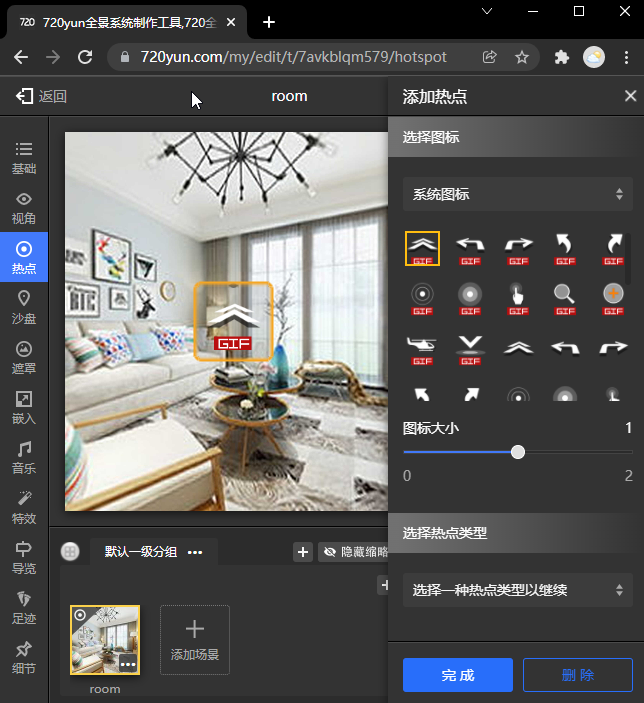


#### 2-7-VR 场景的切换

在实际开发中我们通常会遇到这样的需求：

在客厅的VR场景中有一扇进入卧室的门，在卧室门上有一个写着“卧室”的标记点。

当我们点击“卧室”标记点时，就进入卧室的VR 中。

这个需求便涉及了客厅和卧室两个VR场景的切换。

两个VR场景的切换最简单的实现方法就是直接换贴图了，这个方法快速、简单、直接，所以咱们先用代码写一下这个功能。

1.准备一份VR数据，我把它放进了vr.json 文件里，这就相当于后端数据库里的数据了。

```json
[
  {
    "id": 1,
    "imgSrc": "./images/room.jpg",
    "eye": [-0.14966274559865525, -0.009630159419482085, 0.002884893313037499],
    "marks": [
      {
        "name": "次卧",
        "pos": [-0.45099085840209097, 0.0889607157340315, 0.19670596506927274],
        "link": 2
      },
      {
        "name": "主卧",
        "pos": [-0.34961792927865026, 0.30943492493218633, -0.17893387258739163],
        "link": 3
      }
    ]
  },
  {
    "id": 2,
    "imgSrc": "./images/secBed.jpg",
    "eye": [-0.14966274559865525, -0.009630159419482085, 0.002884893313037499],
    "marks": [
      {
        "name": "客厅",
        "pos": [-0.34819482247111166, 0.29666506812630905, -0.20186679508508473],
        "link": 1
      }
    ]
  },
  {
    "id": 3,
    "imgSrc": "./images/mainBed.jpg",
    "eye": [-0.14966274559865525, -0.009630159419482085, 0.002884893313037499],
    "marks": [
      {
        "name": "客厅",
        "pos": [-0.07077938553590507, 0.14593627464082626, -0.47296181910077806],
        "link": 1
      }
    ]
  }
]

```

当前这个json 文件里有3个VR 场景的数据，分别是客厅、主卧、次卧。

- imgSrc VR图片
- eye 相机视点
- marks 标记点
  - name 标记点名称
  - pos 标记点世界位，可在上一节添加标记点的时候，将其存储到后端
  - link 当前标记点链接的VR 的id


2.基于之前添加标记点文件，做下调整，建立一个标记点容器marks，之后会往marks里放html类型的标记点。

```html
<style>
  .mark {
    position: absolute;
    transform: translate(-50%, -50%);
    top: 0;
    left: 0;
    color: #fff;
    background-color: rgba(0, 0, 0, 0.6);
    padding: 6px 12px;
    border-radius: 3px;
    user-select: none;
    cursor: pointer;
  }
</style>

<body>
  <canvas id="canvas"></canvas>
  <div id="marks"></div>
  ……
</body>


```


3.简化出一个VR场景。

```js
import { createProgram, worldPos } from "/jsm/Utils.js";
import {
  Matrix4, PerspectiveCamera, Vector3
} from 'https://unpkg.com/three/build/three.module.js';
import OrbitControls from './lv/OrbitControls.js'
import Mat from './lv/Mat.js'
import Geo from './lv/Geo.js'
import Obj3D from './lv/Obj3D.js'
import Scene from './lv/Scene.js'
import Earth from './lv/Earth.js'

const canvas = document.getElementById('canvas');
canvas.width = window.innerWidth;
canvas.height = window.innerHeight;
let gl = canvas.getContext('webgl');

// 球体
const earth = new Earth(0.5, 64, 32)

// 目标点
const target = new Vector3()
const [fov, aspect, near, far] = [
  60, canvas.width / canvas.height,
  0.1, 5
]
// 透视相机
const camera = new PerspectiveCamera(fov, aspect, near, far)
// 轨道控制器
const orbit = new OrbitControls({
  camera,
  target,
  dom: canvas,
  enablePan: false,
  maxZoom: 15,
  minZoom: 0.4
})

//投影视图矩阵
const pvMatrix = orbit.getPvMatrix()

//标记
const marks = document.querySelector('#marks')

// 场景
const scene = new Scene({ gl })
//注册程序对象
scene.registerProgram(
  'map',
  {
    program: createProgram(
      gl,
      document.getElementById('vs').innerText,
      document.getElementById('fs').innerText,
    ),
    attributeNames: ['a_Position', 'a_Pin'],
    uniformNames: ['u_PvMatrix', 'u_ModelMatrix', 'u_Sampler']
  }
)

//球体
const mat = new Mat({
  program: 'map',
  data: {
    u_PvMatrix: {
      value: orbit.getPvMatrix().elements,
      type: 'uniformMatrix4fv',
    },
    u_ModelMatrix: {
      value: new Matrix4().elements,
      type: 'uniformMatrix4fv',
    },
  },
  maps: {
    u_Sampler: {
      magFilter: gl.LINEAR,
      minFilter: gl.LINEAR,
    }
  }
})
const geo = new Geo({
  data: {
    a_Position: {
      array: earth.vertices,
      size: 3
    },
    a_Pin: {
      array: earth.uv,
      size: 2
    }
  },
  index: {
    array: earth.indexes
  }
})
scene.add(new Obj3D({ geo, mat }))

// 渲染
render()

function render() {
  orbit.getPvMatrix()
  scene.draw()
  requestAnimationFrame(render)
}

/* 取消右击菜单的显示 */
canvas.addEventListener('contextmenu', event => {
  event.preventDefault()
})
/* 指针按下时，设置拖拽起始位，获取轨道控制器状态。 */
canvas.addEventListener('pointerdown', event => {
  orbit.pointerdown(event)
})
/* 指针移动时，若控制器处于平移状态，平移相机；若控制器处于旋转状态，旋转相机。 */
canvas.addEventListener('pointermove', event => {
  orbit.pointermove(event)
  updateMarkCp()
})
/* 指针抬起 */
canvas.addEventListener('pointerup', event => {
  orbit.pointerup(event)
})
/* 滚轮事件 */
canvas.addEventListener('wheel', event => {
  orbit.wheel(event, 'OrthographicCamera')
  updateMarkCp()
})


```

当前是渲染不出东西来的，因为我还没有给球体指定贴图。


3.请求VR 数据，更新VR。

```js
let data;
let curVr;
fetch('./data/vr.json')
  .then((res) => res.json())
  .then(dt => {
    data = dt
    curVr = getVrById(1)
    //更新VR
    updateVr()
    // 渲染
    render()
  });

//根据id获取VR数据
function getVrById(id) {
  for (let i = 0; i < data.length; i++) {
    if (id === data[i].id) {
      return data[i]
    }
  }
}

//根据数据更新VR
function updateVr() {
  const image = new Image()
  image.src = curVr.imgSrc
  image.onload = function () {
    //更新图片
    mat.setMap('u_Sampler', { image })
    //更新相机视点
    camera.position.set(...curVr.eye)
    orbit.updateCamera()
    orbit.resetSpherical()
    //显示标记点
    showMark()
  }
}

//显示标记点
function showMark() {
  curVr.marks.forEach(ele => {
    const div = document.createElement('div')
    div.className = 'mark'
    div.innerText = ele.name
    div.setAttribute('data-link', ele.link)
    marks.append(div)
  })
}

//更新标记点的canvas坐标位
function updateMarkCp() {
  if (!marks.children.length) { return }
  const { position } = camera
  const EO = target.clone().sub(position)
  curVr.marks.forEach((ele, ind) => {
    const markWp = new Vector3(...ele.pos)
    const mark = marks.children[ind]
    const dot = markWp.clone().sub(position).dot(EO)
    mark.style.display = dot > 0 ? 'block' : 'none'
    const { x, y } = markWp.clone().applyMatrix4(pvMatrix)
    mark.style.left = `${(x + 1) * canvas.width / 2}px`
    mark.style.top = `${(-y + 1) * canvas.height / 2}px`
  })
}


```


5.点击标记点时，根据标记点的data-link 更新VR

```js
marks.addEventListener('click', ({ target }) => {
  if (target.className !== 'mark') { return }
  marks.innerHTML = ''
  curVr = getVrById(parseInt(target.getAttribute('data-link')))
  updateVr()
})


```


6.连续渲染的时候，更新标记点的canvas坐标位。

```js
function render() {
  orbit.getPvMatrix()
  scene.draw()
  updateMarkCp()
  requestAnimationFrame(render)
}


```


7.把鼠标的位移事件绑定到window上。

当鼠标移动到标记点上时，会被标记点卡住，无法移动，这是因为标记点挡住了canvas，所以不能再把鼠标事件绑定到canvas上了。

```js
window.addEventListener('pointermove', event => {
  orbit.pointermove(event)
})


```

到目前为止，VR 场景切换的基本功能已经搞定了。

然而，老板可能还会让我们给VR一个过度动画，因为别人家的VR 也会有这样的效果。


#### 2-8-VR场景的过度动画

当前显示的VR就叫它旧VR，接下来要显示的VR就叫它新VR。

这两个VR可以想象成两张图片，旧VR在新VR上面，旧VR遮挡了新VR。

在切换VR的时候，我们可以先实现这样一个过渡效果：让旧VR渐隐，从而露出下面的新VR。

帧缓冲区便可以视之为存储在内存里的图片。

我们将两个VR场景分别渲染到两个帧缓冲区里后，便可以基于透明度融合一下，然后贴到一个充满窗口的平面上，从而实现过度效果。

1.封装个场景对象出来，这个场景里只有一个充满窗口的平面，之后会把帧缓冲区贴上去。

- VRPlane.js

```js
import { createProgram } from "./Utils.js";
import Mat from './Mat.js'
import Geo from './Geo.js'
import Obj3D from './Obj3D.js'
import Scene from './Scene.js'
import Rect from './Rect.js'

const vs = `
  attribute vec4 a_Position;
  attribute vec2 a_Pin;
  varying vec2 v_Pin;
  void main(){
    gl_Position=a_Position;
    v_Pin=a_Pin;
  }
`

const fs = `
  precision mediump float;
  uniform float u_Ratio;
  uniform sampler2D u_SampNew;
  uniform sampler2D u_SampOld;
  varying vec2 v_Pin;
  void main(){
    vec4 t1 = texture2D( u_SampNew, v_Pin );
    vec4 t2 = texture2D( u_SampOld, v_Pin );
    gl_FragColor = mix(t2,t1, u_Ratio);
  }
`

export default class VRPlane extends Scene{
  constructor(attr){
    super(attr)
    this.createModel()
  }
  createModel() {
    const { gl } = this
    this.registerProgram('map', {
      program: createProgram(gl,vs,fs),
      attributeNames: ['a_Position', 'a_Pin'],
      uniformNames: ['u_SampNew', 'u_SampOld', 'u_Ratio']
    })
    const mat = new Mat({
      program: 'map',
      data: {
        u_Ratio: {
          value: 0,
          type: 'uniform1f',
        },
      }
    })
    const rect = new Rect(2, 2, 0.5, 0.5)
    const geo = new Geo({
      data: {
        a_Position: {
          array: rect.vertices,
          size: 3
        },
        a_Pin: {
          array: rect.uv,
          size: 2
        }
      },
      index: {
        array: rect.indexes
      }
    })
    this.add(new Obj3D({ geo, mat }))
    this.mat=mat
  }
  
}


```


2.封装一个包含VR场景的帧缓冲区对象。

- VRFrame.js

```js
import { createProgram } from "./Utils.js";
import {Matrix4} from 'https://unpkg.com/three/build/three.module.js';
import Mat from './Mat.js'
import Geo from './Geo.js'
import Obj3D from './Obj3D.js'
import Earth from './Earth.js'
import Frame from './Frame.js'

const vs = `
  attribute vec4 a_Position;
  attribute vec2 a_Pin;
  uniform mat4 u_PvMatrix;
  uniform mat4 u_ModelMatrix;
  varying vec2 v_Pin;
  void main(){
    gl_Position=u_PvMatrix*u_ModelMatrix*a_Position;
    v_Pin=a_Pin;
  }
`
const fs = `
  precision mediump float;
  uniform sampler2D u_Sampler;
  varying vec2 v_Pin;
  void main(){
    gl_FragColor=texture2D(u_Sampler,v_Pin);
  }
`

/* 参数
  gl,
  orbit,
*/
export default class VRFrame extends Frame{
  constructor(attr){
    super(attr)
    this.createModel()
  }
  createModel() {
    const { orbit, gl } = this

    this.registerProgram('map', {
      program: createProgram(gl,vs,fs),
      attributeNames: ['a_Position', 'a_Pin'],
      uniformNames: ['u_PvMatrix', 'u_ModelMatrix', 'u_Sampler']
    })
    const mat = new Mat({
      program: 'map',
      data: {
        u_PvMatrix: {
          value: orbit.getPvMatrix().elements,
          type: 'uniformMatrix4fv',
        },
        u_ModelMatrix: {
          value: new Matrix4().elements,
          type: 'uniformMatrix4fv',
        },
      },
      maps: {
        u_Sampler: {
          magFilter: gl.LINEAR,
          minFilter: gl.LINEAR,
        }
      }
    })
    const earth = new Earth(0.5, 64, 32)
    const geo = new Geo({
      data: {
        a_Position: {
          array: earth.vertices,
          size: 3
        },
        a_Pin: {
          array: earth.uv,
          size: 2
        }
      },
      index: {
        array: earth.indexes
      }
    })
    this.add(new Obj3D({ geo, mat }))
    this.draw()
    this.mat=mat
  }

}

```


3.基于之前的场景切换文件修改代码，引入组件。

```js
import {
  Matrix4, PerspectiveCamera, Vector3
} from 'https://unpkg.com/three/build/three.module.js';
import OrbitControls from './lv/OrbitControls.js'
import VRFrame from './lv/VRFrame.js';
import VRPlane from './lv/VRPlane.js';
import Track from '/jsm/Track.js';

```


4.开启透明度。

```js
let gl = canvas.getContext('webgl');
gl.enable(gl.BLEND);
gl.blendFunc(gl.SRC_ALPHA, gl.ONE_MINUS_SRC_ALPHA);

```


5.实例化一个场景对象，两个帧缓冲区。

```js
const scene = new VRPlane({ gl })
const vrNew = new VRFrame({ gl, orbit })
const vrOld = new VRFrame({ gl, orbit })
scene.mat.setMap('u_SampOld', {
  texture: vrOld.texture
})

```

初始状态，旧VR 是没有图片的，默认画出来就是一张黑图，将其传给场景对象的u_SampOld后，便可以实现在黑暗中渐现新VR的效果。

新VR 需要在加载到图片后，画出VR，再传给场景对象的u_SampNew。


6.实例化时间轨对象。

```js
// 是否制作补间动画
let tweenable = false
// 补间数据
let aniDt = { ratio: 0 }
// 时间轨
let track = new Track(aniDt)
track.timeLen = 1000
track.keyMap = new Map([
  ['ratio', [[0, 0], [1000, 1]]]
])
track.onEnd = () => {
  tweenable = false
}
```


7.在切换图片时：

- 开启补间动画
- 设置新、旧VR的图片
- 把旧VR的纹理对象传入u_SampOld
- 根据VR 数据更新视点位置
- 根据VR 数据显示标记点

```js
//暂存当前的VR图像
let tempImg = null
// 更新VR图像
function updateVr() {
  const image = new Image()
  image.src = curVr.imgSrc
  image.onload = function () {
    //开启补间动画
    tweenable = true
    //时间轨起始时间
    track.start = new Date()
    
    //若tempImg 不为null
    if (tempImg) {
      // 设置旧VR的图片
      vrOld.mat.setMap('u_Sampler', { image: tempImg })
      vrOld.draw()
      // 把旧VR的纹理对象传入u_SampOld
      scene.mat.setMap('u_SampOld', {
        texture: vrOld.texture
      })
    }
    //暂存当前图片
    tempImg = image
    //设置新VR的图片
    vrNew.mat.setMap('u_Sampler', { image })
    //设置相机视点
    camera.position.set(...curVr.eye)
    orbit.updateCamera()
    orbit.resetSpherical()
    //显示当前VR的标记点
    showMark()
  }
}
```

将之前 Mat.js 对象的setMap 方法做下调整。

```js
setMap(key,val) {
  const obj = this.maps[key]
  val.needUpdate = true
  if (obj) {
    Object.assign(obj,val)
  } else {
    this.maps[key]=val
  }
}


```

这样，若key在maps中存在，就合并val；若不存在，就写入val。


8.连续渲染。

```js
function render() {
  if (tweenable) {
    // 更新时间轨的时间
    track.update(new Date())
    // 更新场景对象的插值数据
    scene.mat.setData('u_Ratio', {
      value: aniDt.ratio
    })
  }
  // 更新投影视图矩阵
  orbit.getPvMatrix()
  // 新VR绘图
  vrNew.draw()
  // 更新场景对象的u_SampNew
  scene.mat.setMap('u_SampNew', {
    texture: vrNew.texture
  })
  //场景对象绘图
  scene.draw()
  // 更新标记点的canvas坐标
  updateMarkCp()

  requestAnimationFrame(render)
}


```

到目前为止，我们便可以实现VR场景的透明度补间动画。

接下来，我们还可以再丰富一下补间动画效果。


9.在透明度动画的基础上，再让旧VR做一个放大效果，给用户营造一个拉进视口的效果，使项目看起来更加走心。

```java
precision mediump float;
uniform float u_Ratio;
uniform sampler2D u_SampNew;
uniform sampler2D u_SampOld;
varying vec2 v_Pin;
void main(){
  vec2 halfuv=vec2(0.5,0.5);
  float scale=1.0-u_Ratio*0.1;
  vec2 pin=(v_Pin-halfuv)*scale+halfuv;
  vec4 t1 = texture2D( u_SampNew, v_Pin );
  vec4 t2 = texture2D( u_SampOld, pin );
  gl_FragColor = mix(t2,t1, u_Ratio);
}

```

放大旧VR的方法有很多，可以从模型、相机、片元着色器等方面来实现。

我这里就找了个比较简单的方法，在片元着色器里放大旧VR。

在片元着色器里放大旧VR 的方法，至少有两种：

- 基于片元放大旧VR
- 基于UV放大旧VR

基于片元放大旧VR，需要在片元着色器里知道canvas画布在gl_FragCoord 坐标系里的中心点，有点麻烦。

基于UV放大旧VR，直接基于uv 坐标系的中心点(0.5,0.5) 缩小uv坐标即可，比较简单，所以我就使用这个方法放大旧VR了。

到目前为止，VR相关的核心原理算是告一段落了。

用过原生webgl 做项目，大家可以发现一个好处，只要底子扎实，就不会畏惧各种新需求、新功能，因为你会拥有更多、更自由、更灵活的选择，从而找到问题最优的解。


### 3-线条的纹理映射

按理来说，线条是一条没有宽度的线，它是显示不出来的。

然而，在实际生活中，我们也会将一些类似线条、有一定宽度的东西理解为线条，比如针线、耳机线、交通路线等。

我们在显示这样的线的时候，是需要用有宽度的线来显示的。

之前在说WebGL图形的时候说过，WebGL有LINES、LINE_STRIP、LINE_LOOP  三种画线的方法。

不过，三种方法只能绘制一个像素宽的线，我要想画的是下图中粗点的公路。

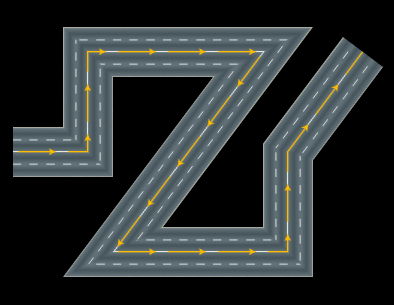


这条公路的绘制要分两部分考虑：

- 宽度线
- 纹理映射

#### 

#### 3-1-认识宽度线

当线有了宽度之后，它就不仅仅是有了宽度那么简单，因为这本质上是一个由线转面，提升了一个维度的问题。这会延伸出许多除宽度之外的其它特性。

对于有宽度的线，canvas 2d 就做得很好，所以咱们先通过canvas 2d 认识一下有宽度的线的特性：

- lineWidth 定义描边的宽度，它是从路径的中心开始绘制的，内外各占宽度的一半。

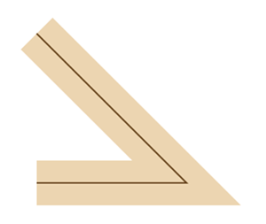


- lineCap 线条端点样式  

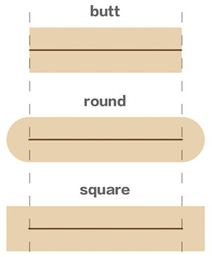


- lineJoin 拐角类型  

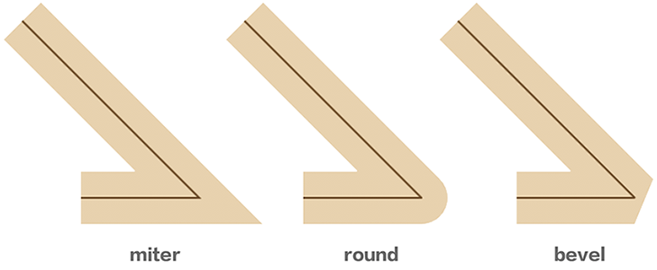


- miterLimit 限制尖角

  当lineJoin 为miter 时，若拐角过小，拐角的厚度就会过大。

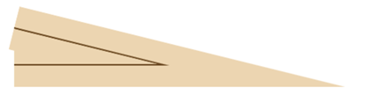


​	miterLimit=1 后，可避免此问题

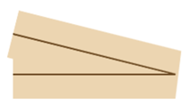


- setLineDash(segments) 虚线 

  ctx.setLineDash([ 60, 90 ])

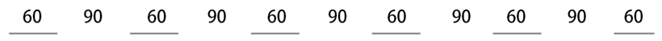


​		ctx.setLineDash([ 60, 90, 120 ])  

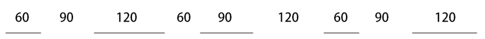


- lineDashOffset 虚线偏移  

  ctx.lineDashOffset=0

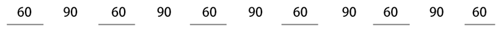

​		ctx.lineDashOffset=-60

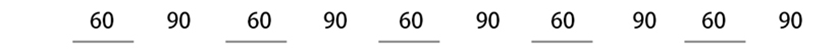


#### 3-2-宽度线的绘制思路

- 着色器绘图：先用WebGL 原生方法绘制单像素的线，然后利用帧缓冲区为其描边。
  
  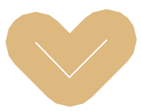

  - 优点：简单快速，可以画出拐角和端点都为round 类型的线
  - 缺点：难以控制其端点和拐角样式，无法做纹理映射，无法深度测试
  
  
  
- 顶点建模，基于线条路径，向其内外两侧挤压线条。
  
  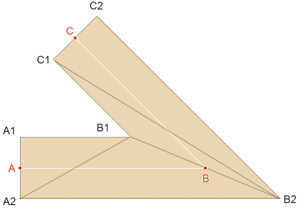
  
  - 优点：可控性强，可满足各种线条特性，可做纹理映射，支持深度测试
  - 缺点：顶点点位的计算量有点大。

因为我们要为宽度线贴图，所以我就用顶点建模的方式绘制有宽度的线了。

我们先用最简单的方式画一条宽度线：像canvas 2d那样，以lineCap为butt，lineJoin 为miter的方式绘制。


#### 3-3-宽度线的挤压原理

宽度线中相邻的两条线段存在两种关系：

- 相交

  


- 平行

  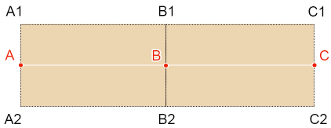


挤压顶点的方式有两种：

- 垂直挤压，对应线条端点或相邻线段平行时的点。
- 非垂直挤压，对应相邻线段不平行时的点，即相交线段的拐点。


#### 3-4-垂直挤压点

以下图为例：


已知：

- 点A、点B
- 线条宽度为lineWidth
- A1、A2是自点A 沿AB方向垂直挤压出的点

求：A1、A2

解：

计算线条宽度的一半h：

```
h=lineWidth/2
```

由点A、点B计算向量AB：

```
AB(x,y)=B-A
```

将向量AB逆时针旋转90°，设置长度为h，得点A1：

```
A1=h*(-y,x)/|(-y,x)|
```

将向量AB顺时针旋转90°，设置长度为h，得点A2：

```
A2=h*(y,-x)/|(y,-x)|
```

挤压端点C 后的点C1、C2 亦是同理。

至于挤压中间点B 后的B1、B2，若点B相邻的线段平行，其计算方法亦是同理。

AB是否平行于BC的判断方法：

```
(Math.atan2(AB.y,AB.x)-Math.atan2(BC.y,BC.x))%Math.PI
```


#### 3-4-计算拐点


已知：

- 点A、点B、点C
- 线条宽度为lineWidth
- AB、BC 不平行

求：拐点B1、B2

思路：

求拐点的本质，就是求两条直线的的交点。

求直线交点的方法有很多，高中数学有一个用直线一般式求交点的方法，我们也可以用向量推导。

解：

由已知条件可知：

```
BD∥EB2
BE∥DB2
|BF|=|BG|
```

所以：

BEB2D 是等边平行四边形。

计算向量BD的单位向量d：

```
d=AB/|AB| 
```

计算向量BE的单位向量e：

```
e=CB/|CB|
```

由等边平行四边形定理，可求得BB2 的单位向量b：

```js
b=(d+e)/|d+e|
```

接下来，只要求得BB2的长度，便可知道点B2。

由向量的点积公式可知：

```
cos∠B2BG=(BG·b)/(|BG|*|b|)
```

因为：

b是单位向量

所以：

```
cos∠B2BG=(BG·b)/|BG|
```

由余弦公式可知：

```
cos∠B2BG=|BG|/|BB2|
|BB2|=|BG|/cos∠B2BG
```

所以：

```
BB2=b*|BB2|
```

所以：

```js
B2=BB2+B
```

知道了B2后，B1也就好求了：

```
B1=-BB2+B
```

这便是用向量推导拐点的方法。

对于用直线的一般式求交点的方法，我就不细说了，大家可以参考一下我的[相关文章](http://yxyy.name/blog/md.html?ossName=162765212208629481006223312756.md&title=%E6%BC%AB%E8%B0%88%E7%9B%B4%E7%BA%BF%E4%B9%8B%E7%82%B9%E6%96%9C%E5%BC%8F%E5%92%8C%E4%B8%80%E8%88%AC%E5%BC%8F)。

接下来咱们说一下代码实现。


#### 3-5-绘制宽度线

1.建立一个BoldLine 对象

```js
import {Vector2} from 'https://unpkg.com/three/build/three.module.js';

/*
属性：
  points:线条节点,二维，[Vector2,Vector2,……]
  lineWidth：线宽
  vertices：顶点集合
  normals：法线集合
  indexes：顶点索引集合
  uv：uv坐标集合
*/
export default class BoldLine{
  constructor(points=[],lineWidth=1){
    this.points=points
    this.lineWidth=lineWidth
    this.vertices=null
    this.normals=null
    this.indexes = null
    this.uv = null
    this.init()
  }
  init() {
    const { points,lineWidth:h } = this
    const len = points.length
    if (len < 2) { return }
    
    // 挤压线条，获取顶点
    const extrudePoints=this.extrude()
    
    // 顶点集合
    const vertices = []
    // 顶点索引
    const indexes = []
    
    // 以线段挤压出的四边形为单位，构建顶点集合、顶点索引
    const len1 = points.length - 1
    for (let i = 0; i < len1; i++) {
      //四边形的4个顶点
      const pi=i * 2
      const [A1, A2, B1, B2] = [
        extrudePoints[pi],
        extrudePoints[pi+1],
        extrudePoints[pi+2],
        extrudePoints[pi+3],
      ]
      vertices.push(
        ...A1, ...A2, ...B1, ...B2
      )
      // 顶点索引
      const A1i = i * 4
      const A2i = A1i+1
      const B1i = A1i+2
      const B2i = A1i + 3
      indexes.push(
        A1i,A2i,B1i,
        B1i,A2i,B2i
      )
    }
    
    this.vertices=new Float32Array(vertices)
    this.indexes=new Uint16Array(indexes)
  }

  // 挤压线条
  extrude() {
    const { points } = this
    //线宽的一半
    const h = this.lineWidth / 2
    //顶点集合，挤压起始点置入其中
    const extrudePoints = [
      ...this.verticalPoint(points[0],points[1],h)
    ]
    // 挤压线条内部点，置入extrudePoints
    const len1=points.length-1
    const len2=len1-1
    for (let i = 0; i < len2; i++){
      // 三个点,两条线
      const A=points[i]
      const B=points[i+1]
      const C = points[i + 2]
      // 两条线是否相交
      if (this.intersect(A,B,C)) {
        extrudePoints.push(...this.interPoint(A, B, C, h))
      } else {
        extrudePoints.push(...this.verticalPoint(B, C, h))
      }
    }
    // 挤压最后一个点
    extrudePoints.push(...this.verticalPoint(
      points[len2], points[len1], h, points[len1]
    ))
    return extrudePoints
  }

  // 判断两条直线是否相交
  intersect(A,B,C) {
    const angAB=B.clone().sub(A).angle ()
    const angBC = C.clone().sub(B).angle ()
    return !!(angAB-angBC)%Math.PI
  }
  //垂直挤压点
  verticalPoint(A,B,h,M=A) {
    const {x,y} = B.clone().sub(A)
    return [
      new Vector2(-y, x).setLength(h).add(M),
      new Vector2(y,-x).setLength(h).add(M)
    ]
  }
  // 拐点
  interPoint(A, B, C, h) {
    const d=B.clone().sub(A).normalize()
    const e = B.clone().sub(C).normalize()
    const b = d.clone().add(e).normalize()
    const BG = new Vector2(d.y, -d.x).setLength(h)
    const BGLen=BG.length()
    const cos = BG.clone().dot(b) / BGLen
    const BB2 = b.setLength(BGLen / cos)
    const BB1 = BB2.clone().negate()
    return [
      BB1.add(B),
      BB2.add(B)
    ]
  }
}
```


2.绘制宽度线

```html
<canvas id="canvas"></canvas>
<script id="vs" type="x-shader/x-vertex">
    attribute vec4 a_Position;
    void main(){
      gl_Position = a_Position;
    }
</script>
<script id="fs" type="x-shader/x-fragment">
    precision mediump float;
    void main(){
      gl_FragColor=vec4(1.0);
    }
</script>
<script type="module">
  import { createProgram, imgPromise } from './lv/Utils.js';
  import { Matrix4, PerspectiveCamera, Vector3, Vector2 } from 'https://unpkg.com/three/build/three.module.js';
  import OrbitControls from './jsm/OrbitControls.js'
  import Mat from './lv/Mat.js'
  import Geo from './lv/Geo.js'
  import Obj3D from './lv/Obj3D.js'
  import Scene from './lv/Scene.js'
  import BoldLine from './lv/BoldLine.js'

  const canvas = document.getElementById('canvas');
  canvas.width = 900;
  canvas.height = 900;
  let gl = canvas.getContext('webgl');

  // 场景
  const scene = new Scene({ gl })
  // 注册程序对象
  scene.registerProgram(
    'line',
    {
      program: createProgram(
        gl,
        document.getElementById('vs').innerText,
        document.getElementById('fs').innerText
      ),
      attributeNames: ['a_Position'],
    }
  )
  const mat = new Mat({
    program: 'line',
    mode: 'TRIANGLES'
  })

  const line = new BoldLine([
    new Vector2(-0.7, 0),
    new Vector2(-0.4, 0),
    new Vector2(-0.4, 0.4),
    new Vector2(0.3, 0.4),
    new Vector2(-0.3, -0.4),
    new Vector2(0.4, -0.4),
    new Vector2(0.4, 0),
    new Vector2(0.7, 0.4),
  ], 0.2)

  const geo = new Geo({
    data: {
      a_Position: {
        array: line.vertices,
        size: 2
      },
    },
    index: {
      array: line.indexes
    }
  })
  scene.add(new Obj3D({ geo, mat }))
  scene.draw()
</script>	
```

效果如下：

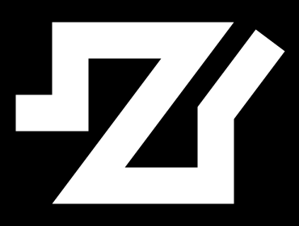


#### 3-6-宽度线贴图思路

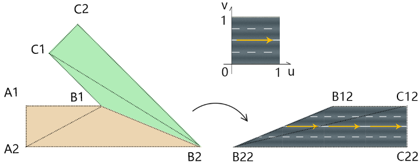

1.以线段挤出的四边形为单位进行贴图。

2.贴图的时候，为了方便做纹理映射，可以先让每一个四边形躺平，再做纹理映射。

3.为了避免贴图拉伸，可基于线宽，设置贴图在u向的reapeat 系数。

举个例子。

已知：

- 贴图是一个正方形图片。


- 线宽为h

求：则点B1、B2、C1、C2所对应的uv坐标

解：

```
B1:(B12.x/h,1)
B2:(B22.x/h,0)
C1:(C12.x/h,1)
C2:(C22.x/h,0)
```


#### 3-7-宽度线贴图代码

1.在BoldLine.js 中计算uv坐标。

```js
init() {
  const { points,lineWidth:h } = this
  const len = points.length
  if (len < 2) { return }

  // 挤压线条，获取顶点
  const extrudePoints=this.extrude()

  // 顶点集合
  const vertices = []
  // 顶点索引
  const indexes = []
  // uv 坐标
  const uv=[]

  // 以线段挤压成的四边形为单位，构建顶点集合、顶点索引、uv
  const len1 = points.length - 1
  for (let i = 0; i < len1; i++) {
    //四边形的4个顶点
    const pi=i * 2
    const [A1, A2, B1, B2] = [
      extrudePoints[pi],
      extrudePoints[pi+1],
      extrudePoints[pi+2],
      extrudePoints[pi+3],
    ]
    vertices.push(
      ...A1, ...A2, ...B1, ...B2
    )
    // 顶点索引
    const A1i = i * 4
    const A2i = A1i+1
    const B1i = A1i+2
    const B2i = A1i + 3
    indexes.push(
      A1i,A2i,B1i,
      B1i,A2i,B2i
    )
    //逆向旋转四边形
    const ang = -B1.clone().sub(A1).angle()
    const O = new Vector2()
    const [lb, rt, rb] = [
      A2.clone().sub(A1).rotateAround(O,ang),
      B1.clone().sub(A1).rotateAround(O,ang),
      B2.clone().sub(A1).rotateAround(O,ang),
    ]
    uv.push(
      0, 1,        //A1
      lb.x / h, 0, //A2
      rt.x / h, 1, //B1
      rb.x / h, 0, //B2
    )
  }

  this.vertices = new Float32Array(vertices)
  this.uv=new Float32Array(uv)
  this.indexes=new Uint16Array(indexes)
}
```


2.绘制宽度线

```html
<canvas id="canvas"></canvas>
<script id="vs" type="x-shader/x-vertex">
    attribute vec4 a_Position;
    attribute vec2 a_Pin;
    varying vec2 v_Pin;
    void main(){
      gl_Position = a_Position;
      v_Pin=a_Pin;
      gl_PointSize=10.0;
    }
</script>
<script id="fs" type="x-shader/x-fragment">
    precision mediump float;
    uniform sampler2D u_Sampler;
    varying vec2 v_Pin;
    void main(){
      gl_FragColor=texture2D(u_Sampler,v_Pin);
    }
</script>
<script type="module">
  import { createProgram, imgPromise } from './lv/Utils.js';
  import { Matrix4, PerspectiveCamera, Vector3, Vector2 } from 'https://unpkg.com/three/build/three.module.js';
  import OrbitControls from './jsm/OrbitControls.js'
  import Mat from './lv/Mat.js'
  import Geo from './lv/Geo.js'
  import Obj3D from './lv/Obj3D.js'
  import Scene from './lv/Scene.js'
  import BoldLine from './lv/BoldLine.js'

  const canvas = document.getElementById('canvas');
  canvas.width = 900;
  canvas.height = 900;
  let gl = canvas.getContext('webgl');

  // 场景
  const scene = new Scene({ gl })
  // 注册程序对象
  scene.registerProgram(
    'line',
    {
      program: createProgram(
        gl,
        document.getElementById('vs').innerText,
        document.getElementById('fs').innerText
      ),
      attributeNames: ['a_Position', 'a_Pin'],
      uniformNames: ['u_Sampler']
    }
  )
  const mat = new Mat({
    program: 'line',
    mode: 'TRIANGLES'
  })

  const line = new BoldLine([
    new Vector2(-0.7, 0),
    new Vector2(-0.4, 0),
    new Vector2(-0.4, 0.4),
    new Vector2(0.3, 0.4),
    new Vector2(-0.3, -0.4),
    new Vector2(0.4, -0.4),
    new Vector2(0.4, 0),
    new Vector2(0.7, 0.4),
  ], 0.2)

  const geo = new Geo({
    data: {
      a_Position: {
        array: line.vertices,
        size: 2
      },
      a_Pin: {
        array: line.uv,
        size: 2
      }
    },
    index: {
      array: line.indexes
    }
  })
  scene.add(new Obj3D({ geo, mat }))

  const image = new Image()
  image.src = `./images/road.jpg`
  image.onload = function () {
    mat.setMap('u_Sampler', {
      image
    })
    scene.draw()
  }
</script>
```


3.对Mat.js 对象里的updateMap() 方法稍作调整，判断一下要更新的贴图里有没有纹理对象texture，若没有，就新建一个。

```js
updateMap(gl, map, ind) {
  const {
    format = gl.RGB,
    image,
    wrapS,
    wrapT,
    magFilter,
    minFilter,
    texture
  } = map
  if (!texture) {
    map.texture = gl.createTexture()
  }
  gl.pixelStorei(gl.UNPACK_FLIP_Y_WEBGL, 1)
  gl.activeTexture(gl[`TEXTURE${ind}`])
  gl.bindTexture(gl.TEXTURE_2D, map.texture)
  ……
}
```


效果如下：


## 总结

因为时间原因，webgl 知识暂且告一段落。

到目前为止，我们对webgl基础知识的充能已经足够了。

接下来，我会带大家快速入门three.js，然后进入实战。

等说完实战，我会回头继续说webgl 和图形学，预计会包含以下知识点：

- Fragment Shader 进阶
- 傅里叶变换，抗锯齿、肌理
- 用纹理制作环境光、凹凸贴图、法线贴图
- 利用三角形重心坐标开发光栅引擎
- 纹理滤波器的内部实现原理
- 微积分，图形学进阶的必经之路
- 光线追踪，接近真实自然的渲染算法
- 流体动力学仿真
- 三维模型布尔运算


